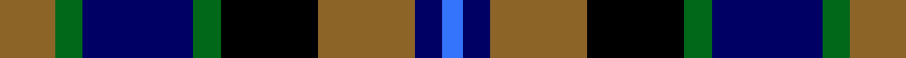

This page is one **sett** — a single exact thread-count. It belongs to the [tartan](/tartans/o8g4db16g4k14o14db4b3/)
(the same proportion at any scale), whose colour order is pattern [BBRKGBGR](/stripes/bbrkgbgr/).

Sourced from tartans-authority.  It is a [8 stripe tartan](/stripes/stripes8/).

Original link http://www.tartansauthority.com/tartan-ferret/display/5200/

## Thread count
LT/16 G8 DB32 G8 K28 LT28 DB8 B/6

## Palette

Palette: <strong>Tartan Register</strong> <small style="color:#888">(3 of 5 colours)</small>
<table><thead><tr><th>Colour</th><th>Threads</th><th>Shade</th><th>Base</th><th>OKLCh</th></tr></thead><tbody><tr><td>LT/</td><td style="text-align:right;font-variant-numeric:tabular-nums">16</td><td><code style="background-color:#8C6428;">#8C6428</code> <small style="color:#888">#8C6428</small></td><td>R <code style="background-color:#CC0000;">#CC0000</code></td><td><small style="color:#888">oklch(53.3% 0.092 74.3)</small></td></tr><tr><td>G</td><td style="text-align:right;font-variant-numeric:tabular-nums">8</td><td><code style="background-color:#006818;">#006818</code> <small style="color:#888">#006818</small></td><td>G <code style="background-color:#006100;">#006100</code></td><td><small style="color:#888">oklch(45.0% 0.142 145.0)</small></td></tr><tr><td>DB</td><td style="text-align:right;font-variant-numeric:tabular-nums">32</td><td><code style="background-color:#000064;">#000064</code> <small style="color:#888">#000064</small></td><td>B <code style="background-color:#2A418A;">#2A418A</code></td><td><small style="color:#888">oklch(22.7% 0.158 264.1)</small></td></tr><tr><td>G</td><td style="text-align:right;font-variant-numeric:tabular-nums">8</td><td><code style="background-color:#006818;">#006818</code> <small style="color:#888">#006818</small></td><td>G <code style="background-color:#006100;">#006100</code></td><td><small style="color:#888">oklch(45.0% 0.142 145.0)</small></td></tr><tr><td>K</td><td style="text-align:right;font-variant-numeric:tabular-nums">28</td><td><code style="background-color:#000000;">#000000</code> <small style="color:#888">#000000</small></td><td>K <code style="background-color:#000000;">#000000</code></td><td><small style="color:#888">oklch(0.0% 0.000 0.0)</small></td></tr><tr><td>LT</td><td style="text-align:right;font-variant-numeric:tabular-nums">28</td><td><code style="background-color:#8C6428;">#8C6428</code> <small style="color:#888">#8C6428</small></td><td>R <code style="background-color:#CC0000;">#CC0000</code></td><td><small style="color:#888">oklch(53.3% 0.092 74.3)</small></td></tr><tr><td>DB</td><td style="text-align:right;font-variant-numeric:tabular-nums">8</td><td><code style="background-color:#000064;">#000064</code> <small style="color:#888">#000064</small></td><td>B <code style="background-color:#2A418A;">#2A418A</code></td><td><small style="color:#888">oklch(22.7% 0.158 264.1)</small></td></tr><tr><td>B/</td><td style="text-align:right;font-variant-numeric:tabular-nums">6</td><td><code style="background-color:#3474FC;">#3474FC</code> <small style="color:#888">#3474FC</small></td><td>B <code style="background-color:#2A418A;">#2A418A</code></td><td><small style="color:#888">oklch(59.7% 0.214 262.7)</small></td></tr></tbody></table>

# Sample pattern

## Nearest tartans

The nearest existing variants by ΔTartan distance, with this tartan at the top so the swatches line up against it.

ΔTartan

Tartan

Sett

—

<a href="/ttd/edit/#slug=o8g4db16g4k14o14db4b3~x2">Hinnigan (Personal)</a> <a class="nn-out" href="/setts/s8/o8g4db16g4k14o14db4b3~x2/" title="open its dictionary page">↗</a>

0.69

<a href="/ttd/edit/#slug=k6b2db12g8r5k2g3~x4">Cooke</a> <a class="nn-out" href="/setts/s7/k6b2db12g8r5k2g3~x4/" title="open its dictionary page">↗</a>

0.77

<a href="/ttd/edit/#slug=k3w2k3g8k8db8r2db3~x2">Davidson, Double</a> <a class="nn-out" href="/setts/s8/k3w2k3g8k8db8r2db3~x2/" title="open its dictionary page">↗</a>

0.81

<a href="/ttd/edit/#slug=db10r7db31k25g23k8db7k8ly5~x2">MacCallum, of Berwick</a> <a class="nn-out" href="/setts/s9/db10r7db31k25g23k8db7k8ly5~x2/" title="open its dictionary page">↗</a>

0.87

<a href="/ttd/edit/#slug=dg3lb2k3dg8k8db8r2db3">Davidson Double</a> <a class="nn-out" href="/setts/s8/dg3lb2k3dg8k8db8r2db3/" title="open its dictionary page">↗</a>

0.87

<a href="/ttd/edit/#slug=t3g8k9db7r2db2~x2">Wellington, or Waterloo</a> <a class="nn-out" href="/setts/s6/t3g8k9db7r2db2~x2/" title="open its dictionary page">↗</a>

0.90

<a href="/ttd/edit/#slug=b2g6ly1k6db6k1db1~x2">Hogarth, of Firhill</a> <a class="nn-out" href="/setts/s7/b2g6ly1k6db6k1db1~x2/" title="open its dictionary page">↗</a>

0.91

<a href="/ttd/edit/#slug=lr4g17k17db17r3db3~x2">Royal Highland</a> <a class="nn-out" href="/setts/s6/lr4g17k17db17r3db3~x2/" title="open its dictionary page">↗</a>

0.94

<a href="/ttd/edit/#slug=db4lg2db10k12dg10lb3dg2lb4~x2">Business Air</a> <a class="nn-out" href="/setts/s8/db4lg2db10k12dg10lb3dg2lb4~x2/" title="open its dictionary page">↗</a>

0.95

<a href="/ttd/edit/#slug=dp2g6k2db6k1r2~x4">MacCaughan, or MacEachain</a> <a class="nn-out" href="/setts/s6/dp2g6k2db6k1r2~x4/" title="open its dictionary page">↗</a>

0.96

<a href="/ttd/edit/#slug=r1k2dg4k1dg1k2db3k1w1~x6">MacKean dress</a> <a class="nn-out" href="/setts/s9/r1k2dg4k1dg1k2db3k1w1~x6/" title="open its dictionary page">↗</a>

## Neighbour map

Every grey dot is one of 14299 variants placed by the first two principal components of the ΔTartan feature space (44% of its variance). Red is this tartan; blue dots are its nearest — click one to open its page.

<svg viewBox="0 0 640 380" role="img" style="max-width:100%;height:auto;border:1px solid #e0e0e0;border-radius:4px;display:block" xmlns="http://www.w3.org/2000/svg"><image href="/nn/cloud.v1.png" width="640" height="380"/><a href="/setts/s7/k6b2db12g8r5k2g3~x4/"><circle cx="81.8" cy="219.3" r="4" fill="#3465a4"><title>Cooke</title></circle></a><a href="/setts/s8/k3w2k3g8k8db8r2db3~x2/"><circle cx="104.3" cy="242.5" r="4" fill="#3465a4"><title>Davidson, Double</title></circle></a><a href="/setts/s9/db10r7db31k25g23k8db7k8ly5~x2/"><circle cx="120.2" cy="206.3" r="4" fill="#3465a4"><title>MacCallum, of Berwick</title></circle></a><a href="/setts/s8/dg3lb2k3dg8k8db8r2db3/"><circle cx="66.2" cy="244.9" r="4" fill="#3465a4"><title>Davidson Double</title></circle></a><a href="/setts/s6/t3g8k9db7r2db2~x2/"><circle cx="57.1" cy="245.0" r="4" fill="#3465a4"><title>Wellington, or Waterloo</title></circle></a><a href="/setts/s7/b2g6ly1k6db6k1db1~x2/"><circle cx="83.2" cy="209.8" r="4" fill="#3465a4"><title>Hogarth, of Firhill</title></circle></a><a href="/setts/s6/lr4g17k17db17r3db3~x2/"><circle cx="93.4" cy="223.9" r="4" fill="#3465a4"><title>Royal Highland</title></circle></a><a href="/setts/s8/db4lg2db10k12dg10lb3dg2lb4~x2/"><circle cx="58.2" cy="210.5" r="4" fill="#3465a4"><title>Business Air</title></circle></a><a href="/setts/s6/dp2g6k2db6k1r2~x4/"><circle cx="94.2" cy="225.7" r="4" fill="#3465a4"><title>MacCaughan, or MacEachain</title></circle></a><a href="/setts/s9/r1k2dg4k1dg1k2db3k1w1~x6/"><circle cx="89.3" cy="233.9" r="4" fill="#3465a4"><title>MacKean dress</title></circle></a><circle cx="84.5" cy="224.1" r="5" fill="#c00000"/></svg>

ID: /setts/s8/o8g4db16g4k14o14db4b3~x2/
