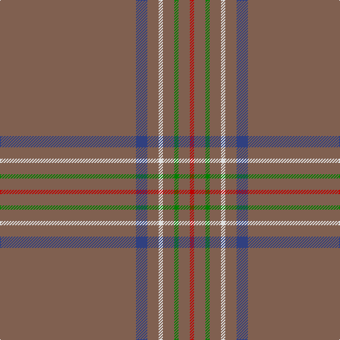

In pattern [RBRWRGRR](/stripes/rbrwrgrr/).

This was sourced from weddslist.  It is a [8 stripe tartan](/stripes/stripes8/).

Original link http://www.weddslist.com/cgi-bin/tartans/pg.pl?source=sts

## Thread count
LT/192 B16 LT16 LN6 LT16 G6 LT16 R/6

## Palette
Each colour and the base-6 reference it is a variant of.

| Colour | Shade | Base |
|---|---|---|
| B | <code style="background-color:#304080;">#304080</code> `oklch(39.4% 0.109 270.2)` <small>#304080</small> | B <code style="background-color:#2A418A;">#2A418A</code> |
| G | <code style="background-color:#008000;">#008000</code> `oklch(52.0% 0.177 142.5)` <small>#008000</small> | G <code style="background-color:#006100;">#006100</code> |
| LN | <code style="background-color:#E0E0E0;">#E0E0E0</code> `oklch(90.7% 0.000 89.9)` <small>#E0E0E0</small> | W <code style="background-color:#F7F7F7;">#F7F7F7</code> |
| LT | <code style="background-color:#806050;">#806050</code> `oklch(51.7% 0.049 47.8)` <small>#806050</small> | R <code style="background-color:#CC0000;">#CC0000</code> |
| R | <code style="background-color:#C00000;">#C00000</code> `oklch(50.7% 0.208 29.2)` <small>#C00000</small> | R <code style="background-color:#CC0000;">#CC0000</code> |

# Sample pattern

## Nearest tartans

The nearest existing variants by ΔTartan distance.

1. [Burnett of Leys Hunting Family Tartan Tartan Number: 1657. Earliest known date: 1988 Nothing See products available Copyright © Blair Urquhart, Comrie, 2015](/setts/s8/dy96db8dy8w3dy8g3dy8r3~x2/) — ΔT 1.62
1. [Eternity Fashion Tartan Tartan Number: 10214. Earliest known date: 01/02/2010 This tartan was designed for day wear grey tweed jackets. It has been shown in the Dedicated to Wedding magazine (April 2010). Perfection leads to eternity is the goal for all eternal marriage. See products available Copyright © Blair Urquhart, Comrie, 2015](/setts/s5/n88dy3lo2k2k1~x2/) — ΔT 1.78
1. [Connacht](/setts/s10/o64g6o2g3o2g6o64dr2o2dr6~x2/) — ΔT 1.87
1. [Eternity, Dedicated 2 Weddings](/setts/s5/do88o3ly2k2lr1~x2/) — ΔT 2.30
1. [Eternity (Fashion)](/setts/s5/n88dy3lo2k2lr1~x2/) — ΔT 2.39
1. [Reece, Mathew](/setts/s7/w2o44dt8o2dt2o3r1~x2/) — ΔT 2.40
1. [Windy Meadows (Fashion)](/setts/s6/dy45lb2r4ly1o2n2~x4/) — ΔT 2.55
1. [Cairngorms National Park](/setts/s8/m57m5m2m8o2m3ly2m14~x2/) — ΔT 2.61
1. [Torridon Tweed](/setts/s6/n4db1n6m1n14lr1~x8/) — ΔT 2.61
1. [Highland Dusk](/setts/s13/n43db2n2r1n1dt11n2db2n1n1n20w4n7~x2/) — ΔT 2.71

## Neighbour map

Every grey dot is one of 14299 variants placed by the first two principal components of the ΔTartan feature space (44% of its variance). Red is this tartan; blue dots are its nearest — click one to open its page.

<svg viewBox="0 0 640 380" role="img" style="max-width:100%;height:auto;border:1px solid #e0e0e0;border-radius:4px;display:block" xmlns="http://www.w3.org/2000/svg"><image href="/nn/cloud.v1.png" width="640" height="380"/><a href="/setts/s8/dy96db8dy8w3dy8g3dy8r3~x2/"><circle cx="626.0" cy="146.4" r="4" fill="#3465a4"><title>Burnett of Leys Hunting Family Tartan Tartan Number: 1657. Earliest known date: 1988 Nothing See products available Copyright © Blair Urquhart, Comrie, 2015</title></circle></a><a href="/setts/s5/n88dy3lo2k2k1~x2/"><circle cx="626.0" cy="176.3" r="4" fill="#3465a4"><title>Eternity Fashion Tartan Tartan Number: 10214. Earliest known date: 01/02/2010 This tartan was designed for day wear grey tweed jackets. It has been shown in the Dedicated to Wedding magazine (April 2010). Perfection leads to eternity is the goal for all eternal marriage. See products available Copyright © Blair Urquhart, Comrie, 2015</title></circle></a><a href="/setts/s10/o64g6o2g3o2g6o64dr2o2dr6~x2/"><circle cx="626.0" cy="189.0" r="4" fill="#3465a4"><title>Connacht</title></circle></a><a href="/setts/s5/do88o3ly2k2lr1~x2/"><circle cx="626.0" cy="155.4" r="4" fill="#3465a4"><title>Eternity, Dedicated 2 Weddings</title></circle></a><a href="/setts/s5/n88dy3lo2k2lr1~x2/"><circle cx="626.0" cy="193.5" r="4" fill="#3465a4"><title>Eternity (Fashion)</title></circle></a><a href="/setts/s7/w2o44dt8o2dt2o3r1~x2/"><circle cx="626.0" cy="136.1" r="4" fill="#3465a4"><title>Reece, Mathew</title></circle></a><a href="/setts/s6/dy45lb2r4ly1o2n2~x4/"><circle cx="617.7" cy="120.4" r="4" fill="#3465a4"><title>Windy Meadows (Fashion)</title></circle></a><a href="/setts/s8/m57m5m2m8o2m3ly2m14~x2/"><circle cx="626.0" cy="174.3" r="4" fill="#3465a4"><title>Cairngorms National Park</title></circle></a><a href="/setts/s6/n4db1n6m1n14lr1~x8/"><circle cx="626.0" cy="270.0" r="4" fill="#3465a4"><title>Torridon Tweed</title></circle></a><a href="/setts/s13/n43db2n2r1n1dt11n2db2n1n1n20w4n7~x2/"><circle cx="605.2" cy="122.0" r="4" fill="#3465a4"><title>Highland Dusk</title></circle></a><circle cx="626.0" cy="155.4" r="5" fill="#c00000"/></svg>

ID: /setts/s8/o96db8o8w3o8g3o8r3~x2/
