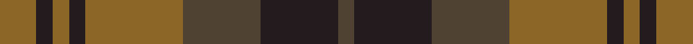

In pattern [GBGRBRBR](/stripes/gbgrbrbr/).

This was sourced from register-of-tartans.  It is a [8 stripe tartan](/stripes/stripes8/).

Original link https://www.tartanregister.gov.uk/tartanDetails.aspx?ref=10254

## Register references

External register numbers recorded for this tartan.

- Scottish Register of Tartans: [10254](https://www.tartanregister.gov.uk/tartanDetails.aspx?ref=10254)

## Thread count
LT/18 K8 LT8 K8 LT48 T38 K38 T/8

## Palette
Each colour and its ΔE from the base-6 reference it is a variant of.

| Colour | Shade | Base | ΔE (OKLab) |
|---|---|---|---|
| K | <code style="background-color:#241B1E;">#241B1E</code> `#241B1E` | B <code style="background-color:#2A418A;">#2A418A</code> | 0.21 |
| LT | <code style="background-color:#8C6627;">#8C6627</code> `#8C6627` | R <code style="background-color:#CC0000;">#CC0000</code> | 0.17 |
| T | <code style="background-color:#4F4232;">#4F4232</code> `#4F4232` | G <code style="background-color:#006100;">#006100</code> | 0.14 |

# Sample pattern

## Nearest tartans

The nearest existing variants by ΔTartan distance.

1. [Glen Esk (1993)](/setts/s7/dg2r1dg8r5y5r1y2~x4/) — ΔT 1.12
1. [McCanna NW (Olympia, USA) Hunting (Personal)](/setts/s7/k1dy4g1k1g1k1dy1~x14/) — ΔT 1.25
1. [Dewar](/setts/s10/dy1r7dy4g7dy1g1~x4/) — ΔT 1.27
1. [Daks-Simpson (Muted Skye)](/setts/s8/db5o15dy4o4dy24o4dy4db5/) — ΔT 1.29
1. [Dorward/Dogwood](/setts/s7/dy7r3dy9g15db19dy14r4~x2/) — ΔT 1.33
1. [Chindecella Ruadh (Personal)](/setts/s8/r10db4r4db4r23n19db19n4~x2/) — ΔT 1.38
1. [Lindsay](/setts/s9/dg24dt3dg3dt3dg3dt9m24dg3m4~x2/) — ΔT 1.41
1. [Glasgow #2](/setts/s7/dg25r4db24r21dg25r3db4~x2/) — ΔT 1.41
1. [Harmony 8](/setts/s5/dr2y10o15dr10y2~x4/) — ΔT 1.43
1. [McCanna NW Htg (Personal)](/setts/s7/k1dy4dg1k1dg1k1dy1~x10/) — ΔT 1.49

## Neighbour map

Every grey dot is one of 14299 variants placed by the first two principal components of the ΔTartan feature space (44% of its variance). Red is this tartan; blue dots are its nearest — click one to open its page.

<svg viewBox="0 0 640 380" role="img" style="max-width:100%;height:auto;border:1px solid #e0e0e0;border-radius:4px;display:block" xmlns="http://www.w3.org/2000/svg"><image href="/nn/cloud.v1.png" width="640" height="380"/><a href="/setts/s7/dg2r1dg8r5y5r1y2~x4/"><circle cx="271.1" cy="257.8" r="4" fill="#3465a4"><title>Glen Esk (1993)</title></circle></a><a href="/setts/s7/k1dy4g1k1g1k1dy1~x14/"><circle cx="317.4" cy="305.2" r="4" fill="#3465a4"><title>McCanna NW (Olympia, USA) Hunting (Personal)</title></circle></a><a href="/setts/s10/dy1r7dy4g7dy1g1~x4/"><circle cx="252.8" cy="254.3" r="4" fill="#3465a4"><title>Dewar</title></circle></a><a href="/setts/s8/db5o15dy4o4dy24o4dy4db5/"><circle cx="315.5" cy="253.8" r="4" fill="#3465a4"><title>Daks-Simpson (Muted Skye)</title></circle></a><a href="/setts/s7/dy7r3dy9g15db19dy14r4~x2/"><circle cx="229.6" cy="279.8" r="4" fill="#3465a4"><title>Dorward/Dogwood</title></circle></a><a href="/setts/s8/r10db4r4db4r23n19db19n4~x2/"><circle cx="290.6" cy="277.5" r="4" fill="#3465a4"><title>Chindecella Ruadh (Personal)</title></circle></a><a href="/setts/s9/dg24dt3dg3dt3dg3dt9m24dg3m4~x2/"><circle cx="336.5" cy="248.0" r="4" fill="#3465a4"><title>Lindsay</title></circle></a><a href="/setts/s7/dg25r4db24r21dg25r3db4~x2/"><circle cx="281.8" cy="261.5" r="4" fill="#3465a4"><title>Glasgow #2</title></circle></a><a href="/setts/s5/dr2y10o15dr10y2~x4/"><circle cx="257.0" cy="276.7" r="4" fill="#3465a4"><title>Harmony 8</title></circle></a><a href="/setts/s7/k1dy4dg1k1dg1k1dy1~x10/"><circle cx="328.5" cy="312.8" r="4" fill="#3465a4"><title>McCanna NW Htg (Personal)</title></circle></a><circle cx="281.3" cy="273.8" r="5" fill="#c00000"/></svg>

ID: /setts/s8/o9do4o4do4o24dy19do19dy4~x2/
