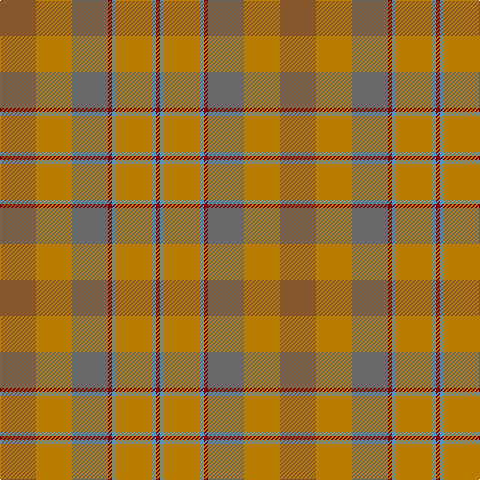

This page is one **sett** — a single exact thread-count. It belongs to the [tartan](/tartans/o9oi9y9oii1t1oi9t1oii1/)
(the same proportion at any scale), whose colour order is pattern [RBRBRGRR](/stripes/rbrbrgrr/).

Sourced from house-of-tartan.  It is a [8 stripe tartan](/stripes/stripes8/).

Original link http://www.house-of-tartan.scotland.net/house/TartanViewjs.asp?colr=Def&tnam=1432

## Thread count
LT/36 DY36 N36 DR4 B4 DY36 B4 DR/4

## Palette

Palette: <strong>custom</strong>
<table><thead><tr><th>Colour</th><th>Threads</th><th>Shade</th><th>Base</th><th>OKLCh</th></tr></thead><tbody><tr><td>LT/</td><td style="text-align:right;font-variant-numeric:tabular-nums">36</td><td><code style="background-color:#88582C;">#88582C</code> <small style="color:#888">#88582C</small></td><td>R <code style="background-color:#CC0000;">#CC0000</code></td><td><small style="color:#888">oklch(50.4% 0.087 61.2)</small></td></tr><tr><td>DY</td><td style="text-align:right;font-variant-numeric:tabular-nums">36</td><td><code style="background-color:#B87C00;">#B87C00</code> <small style="color:#888">#B87C00</small></td><td>R <code style="background-color:#CC0000;">#CC0000</code></td><td><small style="color:#888">oklch(63.2% 0.133 75.1)</small></td></tr><tr><td>N</td><td style="text-align:right;font-variant-numeric:tabular-nums">36</td><td><code style="background-color:#686868;">#686868</code> <small style="color:#888">#686868</small></td><td>G <code style="background-color:#006100;">#006100</code></td><td><small style="color:#888">oklch(51.7% 0.000 89.9)</small></td></tr><tr><td>DR</td><td style="text-align:right;font-variant-numeric:tabular-nums">4</td><td><code style="background-color:#7C0000;">#7C0000</code> <small style="color:#888">#7C0000</small></td><td>R <code style="background-color:#CC0000;">#CC0000</code></td><td><small style="color:#888">oklch(36.8% 0.151 29.2)</small></td></tr><tr><td>B</td><td style="text-align:right;font-variant-numeric:tabular-nums">4</td><td><code style="background-color:#5494BC;">#5494BC</code> <small style="color:#888">#5494BC</small></td><td>B <code style="background-color:#2A418A;">#2A418A</code></td><td><small style="color:#888">oklch(64.0% 0.089 237.8)</small></td></tr><tr><td>DY</td><td style="text-align:right;font-variant-numeric:tabular-nums">36</td><td><code style="background-color:#B87C00;">#B87C00</code> <small style="color:#888">#B87C00</small></td><td>R <code style="background-color:#CC0000;">#CC0000</code></td><td><small style="color:#888">oklch(63.2% 0.133 75.1)</small></td></tr><tr><td>B</td><td style="text-align:right;font-variant-numeric:tabular-nums">4</td><td><code style="background-color:#5494BC;">#5494BC</code> <small style="color:#888">#5494BC</small></td><td>B <code style="background-color:#2A418A;">#2A418A</code></td><td><small style="color:#888">oklch(64.0% 0.089 237.8)</small></td></tr><tr><td>DR/</td><td style="text-align:right;font-variant-numeric:tabular-nums">4</td><td><code style="background-color:#7C0000;">#7C0000</code> <small style="color:#888">#7C0000</small></td><td>R <code style="background-color:#CC0000;">#CC0000</code></td><td><small style="color:#888">oklch(36.8% 0.151 29.2)</small></td></tr></tbody></table>

# Sample pattern

## Nearest tartans

The nearest existing variants by ΔTartan distance, with this tartan at the top so the swatches line up against it.

ΔTartan

Tartan

Sett

—

<a href="/ttd/edit/#slug=o9oi9y9oii1t1oi9t1oii1~x4">Jardine of Castlemilk Family Tartan Tartan Number: 1432. Earliest known date: c.1978 The chiefly house is Jardine of Applegirth, a baronetcy created in 1672. The Jardines of Castlemilk in Dumfriesshire settled there in the early fourteenth century. The tartan is approved by Col Jardine. The darker brown is recorded as &quot;J.Br&quot;, and the lighter as &quot;Olive Br&quot; in the Lyon Books. See products available Copyright © Blair Urquhart, Comrie, 2015</a> <a class="nn-out" href="/setts/s8/o9oi9y9oii1t1oi9t1oii1~x4/" title="open its dictionary page">↗</a>

1.31

<a href="/ttd/edit/#slug=r3o23y8g6y8t6y10t12y3~x2">Lawrence's Seven Pillars of Khaki</a> <a class="nn-out" href="/setts/s9/r3o23y8g6y8t6y10t12y3~x2/" title="open its dictionary page">↗</a>

1.35

<a href="/ttd/edit/#slug=y16oi2y2o2y2oi2y2do6n10y3~x2">Annan (Fashion)</a> <a class="nn-out" href="/setts/s10/y16oi2y2o2y2oi2y2do6n10y3~x2/" title="open its dictionary page">↗</a>

1.57

<a href="/ttd/edit/#slug=do10y24r3y3r24dg3y6do6~x2">Earle's Flame (Fashion)</a> <a class="nn-out" href="/setts/s8/do10y24r3y3r24dg3y6do6~x2/" title="open its dictionary page">↗</a>

1.61

<a href="/ttd/edit/#slug=r12w4r3lo18r3ly4g2~x2">Golden Pheasant</a> <a class="nn-out" href="/setts/s7/r12w4r3lo18r3ly4g2~x2/" title="open its dictionary page">↗</a>

1.64

<a href="/ttd/edit/#slug=n9o9y9r1yi1o9yi1r1~x4">Jardine</a> <a class="nn-out" href="/setts/s8/n9o9y9r1yi1o9yi1r1~x4/" title="open its dictionary page">↗</a>

1.75

<a href="/ttd/edit/#slug=g3yi16o11yi2y11yi2y11yi2o11yi16w3~x2">Harmony 14</a> <a class="nn-out" href="/setts/s11/g3yi16o11yi2y11yi2y11yi2o11yi16w3~x2/" title="open its dictionary page">↗</a>

1.88

<a href="/ttd/edit/#slug=dr9o9n9r1db1o9db1r1~x4">Jardine, of Castlemilk</a> <a class="nn-out" href="/setts/s8/dr9o9n9r1db1o9db1r1~x4/" title="open its dictionary page">↗</a>

1.89

<a href="/setts/s10/o5n3o22r3n6ni17r2ni4r2ni4~x2/">Clyde</a>

1.91

<a href="/ttd/edit/#slug=g3dy4g2dy22n5r16ly3~x2">Pubcrawlers (Corporate)</a> <a class="nn-out" href="/setts/s7/g3dy4g2dy22n5r16ly3~x2/" title="open its dictionary page">↗</a>

1.94

<a href="/setts/s12/y23o4dy6g6y4lb1y4~x4/">Tricor</a>

## Neighbour map

Every grey dot is one of 14359 variants placed by the first two principal components of the ΔTartan feature space (44% of its variance). Red is this tartan; blue dots are its nearest — click one to open its page.

<svg viewBox="0 0 640 380" role="img" style="max-width:100%;height:auto;border:1px solid #e0e0e0;border-radius:4px;display:block" xmlns="http://www.w3.org/2000/svg"><image href="/nn/cloud.v1.png" width="640" height="380"/><a href="/setts/s9/r3o23y8g6y8t6y10t12y3~x2/"><circle cx="256.8" cy="261.8" r="4" fill="#3465a4"><title>Lawrence's Seven Pillars of Khaki</title></circle></a><a href="/setts/s10/y16oi2y2o2y2oi2y2do6n10y3~x2/"><circle cx="348.0" cy="222.7" r="4" fill="#3465a4"><title>Annan (Fashion)</title></circle></a><a href="/setts/s8/do10y24r3y3r24dg3y6do6~x2/"><circle cx="341.5" cy="262.0" r="4" fill="#3465a4"><title>Earle's Flame (Fashion)</title></circle></a><a href="/setts/s7/r12w4r3lo18r3ly4g2~x2/"><circle cx="282.9" cy="219.6" r="4" fill="#3465a4"><title>Golden Pheasant</title></circle></a><a href="/setts/s8/n9o9y9r1yi1o9yi1r1~x4/"><circle cx="357.2" cy="266.1" r="4" fill="#3465a4"><title>Jardine</title></circle></a><a href="/setts/s11/g3yi16o11yi2y11yi2y11yi2o11yi16w3~x2/"><circle cx="310.1" cy="263.9" r="4" fill="#3465a4"><title>Harmony 14</title></circle></a><a href="/setts/s8/dr9o9n9r1db1o9db1r1~x4/"><circle cx="291.7" cy="234.3" r="4" fill="#3465a4"><title>Jardine, of Castlemilk</title></circle></a><a href="/setts/s10/o5n3o22r3n6ni17r2ni4r2ni4~x2/"><circle cx="338.3" cy="236.9" r="4" fill="#3465a4"><title>Clyde</title></circle></a><a href="/setts/s7/g3dy4g2dy22n5r16ly3~x2/"><circle cx="316.9" cy="215.9" r="4" fill="#3465a4"><title>Pubcrawlers (Corporate)</title></circle></a><a href="/setts/s12/y23o4dy6g6y4lb1y4~x4/"><circle cx="384.8" cy="190.3" r="4" fill="#3465a4"><title>Tricor</title></circle></a><circle cx="315.5" cy="241.3" r="5" fill="#c00000"/></svg>

ID: /setts/s8/o9oi9y9oii1t1oi9t1oii1~x4/
