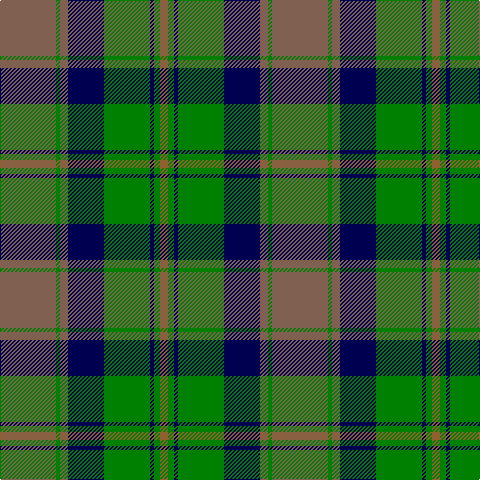

This page is one **sett** — a single exact thread-count. It belongs to the [tartan](/tartans/oi28g2oi4db18g23db2g3o4/)
(the same proportion at any scale), whose colour order is pattern [RGBGBRGR](/stripes/rgbgbrgr/).

Sourced from weddslist.  It is a [8 stripe tartan](/stripes/stripes8/).

Original link http://www.weddslist.com/cgi-bin/tartans/pg.pl?source=sts

## Thread count
LTa/56 G4 LTa8 DB36 G46 DB4 G6 LT/8

## Palette

Palette: <strong>custom</strong>
<table><thead><tr><th>Colour</th><th>Threads</th><th>Shade</th><th>Base</th><th>OKLCh</th></tr></thead><tbody><tr><td>LTa/</td><td style="text-align:right;font-variant-numeric:tabular-nums">56</td><td><code style="background-color:#806050;">#806050</code> <small style="color:#888">#806050</small></td><td>R <code style="background-color:#CC0000;">#CC0000</code></td><td><small style="color:#888">oklch(51.7% 0.049 47.8)</small></td></tr><tr><td>G</td><td style="text-align:right;font-variant-numeric:tabular-nums">4</td><td><code style="background-color:#008000;">#008000</code> <small style="color:#888">#008000</small></td><td>G <code style="background-color:#006100;">#006100</code></td><td><small style="color:#888">oklch(52.0% 0.177 142.5)</small></td></tr><tr><td>LTa</td><td style="text-align:right;font-variant-numeric:tabular-nums">8</td><td><code style="background-color:#806050;">#806050</code> <small style="color:#888">#806050</small></td><td>R <code style="background-color:#CC0000;">#CC0000</code></td><td><small style="color:#888">oklch(51.7% 0.049 47.8)</small></td></tr><tr><td>DB</td><td style="text-align:right;font-variant-numeric:tabular-nums">36</td><td><code style="background-color:#000050;">#000050</code> <small style="color:#888">#000050</small></td><td>B <code style="background-color:#2A418A;">#2A418A</code></td><td><small style="color:#888">oklch(19.5% 0.135 264.1)</small></td></tr><tr><td>G</td><td style="text-align:right;font-variant-numeric:tabular-nums">46</td><td><code style="background-color:#008000;">#008000</code> <small style="color:#888">#008000</small></td><td>G <code style="background-color:#006100;">#006100</code></td><td><small style="color:#888">oklch(52.0% 0.177 142.5)</small></td></tr><tr><td>DB</td><td style="text-align:right;font-variant-numeric:tabular-nums">4</td><td><code style="background-color:#000050;">#000050</code> <small style="color:#888">#000050</small></td><td>B <code style="background-color:#2A418A;">#2A418A</code></td><td><small style="color:#888">oklch(19.5% 0.135 264.1)</small></td></tr><tr><td>G</td><td style="text-align:right;font-variant-numeric:tabular-nums">6</td><td><code style="background-color:#008000;">#008000</code> <small style="color:#888">#008000</small></td><td>G <code style="background-color:#006100;">#006100</code></td><td><small style="color:#888">oklch(52.0% 0.177 142.5)</small></td></tr><tr><td>LT/</td><td style="text-align:right;font-variant-numeric:tabular-nums">8</td><td><code style="background-color:#906030;">#906030</code> <small style="color:#888">#906030</small></td><td>R <code style="background-color:#CC0000;">#CC0000</code></td><td><small style="color:#888">oklch(53.1% 0.089 63.7)</small></td></tr></tbody></table>

# Sample pattern

## Nearest tartans

The nearest existing variants by ΔTartan distance, with this tartan at the top so the swatches line up against it.

ΔTartan

Tartan

Sett

—

<a href="/ttd/edit/#slug=oi28g2oi4db18g23db2g3o4~x2">Dalbraith-Eastern Western Motor Group</a> <a class="nn-out" href="/setts/s8/oi28g2oi4db18g23db2g3o4~x2/" title="open its dictionary page">↗</a>

0.73

<a href="/ttd/edit/#slug=t39g3t3g20k3g20k3g3k20r3~x2">Dunedin Chapter (Corporate)</a> <a class="nn-out" href="/setts/s10/t39g3t3g20k3g20k3g3k20r3~x2/" title="open its dictionary page">↗</a>

0.84

<a href="/ttd/edit/#slug=g5k1lo2k1g19k15lo2y20g3~x2">Maine Acadia</a> <a class="nn-out" href="/setts/s9/g5k1lo2k1g19k15lo2y20g3~x2/" title="open its dictionary page">↗</a>

0.89

<a href="/ttd/edit/#slug=r3dg2k1dg20k9t20k1t2r3~x2">Ayrton</a> <a class="nn-out" href="/setts/s9/r3dg2k1dg20k9t20k1t2r3~x2/" title="open its dictionary page">↗</a>

0.95

<a href="/ttd/edit/#slug=g8lr4dt21g6r7g1r1g8~x2">Cathcart</a> <a class="nn-out" href="/setts/s8/g8lr4dt21g6r7g1r1g8~x2/" title="open its dictionary page">↗</a>

0.98

<a href="/ttd/edit/#slug=r6g3k3o24g4k10g4r2g24r6g2~x2">MacNeish Htg</a> <a class="nn-out" href="/setts/s11/r6g3k3o24g4k10g4r2g24r6g2~x2/" title="open its dictionary page">↗</a>

1.02

<a href="/ttd/edit/#slug=t3dy26g4t13k13t2~x2">MacTavish Hunting Clan Tartan Tartan Number: 232. Earliest known date: pre 2003 See Lord Thomson See products available Copyright © Blair Urquhart, Comrie, 2015</a> <a class="nn-out" href="/setts/s6/t3dy26g4t13k13t2~x2/" title="open its dictionary page">↗</a>

1.03

<a href="/ttd/edit/#slug=db12r1db1r1db1r4g12ly1g2~x4">Durie (Clan)</a> <a class="nn-out" href="/setts/s9/db12r1db1r1db1r4g12ly1g2~x4/" title="open its dictionary page">↗</a>

1.03

<a href="/ttd/edit/#slug=k2dt3k2dt18k11dt2k11g25dp2~x2">Aitchison (Personal)</a> <a class="nn-out" href="/setts/s9/k2dt3k2dt18k11dt2k11g25dp2~x2/" title="open its dictionary page">↗</a>

1.03

<a href="/ttd/edit/#slug=r2g10k12n1ly2n14k1n1g2~x2">McWilliams Wedding (Personal)</a> <a class="nn-out" href="/setts/s9/r2g10k12n1ly2n14k1n1g2~x2/" title="open its dictionary page">↗</a>

1.04

<a href="/ttd/edit/#slug=g19w1db12t2db2t2db2t16~x2">Norwich No.052</a> <a class="nn-out" href="/setts/s8/g19w1db12t2db2t2db2t16~x2/" title="open its dictionary page">↗</a>

## Neighbour map

Every grey dot is one of 14359 variants placed by the first two principal components of the ΔTartan feature space (44% of its variance). Red is this tartan; blue dots are its nearest — click one to open its page.

<svg viewBox="0 0 640 380" role="img" style="max-width:100%;height:auto;border:1px solid #e0e0e0;border-radius:4px;display:block" xmlns="http://www.w3.org/2000/svg"><image href="/nn/cloud.v1.png" width="640" height="380"/><a href="/setts/s10/t39g3t3g20k3g20k3g3k20r3~x2/"><circle cx="231.3" cy="177.6" r="4" fill="#3465a4"><title>Dunedin Chapter (Corporate)</title></circle></a><a href="/setts/s9/g5k1lo2k1g19k15lo2y20g3~x2/"><circle cx="252.5" cy="172.8" r="4" fill="#3465a4"><title>Maine Acadia</title></circle></a><a href="/setts/s9/r3dg2k1dg20k9t20k1t2r3~x2/"><circle cx="236.6" cy="159.5" r="4" fill="#3465a4"><title>Ayrton</title></circle></a><a href="/setts/s8/g8lr4dt21g6r7g1r1g8~x2/"><circle cx="270.9" cy="193.2" r="4" fill="#3465a4"><title>Cathcart</title></circle></a><a href="/setts/s11/r6g3k3o24g4k10g4r2g24r6g2~x2/"><circle cx="234.6" cy="178.4" r="4" fill="#3465a4"><title>MacNeish Htg</title></circle></a><a href="/setts/s6/t3dy26g4t13k13t2~x2/"><circle cx="251.6" cy="215.6" r="4" fill="#3465a4"><title>MacTavish Hunting Clan Tartan Tartan Number: 232. Earliest known date: pre 2003 See Lord Thomson See products available Copyright © Blair Urquhart, Comrie, 2015</title></circle></a><a href="/setts/s9/db12r1db1r1db1r4g12ly1g2~x4/"><circle cx="267.2" cy="183.3" r="4" fill="#3465a4"><title>Durie (Clan)</title></circle></a><a href="/setts/s9/k2dt3k2dt18k11dt2k11g25dp2~x2/"><circle cx="221.6" cy="199.8" r="4" fill="#3465a4"><title>Aitchison (Personal)</title></circle></a><a href="/setts/s9/r2g10k12n1ly2n14k1n1g2~x2/"><circle cx="191.0" cy="160.7" r="4" fill="#3465a4"><title>McWilliams Wedding (Personal)</title></circle></a><a href="/setts/s8/g19w1db12t2db2t2db2t16~x2/"><circle cx="236.1" cy="176.3" r="4" fill="#3465a4"><title>Norwich No.052</title></circle></a><circle cx="231.4" cy="188.8" r="5" fill="#c00000"/></svg>

ID: /setts/s8/oi28g2oi4db18g23db2g3o4~x2/
