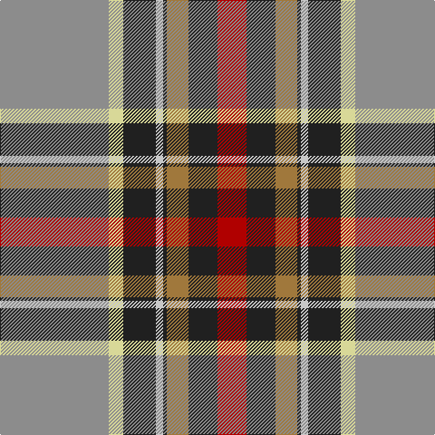

This page is one **sett** — a single exact thread-count. It belongs to the [tartan](/tartans/oi30ly4dt9lb2dt1o6dt8r8/)
(the same proportion at any scale), whose colour order is pattern [RBRBWBYR](/stripes/rbrbwbyr/).

Sourced from register-of-tartans.  It is a [8 stripe tartan](/stripes/stripes8/).

Original link https://www.tartanregister.gov.uk/tartanDetails.aspx?ref=3165

## Also known as

This cloth is also recorded under:

- Norwegian Migration Period (Artefact

2 attestations — the source records this cloth was collapsed from (oldest owns this page)

<ul>
<li>01/01/1901 — Norwegian Migration Period (register-of-tartans, <a href="https://www.tartanregister.gov.uk/tartanDetails.aspx?ref=3165">record</a>)</li>
<li>400 - 600AD — Norwegian Migration Period (Artefact (tartans-authority, <a href="http://www.tartansauthority.com/tartan-ferret/display/5584/">record</a>)</li>
</ul>

## Register references

External register numbers recorded for this tartan.

- Scottish Register of Tartans: [3165](https://www.tartanregister.gov.uk/tartanDetails.aspx?ref=3165)
- Scottish Tartans Authority (ITI): 5584

## Thread count
N/120 LY16 K36 Na8 K4 LT24 K32 DR/32

## Palette

Palette: <strong>Tartan Register</strong> <small style="color:#888">(1 of 6 colours)</small>
<table><thead><tr><th>Colour</th><th>Threads</th><th>Shade</th><th>Base</th><th>OKLCh</th></tr></thead><tbody><tr><td>N/</td><td style="text-align:right;font-variant-numeric:tabular-nums">120</td><td><code style="background-color:#8C8C8C;">#8C8C8C</code> <small style="color:#888">#8C8C8C</small></td><td>R <code style="background-color:#CC0000;">#CC0000</code></td><td><small style="color:#888">oklch(64.0% 0.000 89.9)</small></td></tr><tr><td>LY</td><td style="text-align:right;font-variant-numeric:tabular-nums">16</td><td><code style="background-color:#D8D898;">#D8D898</code> <small style="color:#888">#D8D898</small></td><td>Y <code style="background-color:#F2BF00;">#F2BF00</code></td><td><small style="color:#888">oklch(86.7% 0.083 108.0)</small></td></tr><tr><td>K</td><td style="text-align:right;font-variant-numeric:tabular-nums">36</td><td><code style="background-color:#202020;">#202020</code> <small style="color:#888">#202020</small></td><td>B <code style="background-color:#2A418A;">#2A418A</code></td><td><small style="color:#888">oklch(24.4% 0.000 89.9)</small></td></tr><tr><td>Na</td><td style="text-align:right;font-variant-numeric:tabular-nums">8</td><td><code style="background-color:#C8C8C8;">#C8C8C8</code> <small style="color:#888">#C8C8C8</small></td><td>W <code style="background-color:#F7F7F7;">#F7F7F7</code></td><td><small style="color:#888">oklch(83.3% 0.000 89.9)</small></td></tr><tr><td>K</td><td style="text-align:right;font-variant-numeric:tabular-nums">4</td><td><code style="background-color:#202020;">#202020</code> <small style="color:#888">#202020</small></td><td>B <code style="background-color:#2A418A;">#2A418A</code></td><td><small style="color:#888">oklch(24.4% 0.000 89.9)</small></td></tr><tr><td>LT</td><td style="text-align:right;font-variant-numeric:tabular-nums">24</td><td><code style="background-color:#A0783C;">#A0783C</code> <small style="color:#888">#A0783C</small></td><td>R <code style="background-color:#CC0000;">#CC0000</code></td><td><small style="color:#888">oklch(60.0% 0.092 75.5)</small></td></tr><tr><td>K</td><td style="text-align:right;font-variant-numeric:tabular-nums">32</td><td><code style="background-color:#202020;">#202020</code> <small style="color:#888">#202020</small></td><td>B <code style="background-color:#2A418A;">#2A418A</code></td><td><small style="color:#888">oklch(24.4% 0.000 89.9)</small></td></tr><tr><td>DR/</td><td style="text-align:right;font-variant-numeric:tabular-nums">32</td><td><code style="background-color:#B00000;">#B00000</code> <small style="color:#888">#B00000</small></td><td>R <code style="background-color:#CC0000;">#CC0000</code></td><td><small style="color:#888">oklch(47.5% 0.195 29.2)</small></td></tr></tbody></table>

# Sample pattern

## Nearest tartans

The nearest existing variants by ΔTartan distance, with this tartan at the top so the swatches line up against it.

ΔTartan

Tartan

Sett

—

<a href="/ttd/edit/#slug=oi30ly4dt9lb2dt1o6dt8r8~x4">Norwegian Migration Period</a> <a class="nn-out" href="/setts/s8/oi30ly4dt9lb2dt1o6dt8r8~x4/" title="open its dictionary page">↗</a>

0.95

<a href="/ttd/edit/#slug=r31g19lg27b1w1lo1~x2">Glencross, (Solway) (Personal)</a> <a class="nn-out" href="/setts/s6/r31g19lg27b1w1lo1~x2/" title="open its dictionary page">↗</a>

1.05

<a href="/ttd/edit/#slug=r15lo30k1w6k1lo2dg16t4r6w1~x2">Westwood (Fashion?)</a> <a class="nn-out" href="/setts/s10/r15lo30k1w6k1lo2dg16t4r6w1~x2/" title="open its dictionary page">↗</a>

1.06

<a href="/ttd/edit/#slug=m50ly4w16db2w4db2w15g27r4~x2">Rosevear</a> <a class="nn-out" href="/setts/s9/m50ly4w16db2w4db2w15g27r4~x2/" title="open its dictionary page">↗</a>

1.10

<a href="/ttd/edit/#slug=ri50ly4w16db2w4db2w15g27r4~x2">Rosevear</a> <a class="nn-out" href="/setts/s9/ri50ly4w16db2w4db2w15g27r4~x2/" title="open its dictionary page">↗</a>

1.15

<a href="/ttd/edit/#slug=r8lo44k32w2o52k7o7w3">Golden Wedding (Fashion)</a> <a class="nn-out" href="/setts/s8/r8lo44k32w2o52k7o7w3/" title="open its dictionary page">↗</a>

1.17

<a href="/ttd/edit/#slug=t8k1r22ly1r6k3dg10w1k3t20w1~x2">Unnamed C20th - National Archives</a> <a class="nn-out" href="/setts/s11/t8k1r22ly1r6k3dg10w1k3t20w1~x2/" title="open its dictionary page">↗</a>

1.22

<a href="/ttd/edit/#slug=r8ly2o7ly2n24k2g1~x2">(4) Traill</a> <a class="nn-out" href="/setts/s7/r8ly2o7ly2n24k2g1~x2/" title="open its dictionary page">↗</a>

1.23

<a href="/ttd/edit/#slug=dp8n44k32lp2o53lb8n8lb4">Silver Wedding (Fashion)</a> <a class="nn-out" href="/setts/s8/dp8n44k32lp2o53lb8n8lb4/" title="open its dictionary page">↗</a>

1.27

<a href="/ttd/edit/#slug=k3w1r16k1g21b9k6w1~x4">Ford &amp; Etal</a> <a class="nn-out" href="/setts/s8/k3w1r16k1g21b9k6w1~x4/" title="open its dictionary page">↗</a>

1.28

<a href="/ttd/edit/#slug=lb5o49lb3dg24r5lo4dy30lb4~x2">State Seal of New Mexico (Fashion)</a> <a class="nn-out" href="/setts/s8/lb5o49lb3dg24r5lo4dy30lb4~x2/" title="open its dictionary page">↗</a>

## Neighbour map

Every grey dot is one of 14359 variants placed by the first two principal components of the ΔTartan feature space (44% of its variance). Red is this tartan; blue dots are its nearest — click one to open its page.

<svg viewBox="0 0 640 380" role="img" style="max-width:100%;height:auto;border:1px solid #e0e0e0;border-radius:4px;display:block" xmlns="http://www.w3.org/2000/svg"><image href="/nn/cloud.v1.png" width="640" height="380"/><a href="/setts/s6/r31g19lg27b1w1lo1~x2/"><circle cx="235.0" cy="123.3" r="4" fill="#3465a4"><title>Glencross, (Solway) (Personal)</title></circle></a><a href="/setts/s10/r15lo30k1w6k1lo2dg16t4r6w1~x2/"><circle cx="208.0" cy="87.0" r="4" fill="#3465a4"><title>Westwood (Fashion?)</title></circle></a><a href="/setts/s9/m50ly4w16db2w4db2w15g27r4~x2/"><circle cx="191.4" cy="85.8" r="4" fill="#3465a4"><title>Rosevear</title></circle></a><a href="/setts/s9/ri50ly4w16db2w4db2w15g27r4~x2/"><circle cx="194.0" cy="85.1" r="4" fill="#3465a4"><title>Rosevear</title></circle></a><a href="/setts/s8/r8lo44k32w2o52k7o7w3/"><circle cx="207.6" cy="124.2" r="4" fill="#3465a4"><title>Golden Wedding (Fashion)</title></circle></a><a href="/setts/s11/t8k1r22ly1r6k3dg10w1k3t20w1~x2/"><circle cx="191.0" cy="95.8" r="4" fill="#3465a4"><title>Unnamed C20th - National Archives</title></circle></a><a href="/setts/s7/r8ly2o7ly2n24k2g1~x2/"><circle cx="275.7" cy="119.0" r="4" fill="#3465a4"><title>(4) Traill</title></circle></a><a href="/setts/s8/dp8n44k32lp2o53lb8n8lb4/"><circle cx="183.4" cy="125.1" r="4" fill="#3465a4"><title>Silver Wedding (Fashion)</title></circle></a><a href="/setts/s8/k3w1r16k1g21b9k6w1~x4/"><circle cx="190.7" cy="136.1" r="4" fill="#3465a4"><title>Ford &amp; Etal</title></circle></a><a href="/setts/s8/lb5o49lb3dg24r5lo4dy30lb4~x2/"><circle cx="196.6" cy="136.2" r="4" fill="#3465a4"><title>State Seal of New Mexico (Fashion)</title></circle></a><circle cx="227.9" cy="106.2" r="5" fill="#c00000"/></svg>

ID: /setts/s8/oi30ly4dt9lb2dt1o6dt8r8~x4/
