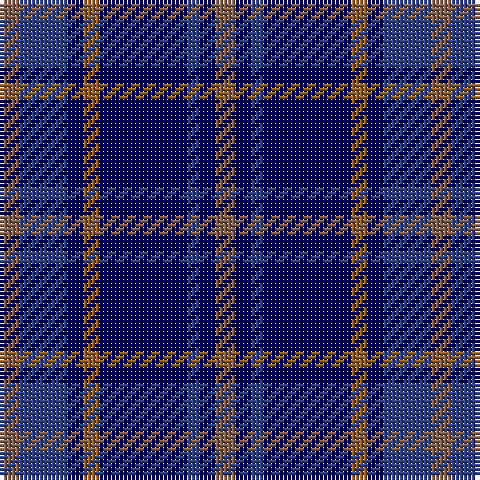

This page is one **sett** — a single exact thread-count. It belongs to the [tartan](/tartans/oi5db12dbi4o4dbi22db3dbi4oi5/)
(the same proportion at any scale), whose colour order is pattern [RBBBRBBR](/stripes/rbbbrbbr/).

Sourced from weddslist.  It is a [8 stripe tartan](/stripes/stripes8/).

Original link http://www.weddslist.com/cgi-bin/tartans/pg.pl?source=sts

## Thread count
LTa/5 B12 DB4 LT4 DB22 B3 DB4 LTa/5

## Palette

Palette: <strong>custom</strong>
<table><thead><tr><th>Colour</th><th>Threads</th><th>Shade</th><th>Base</th><th>OKLCh</th></tr></thead><tbody><tr><td>LTa/</td><td style="text-align:right;font-variant-numeric:tabular-nums">5</td><td><code style="background-color:#806050;">#806050</code> <small style="color:#888">#806050</small></td><td>R <code style="background-color:#CC0000;">#CC0000</code></td><td><small style="color:#888">oklch(51.7% 0.049 47.8)</small></td></tr><tr><td>B</td><td style="text-align:right;font-variant-numeric:tabular-nums">12</td><td><code style="background-color:#304080;">#304080</code> <small style="color:#888">#304080</small></td><td>B <code style="background-color:#2A418A;">#2A418A</code></td><td><small style="color:#888">oklch(39.4% 0.109 270.2)</small></td></tr><tr><td>DB</td><td style="text-align:right;font-variant-numeric:tabular-nums">4</td><td><code style="background-color:#000050;">#000050</code> <small style="color:#888">#000050</small></td><td>B <code style="background-color:#2A418A;">#2A418A</code></td><td><small style="color:#888">oklch(19.5% 0.135 264.1)</small></td></tr><tr><td>LT</td><td style="text-align:right;font-variant-numeric:tabular-nums">4</td><td><code style="background-color:#906030;">#906030</code> <small style="color:#888">#906030</small></td><td>R <code style="background-color:#CC0000;">#CC0000</code></td><td><small style="color:#888">oklch(53.1% 0.089 63.7)</small></td></tr><tr><td>DB</td><td style="text-align:right;font-variant-numeric:tabular-nums">22</td><td><code style="background-color:#000050;">#000050</code> <small style="color:#888">#000050</small></td><td>B <code style="background-color:#2A418A;">#2A418A</code></td><td><small style="color:#888">oklch(19.5% 0.135 264.1)</small></td></tr><tr><td>B</td><td style="text-align:right;font-variant-numeric:tabular-nums">3</td><td><code style="background-color:#304080;">#304080</code> <small style="color:#888">#304080</small></td><td>B <code style="background-color:#2A418A;">#2A418A</code></td><td><small style="color:#888">oklch(39.4% 0.109 270.2)</small></td></tr><tr><td>DB</td><td style="text-align:right;font-variant-numeric:tabular-nums">4</td><td><code style="background-color:#000050;">#000050</code> <small style="color:#888">#000050</small></td><td>B <code style="background-color:#2A418A;">#2A418A</code></td><td><small style="color:#888">oklch(19.5% 0.135 264.1)</small></td></tr><tr><td>LTa/</td><td style="text-align:right;font-variant-numeric:tabular-nums">5</td><td><code style="background-color:#806050;">#806050</code> <small style="color:#888">#806050</small></td><td>R <code style="background-color:#CC0000;">#CC0000</code></td><td><small style="color:#888">oklch(51.7% 0.049 47.8)</small></td></tr></tbody></table>

# Sample pattern

## Nearest tartans

The nearest existing variants by ΔTartan distance, with this tartan at the top so the swatches line up against it.

ΔTartan

Tartan

Sett

—

<a href="/ttd/edit/#slug=oi5db12dbi4o4dbi22db3dbi4oi5">Daks, Muted blue</a> <a class="nn-out" href="/setts/s8/oi5db12dbi4o4dbi22db3dbi4oi5/" title="open its dictionary page">↗</a>

1.08

<a href="/ttd/edit/#slug=dbi6db3dbi6db20k20db8w4~x2">Allianz Deutschland 2012 (Corporate)</a> <a class="nn-out" href="/setts/s7/dbi6db3dbi6db20k20db8w4~x2/" title="open its dictionary page">↗</a>

1.10

<a href="/ttd/edit/#slug=t5db30k25t5db30dp3t5~x2">Van Loo Tartan Tartan Number: 6717. Earliest known date: pre 2005 Nothing See products available Copyright © Blair Urquhart, Comrie, 2015</a> <a class="nn-out" href="/setts/s7/t5db30k25t5db30dp3t5~x2/" title="open its dictionary page">↗</a>

1.12

<a href="/ttd/edit/#slug=k1db7k4lb1k4p1~x4">Scottish Express International</a> <a class="nn-out" href="/setts/s6/k1db7k4lb1k4p1~x4/" title="open its dictionary page">↗</a>

1.20

<a href="/ttd/edit/#slug=k1r1k1db7k1g1k1~x8">Eglinton</a> <a class="nn-out" href="/setts/s7/k1r1k1db7k1g1k1~x8/" title="open its dictionary page">↗</a>

1.23

<a href="/ttd/edit/#slug=k1t1db6k6lp1k6t1db2t1db3t1~x2">Clergy &quot;Two Spirit&quot; (Personal)</a> <a class="nn-out" href="/setts/s11/k1t1db6k6lp1k6t1db2t1db3t1~x2/" title="open its dictionary page">↗</a>

1.26

<a href="/ttd/edit/#slug=dt3db4dt24db6r3db4g3db8w3~x2">Scozia (Fashion)</a> <a class="nn-out" href="/setts/s9/dt3db4dt24db6r3db4g3db8w3~x2/" title="open its dictionary page">↗</a>

1.26

<a href="/ttd/edit/#slug=b11k1b3k5dp9lo1~x2">Joker Fancy Tartan Tartan Number: 6769. Earliest known date: 2005 I have a photo of a fabric swatch that I am trying to match as close as possible. I have been commissioned to make a life size mannequin of Jack Nicholson as the Joker and he wore plaid/tartan pants. I could send you some photos through email and possibly you could help me. Thanks, Andy Garringer USA, January 2008. (96 threads @ 40 epi heavyweight = 2.5 inch repeat) See products available Copyright © Blair Urquhart, Comrie, 2015</a> <a class="nn-out" href="/setts/s6/b11k1b3k5dp9lo1~x2/" title="open its dictionary page">↗</a>

1.27

<a href="/ttd/edit/#slug=db15dp3db30k22dg18dp3dg3w3~x2">Moray (Corporate)</a> <a class="nn-out" href="/setts/s8/db15dp3db30k22dg18dp3dg3w3~x2/" title="open its dictionary page">↗</a>

1.33

<a href="/ttd/edit/#slug=db6w3db21k16dp6k3dp6~x2">Heritage of Scotland</a> <a class="nn-out" href="/setts/s7/db6w3db21k16dp6k3dp6~x2/" title="open its dictionary page">↗</a>

1.35

<a href="/ttd/edit/#slug=db4ly2db17k2r4k2db3k11db3~x2">Stone of Destiny</a> <a class="nn-out" href="/setts/s9/db4ly2db17k2r4k2db3k11db3~x2/" title="open its dictionary page">↗</a>

## Neighbour map

Every grey dot is one of 14359 variants placed by the first two principal components of the ΔTartan feature space (44% of its variance). Red is this tartan; blue dots are its nearest — click one to open its page.

<svg viewBox="0 0 640 380" role="img" style="max-width:100%;height:auto;border:1px solid #e0e0e0;border-radius:4px;display:block" xmlns="http://www.w3.org/2000/svg"><image href="/nn/cloud.v1.png" width="640" height="380"/><a href="/setts/s7/dbi6db3dbi6db20k20db8w4~x2/"><circle cx="235.3" cy="254.6" r="4" fill="#3465a4"><title>Allianz Deutschland 2012 (Corporate)</title></circle></a><a href="/setts/s7/t5db30k25t5db30dp3t5~x2/"><circle cx="349.1" cy="241.3" r="4" fill="#3465a4"><title>Van Loo Tartan Tartan Number: 6717. Earliest known date: pre 2005 Nothing See products available Copyright © Blair Urquhart, Comrie, 2015</title></circle></a><a href="/setts/s6/k1db7k4lb1k4p1~x4/"><circle cx="285.7" cy="258.2" r="4" fill="#3465a4"><title>Scottish Express International</title></circle></a><a href="/setts/s7/k1r1k1db7k1g1k1~x8/"><circle cx="333.9" cy="228.4" r="4" fill="#3465a4"><title>Eglinton</title></circle></a><a href="/setts/s11/k1t1db6k6lp1k6t1db2t1db3t1~x2/"><circle cx="230.4" cy="223.7" r="4" fill="#3465a4"><title>Clergy &quot;Two Spirit&quot; (Personal)</title></circle></a><a href="/setts/s9/dt3db4dt24db6r3db4g3db8w3~x2/"><circle cx="263.9" cy="200.8" r="4" fill="#3465a4"><title>Scozia (Fashion)</title></circle></a><a href="/setts/s6/b11k1b3k5dp9lo1~x2/"><circle cx="263.6" cy="229.4" r="4" fill="#3465a4"><title>Joker Fancy Tartan Tartan Number: 6769. Earliest known date: 2005 I have a photo of a fabric swatch that I am trying to match as close as possible. I have been commissioned to make a life size mannequin of Jack Nicholson as the Joker and he wore plaid/tartan pants. I could send you some photos through email and possibly you could help me. Thanks, Andy Garringer USA, January 2008. (96 threads @ 40 epi heavyweight = 2.5 inch repeat) See products available Copyright © Blair Urquhart, Comrie, 2015</title></circle></a><a href="/setts/s8/db15dp3db30k22dg18dp3dg3w3~x2/"><circle cx="255.2" cy="218.1" r="4" fill="#3465a4"><title>Moray (Corporate)</title></circle></a><a href="/setts/s7/db6w3db21k16dp6k3dp6~x2/"><circle cx="226.2" cy="237.7" r="4" fill="#3465a4"><title>Heritage of Scotland</title></circle></a><a href="/setts/s9/db4ly2db17k2r4k2db3k11db3~x2/"><circle cx="307.8" cy="208.0" r="4" fill="#3465a4"><title>Stone of Destiny</title></circle></a><circle cx="281.0" cy="240.0" r="5" fill="#c00000"/></svg>

ID: /setts/s8/oi5db12dbi4o4dbi22db3dbi4oi5/
