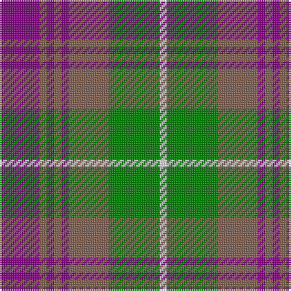

In pattern [BRBRBRGW](/stripes/brbrbrgw/).

This was sourced from weddslist.  It is a [8 stripe tartan](/stripes/stripes8/).

Original link http://www.weddslist.com/cgi-bin/tartans/pg.pl?source=sts

## Thread count
P/22 LT4 P4 LT4 P4 LT22 G28 LN/4

## Palette
Each colour and the base-6 reference it is a variant of.

| Colour | Shade | Base |
|---|---|---|
| G | <code style="background-color:#008000;">#008000</code> `oklch(52.0% 0.177 142.5)` <small>#008000</small> | G <code style="background-color:#006100;">#006100</code> |
| LN | <code style="background-color:#E0E0E0;">#E0E0E0</code> `oklch(90.7% 0.000 89.9)` <small>#E0E0E0</small> | W <code style="background-color:#F7F7F7;">#F7F7F7</code> |
| LT | <code style="background-color:#806050;">#806050</code> `oklch(51.7% 0.049 47.8)` <small>#806050</small> | R <code style="background-color:#CC0000;">#CC0000</code> |
| P | <code style="background-color:#800080;">#800080</code> `oklch(42.1% 0.193 328.4)` <small>#800080</small> | B <code style="background-color:#2A418A;">#2A418A</code> |

# Sample pattern

## Nearest tartans

The nearest existing variants by ΔTartan distance.

1. [Logan #2](/setts/s7/db9r3ly1r3dg9r3ly1~x2/) — ΔT 0.97
1. [Carnegie #3](/setts/s8/r33dg17db50dg17r11dg17r9k7/) — ΔT 0.99
1. [Logan](/setts/s7/db9r3ly1r3g9r3ly1~x2/) — ΔT 1.05
1. [Beck-McSorley](/setts/s8/r1o1m1o7dg7m1dg1m1~x6/) — ΔT 1.09
1. [Cercle de Fermieres de St-Elie . . .](/setts/s7/r2ly1b8r1g7ly1r2~x6/) — ΔT 1.10
1. [Roxburgh Red](/setts/s10/db3g26db3r3db20r3db3r26g5w3~x2/) — ΔT 1.12
1. [Carnegie](/setts/s8/r33g17db50g17r11g17r9k7/) — ΔT 1.12
1. [Unidentified, specimen](/setts/s10/db1g4db1r1db1ly1db5r6db1ly1~x2/) — ΔT 1.12
1. [Wilson's No.193](/setts/s8/g6k1r1t2r2~x4/) — ΔT 1.16
1. [Auld Lang Syne (Philip King Tailoring)](/setts/s8/k1t1k1t7y7k1y1lb1~x6/) — ΔT 1.20

## Neighbour map

Every grey dot is one of 14299 variants placed by the first two principal components of the ΔTartan feature space (44% of its variance). Red is this tartan; blue dots are its nearest — click one to open its page.

<svg viewBox="0 0 640 380" role="img" style="max-width:100%;height:auto;border:1px solid #e0e0e0;border-radius:4px;display:block" xmlns="http://www.w3.org/2000/svg"><image href="/nn/cloud.v1.png" width="640" height="380"/><a href="/setts/s7/db9r3ly1r3dg9r3ly1~x2/"><circle cx="168.2" cy="206.1" r="4" fill="#3465a4"><title>Logan #2</title></circle></a><a href="/setts/s8/r33dg17db50dg17r11dg17r9k7/"><circle cx="171.9" cy="226.0" r="4" fill="#3465a4"><title>Carnegie #3</title></circle></a><a href="/setts/s7/db9r3ly1r3g9r3ly1~x2/"><circle cx="166.9" cy="207.0" r="4" fill="#3465a4"><title>Logan</title></circle></a><a href="/setts/s8/r1o1m1o7dg7m1dg1m1~x6/"><circle cx="235.7" cy="203.5" r="4" fill="#3465a4"><title>Beck-McSorley</title></circle></a><a href="/setts/s7/r2ly1b8r1g7ly1r2~x6/"><circle cx="185.4" cy="203.4" r="4" fill="#3465a4"><title>Cercle de Fermieres de St-Elie . . .</title></circle></a><a href="/setts/s10/db3g26db3r3db20r3db3r26g5w3~x2/"><circle cx="192.7" cy="173.8" r="4" fill="#3465a4"><title>Roxburgh Red</title></circle></a><a href="/setts/s8/r33g17db50g17r11g17r9k7/"><circle cx="158.1" cy="221.0" r="4" fill="#3465a4"><title>Carnegie</title></circle></a><a href="/setts/s10/db1g4db1r1db1ly1db5r6db1ly1~x2/"><circle cx="188.7" cy="196.1" r="4" fill="#3465a4"><title>Unidentified, specimen</title></circle></a><a href="/setts/s8/g6k1r1t2r2~x4/"><circle cx="164.3" cy="218.3" r="4" fill="#3465a4"><title>Wilson's No.193</title></circle></a><a href="/setts/s8/k1t1k1t7y7k1y1lb1~x6/"><circle cx="234.4" cy="202.6" r="4" fill="#3465a4"><title>Auld Lang Syne (Philip King Tailoring)</title></circle></a><circle cx="187.2" cy="211.2" r="5" fill="#c00000"/></svg>

ID: /setts/s8/p11o2p2o2p2o11g14w2~x2/
