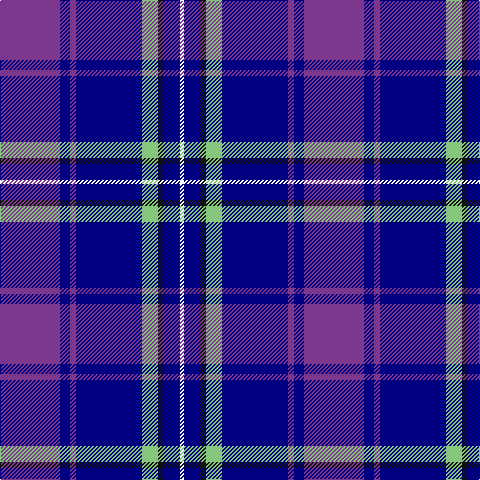

In pattern [BBBBYKBW](/stripes/bbbbykbw/).

This was sourced from register-of-tartans.  It is a [8 stripe tartan](/stripes/stripes8/).

Original link https://www.tartanregister.gov.uk/tartanDetails.aspx?ref=10441

## Register references

External register numbers recorded for this tartan.

- Scottish Register of Tartans: [10441](https://www.tartanregister.gov.uk/tartanDetails.aspx?ref=10441)

## Thread count
P/60 DB10 P6 DB66 LG16 K6 DB16 W/4

## Palette
Each colour and its ΔE from the base-6 reference it is a variant of.

| Colour | Shade | Base | ΔE (OKLab) |
|---|---|---|---|
| DB | <code style="background-color:#000080;">#000080</code> `#000080` | B <code style="background-color:#2A418A;">#2A418A</code> | 0.14 |
| K | <code style="background-color:#101010;">#101010</code> `#101010` | K <code style="background-color:#000000;">#000000</code> | 0.17 |
| LG | <code style="background-color:#86C67C;">#86C67C</code> `#86C67C` | Y <code style="background-color:#F2BF00;">#F2BF00</code> | 0.15 |
| P | <code style="background-color:#7A378B;">#7A378B</code> `#7A378B` | B <code style="background-color:#2A418A;">#2A418A</code> | 0.13 |
| W | <code style="background-color:#FFFFFF;">#FFFFFF</code> `#FFFFFF` | W <code style="background-color:#F7F7F7;">#F7F7F7</code> | 0.02 |

# Sample pattern

## Nearest tartans

The nearest existing variants by ΔTartan distance.

1. [Aberdeen Academy of Performing Arts](/setts/s6/db4p2dp3db24b24w3~x2/) — ΔT 1.24
1. [Gorman Family (Canada) (Personal)](/setts/s6/g6n16db49n14db2w6~x2/) — ΔT 1.24
1. [Dinwiddie Hunting](/setts/s10/ly6db3k3db36k10n18db6k2g4k3~x2/) — ΔT 1.35
1. [Federal Bureau of Investigation](/setts/s7/db6lb2db2lb3db16b26r2~x2/) — ΔT 1.37
1. [US Air Force Reserve Pipe Band Military Tartan Tartan Number: 2437. Earliest known date: 01/01/1988 One of a series of US Military tartans woven exclusively by the Strathmore Woollen Company of Forfar and adopted by the Band of the Air Force Reserve, Georgia, USA in the early 1990s. Although this has no official US Military recognition, it has been widely accepted by US servicemen and their families with Air Force connections as a representative design. Originally called 'Lady Jane of St Cirus', the design was shown to members of the pipe band who liked it sufficiently to adopt it (with Strathmore's agreement). See products available Copyright © Blair Urquhart, Comrie, 2015](/setts/s9/db44k3k20r3db8lg34db3db2lg15~x2/) — ΔT 1.38
1. [Int. Police Association (Official)](/setts/s7/db7r3db26t2db2t26ly4~x2/) — ΔT 1.39
1. [Aberdeen Academy of Performing Art](/setts/s6/db4dp2dp3db24t24w3~x2/) — ΔT 1.39
1. [Musselburgh](/setts/s9/t14lb1t3lo2t3lb1t4db24r3~x4/) — ΔT 1.39
1. [U.S. Forces Thurso (Military)](/setts/s7/db40r3k10lo2lr15w2lr4~x2/) — ΔT 1.40
1. [US Air Force Reserve Pipe Band](/setts/s9/db44lo3k20r3db8lg34db3db2lg15~x2/) — ΔT 1.41

## Neighbour map

Every grey dot is one of 14299 variants placed by the first two principal components of the ΔTartan feature space (44% of its variance). Red is this tartan; blue dots are its nearest — click one to open its page.

<svg viewBox="0 0 640 380" role="img" style="max-width:100%;height:auto;border:1px solid #e0e0e0;border-radius:4px;display:block" xmlns="http://www.w3.org/2000/svg"><image href="/nn/cloud.v1.png" width="640" height="380"/><a href="/setts/s6/db4p2dp3db24b24w3~x2/"><circle cx="264.6" cy="188.0" r="4" fill="#3465a4"><title>Aberdeen Academy of Performing Arts</title></circle></a><a href="/setts/s6/g6n16db49n14db2w6~x2/"><circle cx="306.0" cy="159.2" r="4" fill="#3465a4"><title>Gorman Family (Canada) (Personal)</title></circle></a><a href="/setts/s10/ly6db3k3db36k10n18db6k2g4k3~x2/"><circle cx="238.1" cy="133.2" r="4" fill="#3465a4"><title>Dinwiddie Hunting</title></circle></a><a href="/setts/s7/db6lb2db2lb3db16b26r2~x2/"><circle cx="288.5" cy="190.6" r="4" fill="#3465a4"><title>Federal Bureau of Investigation</title></circle></a><a href="/setts/s9/db44k3k20r3db8lg34db3db2lg15~x2/"><circle cx="230.7" cy="139.1" r="4" fill="#3465a4"><title>US Air Force Reserve Pipe Band Military Tartan Tartan Number: 2437. Earliest known date: 01/01/1988 One of a series of US Military tartans woven exclusively by the Strathmore Woollen Company of Forfar and adopted by the Band of the Air Force Reserve, Georgia, USA in the early 1990s. Although this has no official US Military recognition, it has been widely accepted by US servicemen and their families with Air Force connections as a representative design. Originally called 'Lady Jane of St Cirus', the design was shown to members of the pipe band who liked it sufficiently to adopt it (with Strathmore's agreement). See products available Copyright © Blair Urquhart, Comrie, 2015</title></circle></a><a href="/setts/s7/db7r3db26t2db2t26ly4~x2/"><circle cx="288.6" cy="179.7" r="4" fill="#3465a4"><title>Int. Police Association (Official)</title></circle></a><a href="/setts/s6/db4dp2dp3db24t24w3~x2/"><circle cx="266.1" cy="183.5" r="4" fill="#3465a4"><title>Aberdeen Academy of Performing Art</title></circle></a><a href="/setts/s9/t14lb1t3lo2t3lb1t4db24r3~x4/"><circle cx="273.9" cy="122.6" r="4" fill="#3465a4"><title>Musselburgh</title></circle></a><a href="/setts/s7/db40r3k10lo2lr15w2lr4~x2/"><circle cx="259.8" cy="120.5" r="4" fill="#3465a4"><title>U.S. Forces Thurso (Military)</title></circle></a><a href="/setts/s9/db44lo3k20r3db8lg34db3db2lg15~x2/"><circle cx="231.2" cy="138.4" r="4" fill="#3465a4"><title>US Air Force Reserve Pipe Band</title></circle></a><circle cx="280.0" cy="156.9" r="5" fill="#c00000"/></svg>

ID: /setts/s8/p30db5p3db33lg8k3db8w2~x2/
