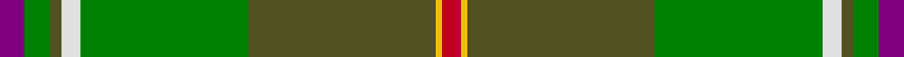

This page is one **sett** — a single exact thread-count. It belongs to the [tartan](/tartans/p4g4dy2w3g27dy30ly1r3/)
(the same proportion at any scale), whose colour order is pattern [BGGWGGYR](/stripes/bggwggyr/).

Sourced from weddslist.  It is a [8 stripe tartan](/stripes/stripes8/).

Original link http://www.weddslist.com/cgi-bin/tartans/pg.pl?source=sts

## Thread count
P/8 G8 T4 LN6 G54 T60 Y2 R/6

## Palette

Palette: <strong>Tartan Dictionary</strong> <small style="color:#888">(1 of 6 colours)</small>
<table><thead><tr><th>Colour</th><th>Threads</th><th>Shade</th><th>Base</th><th>OKLCh</th></tr></thead><tbody><tr><td>P/</td><td style="text-align:right;font-variant-numeric:tabular-nums">8</td><td><code style="background-color:#800080;">#800080</code> <small style="color:#888">#800080</small></td><td>B <code style="background-color:#2A418A;">#2A418A</code></td><td><small style="color:#888">oklch(42.1% 0.193 328.4)</small></td></tr><tr><td>G</td><td style="text-align:right;font-variant-numeric:tabular-nums">8</td><td><code style="background-color:#008000;">#008000</code> <small style="color:#888">#008000</small></td><td>G <code style="background-color:#006100;">#006100</code></td><td><small style="color:#888">oklch(52.0% 0.177 142.5)</small></td></tr><tr><td>T</td><td style="text-align:right;font-variant-numeric:tabular-nums">4</td><td><code style="background-color:#505020;">#505020</code> <small style="color:#888">#505020</small></td><td>G <code style="background-color:#006100;">#006100</code></td><td><small style="color:#888">oklch(42.0% 0.068 109.0)</small></td></tr><tr><td>LN</td><td style="text-align:right;font-variant-numeric:tabular-nums">6</td><td><code style="background-color:#E0E0E0;">#E0E0E0</code> <small style="color:#888">#E0E0E0</small></td><td>W <code style="background-color:#F7F7F7;">#F7F7F7</code></td><td><small style="color:#888">oklch(90.7% 0.000 89.9)</small></td></tr><tr><td>G</td><td style="text-align:right;font-variant-numeric:tabular-nums">54</td><td><code style="background-color:#008000;">#008000</code> <small style="color:#888">#008000</small></td><td>G <code style="background-color:#006100;">#006100</code></td><td><small style="color:#888">oklch(52.0% 0.177 142.5)</small></td></tr><tr><td>T</td><td style="text-align:right;font-variant-numeric:tabular-nums">60</td><td><code style="background-color:#505020;">#505020</code> <small style="color:#888">#505020</small></td><td>G <code style="background-color:#006100;">#006100</code></td><td><small style="color:#888">oklch(42.0% 0.068 109.0)</small></td></tr><tr><td>Y</td><td style="text-align:right;font-variant-numeric:tabular-nums">2</td><td><code style="background-color:#F0C000;">#F0C000</code> <small style="color:#888">#F0C000</small></td><td>Y <code style="background-color:#F2BF00;">#F2BF00</code></td><td><small style="color:#888">oklch(82.7% 0.169 90.5)</small></td></tr><tr><td>R/</td><td style="text-align:right;font-variant-numeric:tabular-nums">6</td><td><code style="background-color:#C00020;">#C00020</code> <small style="color:#888">#C00020</small></td><td>R <code style="background-color:#CC0000;">#CC0000</code></td><td><small style="color:#888">oklch(50.9% 0.206 24.5)</small></td></tr></tbody></table>

# Sample pattern

## Nearest tartans

The nearest existing variants by ΔTartan distance, with this tartan at the top so the swatches line up against it.

ΔTartan

Tartan

Sett

—

<a href="/ttd/edit/#slug=p4g4dy2w3g27dy30ly1r3~x2">Hannigan of Dirleton</a> <a class="nn-out" href="/setts/s8/p4g4dy2w3g27dy30ly1r3~x2/" title="open its dictionary page">↗</a>

1.25

<a href="/ttd/edit/#slug=g6t22g6dy20ly1g45t1w5~x2">Elbrick Hunting (Personal)</a> <a class="nn-out" href="/setts/s8/g6t22g6dy20ly1g45t1w5~x2/" title="open its dictionary page">↗</a>

1.25

<a href="/ttd/edit/#slug=dp4g4y2w3g27y30ly1r3~x2">Hannigan of Dirleton (Personal)</a> <a class="nn-out" href="/setts/s8/dp4g4y2w3g27y30ly1r3~x2/" title="open its dictionary page">↗</a>

1.35

<a href="/ttd/edit/#slug=lo9g18t9r1w1db1~x4">T.H.E. C.O.G. USA (Corporate)</a> <a class="nn-out" href="/setts/s6/lo9g18t9r1w1db1~x4/" title="open its dictionary page">↗</a>

1.41

<a href="/ttd/edit/#slug=dt6w1lo24g6n3g1n3g1n12r1~x2">Chisholm Colonial</a> <a class="nn-out" href="/setts/s10/dt6w1lo24g6n3g1n3g1n12r1~x2/" title="open its dictionary page">↗</a>

1.48

<a href="/ttd/edit/#slug=g62o3g3o31k4g5t5r3~x2">Sheffield, City of (District)</a> <a class="nn-out" href="/setts/s8/g62o3g3o31k4g5t5r3~x2/" title="open its dictionary page">↗</a>

1.55

<a href="/ttd/edit/#slug=k3r12dy8lo2g36dy10t2~x2">Snelgrove Htg (Name)</a> <a class="nn-out" href="/setts/s7/k3r12dy8lo2g36dy10t2~x2/" title="open its dictionary page">↗</a>

1.56

<a href="/ttd/edit/#slug=g22r3w1g2r3t16k3ly2~x4">Stirling University (Corporate)</a> <a class="nn-out" href="/setts/s8/g22r3w1g2r3t16k3ly2~x4/" title="open its dictionary page">↗</a>

1.56

<a href="/ttd/edit/#slug=dy4g26lb1g2lb2dy4lg26dy4g3ly3~x2">Carter (Savannah) (Personal)</a> <a class="nn-out" href="/setts/s10/dy4g26lb1g2lb2dy4lg26dy4g3ly3~x2/" title="open its dictionary page">↗</a>

1.57

<a href="/ttd/edit/#slug=g45k4r2g4r2k4n21r5~x2">Shiach (Personal)</a> <a class="nn-out" href="/setts/s8/g45k4r2g4r2k4n21r5~x2/" title="open its dictionary page">↗</a>

1.57

<a href="/ttd/edit/#slug=g22r3k1g2r3t16k3ly2~x4">Stirling, University of Corporate Univ Tartan Tartan Number: 2297. Earliest known date: 1994 This is the accepted University design. See products available Copyright © Blair Urquhart, Comrie, 2015</a> <a class="nn-out" href="/setts/s8/g22r3k1g2r3t16k3ly2~x4/" title="open its dictionary page">↗</a>

## Neighbour map

Every grey dot is one of 14299 variants placed by the first two principal components of the ΔTartan feature space (44% of its variance). Red is this tartan; blue dots are its nearest — click one to open its page.

<svg viewBox="0 0 640 380" role="img" style="max-width:100%;height:auto;border:1px solid #e0e0e0;border-radius:4px;display:block" xmlns="http://www.w3.org/2000/svg"><image href="/nn/cloud.v1.png" width="640" height="380"/><a href="/setts/s8/g6t22g6dy20ly1g45t1w5~x2/"><circle cx="345.8" cy="127.7" r="4" fill="#3465a4"><title>Elbrick Hunting (Personal)</title></circle></a><a href="/setts/s8/dp4g4y2w3g27y30ly1r3~x2/"><circle cx="333.1" cy="146.4" r="4" fill="#3465a4"><title>Hannigan of Dirleton (Personal)</title></circle></a><a href="/setts/s6/lo9g18t9r1w1db1~x4/"><circle cx="269.0" cy="171.9" r="4" fill="#3465a4"><title>T.H.E. C.O.G. USA (Corporate)</title></circle></a><a href="/setts/s10/dt6w1lo24g6n3g1n3g1n12r1~x2/"><circle cx="265.1" cy="127.5" r="4" fill="#3465a4"><title>Chisholm Colonial</title></circle></a><a href="/setts/s8/g62o3g3o31k4g5t5r3~x2/"><circle cx="364.5" cy="142.2" r="4" fill="#3465a4"><title>Sheffield, City of (District)</title></circle></a><a href="/setts/s7/k3r12dy8lo2g36dy10t2~x2/"><circle cx="287.5" cy="153.8" r="4" fill="#3465a4"><title>Snelgrove Htg (Name)</title></circle></a><a href="/setts/s8/g22r3w1g2r3t16k3ly2~x4/"><circle cx="250.5" cy="124.0" r="4" fill="#3465a4"><title>Stirling University (Corporate)</title></circle></a><a href="/setts/s10/dy4g26lb1g2lb2dy4lg26dy4g3ly3~x2/"><circle cx="228.4" cy="112.8" r="4" fill="#3465a4"><title>Carter (Savannah) (Personal)</title></circle></a><a href="/setts/s8/g45k4r2g4r2k4n21r5~x2/"><circle cx="369.3" cy="154.6" r="4" fill="#3465a4"><title>Shiach (Personal)</title></circle></a><a href="/setts/s8/g22r3k1g2r3t16k3ly2~x4/"><circle cx="250.4" cy="124.7" r="4" fill="#3465a4"><title>Stirling, University of Corporate Univ Tartan Tartan Number: 2297. Earliest known date: 1994 This is the accepted University design. See products available Copyright © Blair Urquhart, Comrie, 2015</title></circle></a><circle cx="306.1" cy="129.9" r="5" fill="#c00000"/></svg>

ID: /setts/s8/p4g4dy2w3g27dy30ly1r3~x2/
