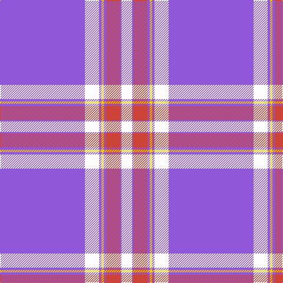

In pattern [BWBYBRBW](/stripes/bwbybrbw/).

This was sourced from tartans-authority.  It is a [8 stripe tartan](/stripes/stripes8/).

Original link http://www.tartansauthority.com/tartan-ferret/display/8586/

## Thread count
P/144 W24 P4 Y4 P4 R24 P2 W/18

## Palette
Each colour and its ΔE from the base-6 reference it is a variant of.

| Colour | Shade | Base | ΔE (OKLab) |
|---|---|---|---|
| P | <code style="background-color:#9058D8;">#9058D8</code> `#9058D8` | B <code style="background-color:#2A418A;">#2A418A</code> | 0.21 |
| R | <code style="background-color:#CC4438;">#CC4438</code> `#CC4438` | R <code style="background-color:#CC0000;">#CC0000</code> | 0.06 |
| W | <code style="background-color:#FCFCFC;">#FCFCFC</code> `#FCFCFC` | W <code style="background-color:#F7F7F7;">#F7F7F7</code> | 0.01 |
| Y | <code style="background-color:#FCCC00;">#FCCC00</code> `#FCCC00` | Y <code style="background-color:#F2BF00;">#F2BF00</code> | 0.04 |

# Sample pattern

## Nearest tartans

The nearest existing variants by ΔTartan distance.

1. [SiMBA](/setts/s6/dp2g3lp21dp42w1g2~x2/) — ΔT 1.82
1. [Menzies Mauve and White](/setts/s8/dp120w10k4w11k3w5k3w19/) — ΔT 1.95
1. [Menzies, Mauve and White](/setts/s8/p120w10k4w11k3w5k3w19/) — ΔT 2.02
1. [Dunlop, dress](/setts/s8/w3db1w30db1p28w1p1w3~x2/) — ΔT 2.24
1. [Baker](/setts/s8/db28o3w1o3db4w2p1w5~x4/) — ΔT 2.47
1. [Baker Dress Family Tartan Tartan Number: 2180. Earliest known date: 1999 STS notes 'Sample in trade specimens file.' See products available Copyright © Blair Urquhart, Comrie, 2015](/setts/s8/db28ly3w1ly3db4w2r1w5~x4/) — ΔT 2.48
1. [Dunlop Dress](/setts/s8/w3db1w30db1dp28w1dp1w3~x2/) — ΔT 2.50
1. [Florence (Fashion)](/setts/s13/o32dp8o1dp1w1o1w1o1o1dp1o1o4dp1~x4/) — ΔT 2.52
1. [Masai Shuka 11 (Artefact)](/setts/s10/p30k5r2k1r10w1r1w1k3w2~x4/) — ΔT 2.52
1. [Jackson (Personal)](/setts/s8/g5ly2dp40w1db15w1db1w1~x2/) — ΔT 2.52

## Neighbour map

Every grey dot is one of 14299 variants placed by the first two principal components of the ΔTartan feature space (44% of its variance). Red is this tartan; blue dots are its nearest — click one to open its page.

<svg viewBox="0 0 640 380" role="img" style="max-width:100%;height:auto;border:1px solid #e0e0e0;border-radius:4px;display:block" xmlns="http://www.w3.org/2000/svg"><image href="/nn/cloud.v1.png" width="640" height="380"/><a href="/setts/s6/dp2g3lp21dp42w1g2~x2/"><circle cx="441.8" cy="121.8" r="4" fill="#3465a4"><title>SiMBA</title></circle></a><a href="/setts/s8/dp120w10k4w11k3w5k3w19/"><circle cx="475.7" cy="99.1" r="4" fill="#3465a4"><title>Menzies Mauve and White</title></circle></a><a href="/setts/s8/p120w10k4w11k3w5k3w19/"><circle cx="479.9" cy="91.6" r="4" fill="#3465a4"><title>Menzies, Mauve and White</title></circle></a><a href="/setts/s8/w3db1w30db1p28w1p1w3~x2/"><circle cx="376.5" cy="107.4" r="4" fill="#3465a4"><title>Dunlop, dress</title></circle></a><a href="/setts/s8/db28o3w1o3db4w2p1w5~x4/"><circle cx="435.7" cy="125.1" r="4" fill="#3465a4"><title>Baker</title></circle></a><a href="/setts/s8/db28ly3w1ly3db4w2r1w5~x4/"><circle cx="412.8" cy="112.5" r="4" fill="#3465a4"><title>Baker Dress Family Tartan Tartan Number: 2180. Earliest known date: 1999 STS notes 'Sample in trade specimens file.' See products available Copyright © Blair Urquhart, Comrie, 2015</title></circle></a><a href="/setts/s8/w3db1w30db1dp28w1dp1w3~x2/"><circle cx="362.8" cy="101.3" r="4" fill="#3465a4"><title>Dunlop Dress</title></circle></a><a href="/setts/s13/o32dp8o1dp1w1o1w1o1o1dp1o1o4dp1~x4/"><circle cx="524.5" cy="79.3" r="4" fill="#3465a4"><title>Florence (Fashion)</title></circle></a><a href="/setts/s10/p30k5r2k1r10w1r1w1k3w2~x4/"><circle cx="343.7" cy="88.2" r="4" fill="#3465a4"><title>Masai Shuka 11 (Artefact)</title></circle></a><a href="/setts/s8/g5ly2dp40w1db15w1db1w1~x2/"><circle cx="416.1" cy="94.8" r="4" fill="#3465a4"><title>Jackson (Personal)</title></circle></a><circle cx="476.3" cy="81.4" r="5" fill="#c00000"/></svg>

ID: /setts/s8/p72w12p2ly2p2r12p1w9~x2/
