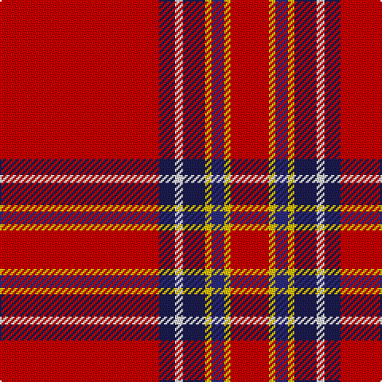

This page is one **sett** — a single exact thread-count. It belongs to the [tartan](/tartans/r100dbi10w5dbi14ly4db8ly4r24/)
(the same proportion at any scale), whose colour order is pattern [RBWBYBYR](/stripes/rbwbybyr/).

Sourced from tartans-authority.  It is a [8 stripe tartan](/stripes/stripes8/).

Original link http://www.tartansauthority.com/tartan-ferret/display/5266/

## Register references

External register numbers recorded for this tartan.

- Scottish Tartans Authority (ITI): 5266

## Thread count
R/100 DBa10 LN5 DBa14 Y4 DB8 Y4 R/24

## Palette

Palette: <strong>Tartan Register</strong>
<table><thead><tr><th>Colour</th><th>Threads</th><th>Shade</th><th>Base</th><th>OKLCh</th></tr></thead><tbody><tr><td>R/</td><td style="text-align:right;font-variant-numeric:tabular-nums">100</td><td><code style="background-color:#C80000;">#C80000</code> <small style="color:#888">#C80000</small></td><td>R <code style="background-color:#CC0000;">#CC0000</code></td><td><small style="color:#888">oklch(52.3% 0.215 29.2)</small></td></tr><tr><td>DBa</td><td style="text-align:right;font-variant-numeric:tabular-nums">10</td><td><code style="background-color:#1C1C50;">#1C1C50</code> <small style="color:#888">#1C1C50</small></td><td>B <code style="background-color:#2A418A;">#2A418A</code></td><td><small style="color:#888">oklch(26.2% 0.093 277.9)</small></td></tr><tr><td>LN</td><td style="text-align:right;font-variant-numeric:tabular-nums">5</td><td><code style="background-color:#E0E0E0;">#E0E0E0</code> <small style="color:#888">#E0E0E0</small></td><td>W <code style="background-color:#F7F7F7;">#F7F7F7</code></td><td><small style="color:#888">oklch(90.7% 0.000 89.9)</small></td></tr><tr><td>DBa</td><td style="text-align:right;font-variant-numeric:tabular-nums">14</td><td><code style="background-color:#1C1C50;">#1C1C50</code> <small style="color:#888">#1C1C50</small></td><td>B <code style="background-color:#2A418A;">#2A418A</code></td><td><small style="color:#888">oklch(26.2% 0.093 277.9)</small></td></tr><tr><td>Y</td><td style="text-align:right;font-variant-numeric:tabular-nums">4</td><td><code style="background-color:#E8C000;">#E8C000</code> <small style="color:#888">#E8C000</small></td><td>Y <code style="background-color:#F2BF00;">#F2BF00</code></td><td><small style="color:#888">oklch(81.9% 0.168 93.7)</small></td></tr><tr><td>DB</td><td style="text-align:right;font-variant-numeric:tabular-nums">8</td><td><code style="background-color:#2C2C80;">#2C2C80</code> <small style="color:#888">#2C2C80</small></td><td>B <code style="background-color:#2A418A;">#2A418A</code></td><td><small style="color:#888">oklch(35.0% 0.138 276.6)</small></td></tr><tr><td>Y</td><td style="text-align:right;font-variant-numeric:tabular-nums">4</td><td><code style="background-color:#E8C000;">#E8C000</code> <small style="color:#888">#E8C000</small></td><td>Y <code style="background-color:#F2BF00;">#F2BF00</code></td><td><small style="color:#888">oklch(81.9% 0.168 93.7)</small></td></tr><tr><td>R/</td><td style="text-align:right;font-variant-numeric:tabular-nums">24</td><td><code style="background-color:#C80000;">#C80000</code> <small style="color:#888">#C80000</small></td><td>R <code style="background-color:#CC0000;">#CC0000</code></td><td><small style="color:#888">oklch(52.3% 0.215 29.2)</small></td></tr></tbody></table>

# Sample pattern

## Nearest tartans

The nearest existing variants by ΔTartan distance, with this tartan at the top so the swatches line up against it.

ΔTartan

Tartan

Sett

—

<a href="/ttd/edit/#slug=r100dbi10w5dbi14ly4db8ly4r24">Earl of Inverness (Royal)</a> <a class="nn-out" href="/setts/s8/r100dbi10w5dbi14ly4db8ly4r24/" title="open its dictionary page">↗</a>

0.47

<a href="/ttd/edit/#slug=r68db27r5ly3r5g3r13t3~x2">De Nardi #2 (Personal)</a> <a class="nn-out" href="/setts/s8/r68db27r5ly3r5g3r13t3~x2/" title="open its dictionary page">↗</a>

0.55

<a href="/ttd/edit/#slug=r60db8w3db10ly3t4ly3r19~x2">Princess Elizabeth #2</a> <a class="nn-out" href="/setts/s8/r60db8w3db10ly3t4ly3r19~x2/" title="open its dictionary page">↗</a>

0.70

<a href="/ttd/edit/#slug=r68db26r5ly3r5g3r13o3~x2">De Nardi (Personal)</a> <a class="nn-out" href="/setts/s8/r68db26r5ly3r5g3r13o3~x2/" title="open its dictionary page">↗</a>

0.95

<a href="/ttd/edit/#slug=r23k1g9r3db1lr1r1~x4">Perthshire Clayquhat District Tartan Tartan Number: 2800. Earliest known date: c.1739 Early historic plaid woven for (or by) Janet Craigie (nee Spalding) from the Braes of Clayquhat (now Cloquhat) in East Perthshire. Two pieces are now in the possession of the Scottish Tartans Authority (2014). See http://scottishtartans.co.uk/An_Unnamed_C18th_Plaid_from_Bridge_of_Cally.pdf See products available Copyright © Blair Urquhart, Comrie, 2015</a> <a class="nn-out" href="/setts/s7/r23k1g9r3db1lr1r1~x4/" title="open its dictionary page">↗</a>

0.97

<a href="/ttd/edit/#slug=r51lr2k11lo3r11lo3r11g3~x2">Hackston (Green stripe) (Portrait)</a> <a class="nn-out" href="/setts/s8/r51lr2k11lo3r11lo3r11g3~x2/" title="open its dictionary page">↗</a>

0.98

<a href="/ttd/edit/#slug=r72db6ly2db11t2db2t2r9k2~x2">Junor (Personal)</a> <a class="nn-out" href="/setts/s9/r72db6ly2db11t2db2t2r9k2~x2/" title="open its dictionary page">↗</a>

1.03

<a href="/ttd/edit/#slug=r48w3k3g2ly6g2r6~x4">Ferguson the Astronomer</a> <a class="nn-out" href="/setts/s7/r48w3k3g2ly6g2r6~x4/" title="open its dictionary page">↗</a>

1.06

<a href="/ttd/edit/#slug=r36db3w1db6g1k1g1r9~x4">Inverness - 1829 (District)</a> <a class="nn-out" href="/setts/s8/r36db3w1db6g1k1g1r9~x4/" title="open its dictionary page">↗</a>

1.08

<a href="/ttd/edit/#slug=r40k3r2db12r2g2r2g2ly3~x2">Oliver, dress</a> <a class="nn-out" href="/setts/s9/r40k3r2db12r2g2r2g2ly3~x2/" title="open its dictionary page">↗</a>

1.10

<a href="/ttd/edit/#slug=r72k6lb2k11ly2db2ly2r18~x2">Princess Elizabeth (Royal)</a> <a class="nn-out" href="/setts/s8/r72k6lb2k11ly2db2ly2r18~x2/" title="open its dictionary page">↗</a>

## Neighbour map

Every grey dot is one of 14359 variants placed by the first two principal components of the ΔTartan feature space (44% of its variance). Red is this tartan; blue dots are its nearest — click one to open its page.

<svg viewBox="0 0 640 380" role="img" style="max-width:100%;height:auto;border:1px solid #e0e0e0;border-radius:4px;display:block" xmlns="http://www.w3.org/2000/svg"><image href="/nn/cloud.v1.png" width="640" height="380"/><a href="/setts/s8/r68db27r5ly3r5g3r13t3~x2/"><circle cx="474.1" cy="114.4" r="4" fill="#3465a4"><title>De Nardi #2 (Personal)</title></circle></a><a href="/setts/s8/r60db8w3db10ly3t4ly3r19~x2/"><circle cx="462.0" cy="114.9" r="4" fill="#3465a4"><title>Princess Elizabeth #2</title></circle></a><a href="/setts/s8/r68db26r5ly3r5g3r13o3~x2/"><circle cx="488.3" cy="118.1" r="4" fill="#3465a4"><title>De Nardi (Personal)</title></circle></a><a href="/setts/s7/r23k1g9r3db1lr1r1~x4/"><circle cx="463.2" cy="121.0" r="4" fill="#3465a4"><title>Perthshire Clayquhat District Tartan Tartan Number: 2800. Earliest known date: c.1739 Early historic plaid woven for (or by) Janet Craigie (nee Spalding) from the Braes of Clayquhat (now Cloquhat) in East Perthshire. Two pieces are now in the possession of the Scottish Tartans Authority (2014). See http://scottishtartans.co.uk/An_Unnamed_C18th_Plaid_from_Bridge_of_Cally.pdf See products available Copyright © Blair Urquhart, Comrie, 2015</title></circle></a><a href="/setts/s8/r51lr2k11lo3r11lo3r11g3~x2/"><circle cx="521.1" cy="115.3" r="4" fill="#3465a4"><title>Hackston (Green stripe) (Portrait)</title></circle></a><a href="/setts/s9/r72db6ly2db11t2db2t2r9k2~x2/"><circle cx="526.4" cy="70.5" r="4" fill="#3465a4"><title>Junor (Personal)</title></circle></a><a href="/setts/s7/r48w3k3g2ly6g2r6~x4/"><circle cx="516.9" cy="98.7" r="4" fill="#3465a4"><title>Ferguson the Astronomer</title></circle></a><a href="/setts/s8/r36db3w1db6g1k1g1r9~x4/"><circle cx="555.2" cy="91.8" r="4" fill="#3465a4"><title>Inverness - 1829 (District)</title></circle></a><a href="/setts/s9/r40k3r2db12r2g2r2g2ly3~x2/"><circle cx="430.4" cy="98.6" r="4" fill="#3465a4"><title>Oliver, dress</title></circle></a><a href="/setts/s8/r72k6lb2k11ly2db2ly2r18~x2/"><circle cx="549.6" cy="84.6" r="4" fill="#3465a4"><title>Princess Elizabeth (Royal)</title></circle></a><circle cx="483.0" cy="99.7" r="5" fill="#c00000"/></svg>

ID: /setts/s8/r100dbi10w5dbi14ly4db8ly4r24/
