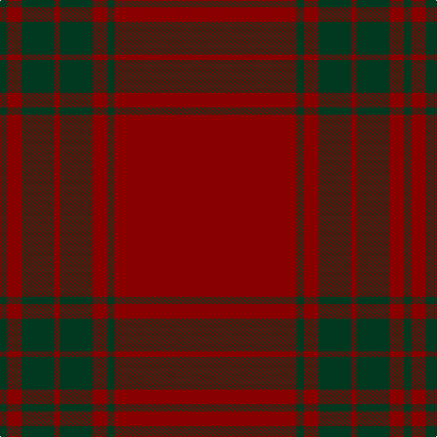

**Bands:** [GRGRGRGR](/stripes/grgrgrgr/) · **Stripes:** [DG R DG R DG R DG R](/stripes/stripes8/) DG R DG R DG R DG R

This was sourced from register-of-tartans.  It is a [8 band tartan](/bands/bands8/).

Original link https://www.tartanregister.gov.uk/tartanDetails.aspx?ref=1925

## Register references

External register numbers recorded for this tartan.

- Scottish Register of Tartans: [1925](https://www.tartanregister.gov.uk/tartanDetails.aspx?ref=1925)
- Scottish Tartans Authority (ITI): 2696
- Scottish Tartans World Register: 2696

## Variants

Other setts woven to the same stripe pattern.

- [Menzies Hunting](/setts/s8/dg48r4dg2r4dg6r2dg3r9/)
- [Menzies Hunting](/setts/s8/dg48r4dg2r4dg6r2dg3r9~x2/)

## Thread count
DG/8 DR16 DG36 DR6 DG36 DR16 DG8 DR/200

## Palette
Each colour and its ΔE from the base-6 reference it is a variant of.

| Colour | Shade | Base | ΔE (OKLab) |
|---|---|---|---|
| DG | <code style="background-color:#003820;">#003820</code> `#003820` | G <code style="background-color:#006100;">#006100</code> | 0.15 |
| DR | <code style="background-color:#880000;">#880000</code> `#880000` | R <code style="background-color:#CC0000;">#CC0000</code> | 0.15 |

# Sample pattern

## Nearest tartans

The nearest existing variants by ΔTartan distance.

1. [Lomond](/setts/s8/r32n5r2n5r6n2r1n7~x4/) — ΔT 1.69
1. [Inverness Augustus](/setts/s7/m18dg1k5dg1k1dg1m9~x2/) — ΔT 1.80
1. [KaDeWe (Corporate)](/setts/s5/r100dg4r8dg18r3~x2/) — ΔT 1.93
1. [Fitzgibbon Red (Name)](/setts/s9/r2k6r24g2r2r1r6k1r2~x2/) — ΔT 2.05
1. [Fitzgibbon Red](/setts/s9/r2dt6r24dg2r2r1r6dt1r2~x2/) — ΔT 2.28
1. [Masai Shuka 06 (Artefact)](/setts/s10/r50dp1r4dp3r8dp15r2dp2r3dp4~x2/) — ΔT 2.37
1. [Dunbar, John Telfer (Personal)](/setts/s7/o5k2o28k10o26k4o4~x2/) — ΔT 2.43
1. [Kyle Green (Name)](/setts/s8/r54g6r5g6r10g3r2g18~x2/) — ΔT 2.49
1. [Kyle Blue (Clan)](/setts/s8/r54dp6r5dp6r10dp3r2dp18~x2/) — ΔT 2.50
1. [MacDonald Lord of the Isles](/setts/s4/r38dg2r5dg16~x2/) — ΔT 2.54

## Neighbour map

Every grey dot is one of 14313 variants placed by the first two principal components of the ΔTartan feature space (44% of its variance). Red is this tartan; blue dots are its nearest — click one to open its page.

<svg viewBox="0 0 640 380" role="img" style="max-width:100%;height:auto;border:1px solid #e0e0e0;border-radius:4px;display:block" xmlns="http://www.w3.org/2000/svg"><image href="/nn/cloud.v1.png" width="640" height="380"/><a href="/setts/s8/r32n5r2n5r6n2r1n7~x4/"><circle cx="608.8" cy="193.6" r="4" fill="#3465a4"><title>Lomond</title></circle></a><a href="/setts/s7/m18dg1k5dg1k1dg1m9~x2/"><circle cx="588.5" cy="221.7" r="4" fill="#3465a4"><title>Inverness Augustus</title></circle></a><a href="/setts/s5/r100dg4r8dg18r3~x2/"><circle cx="626.0" cy="227.8" r="4" fill="#3465a4"><title>KaDeWe (Corporate)</title></circle></a><a href="/setts/s9/r2k6r24g2r2r1r6k1r2~x2/"><circle cx="564.9" cy="160.8" r="4" fill="#3465a4"><title>Fitzgibbon Red (Name)</title></circle></a><a href="/setts/s9/r2dt6r24dg2r2r1r6dt1r2~x2/"><circle cx="602.2" cy="178.7" r="4" fill="#3465a4"><title>Fitzgibbon Red</title></circle></a><a href="/setts/s10/r50dp1r4dp3r8dp15r2dp2r3dp4~x2/"><circle cx="626.0" cy="149.9" r="4" fill="#3465a4"><title>Masai Shuka 06 (Artefact)</title></circle></a><a href="/setts/s7/o5k2o28k10o26k4o4~x2/"><circle cx="602.7" cy="251.1" r="4" fill="#3465a4"><title>Dunbar, John Telfer (Personal)</title></circle></a><a href="/setts/s8/r54g6r5g6r10g3r2g18~x2/"><circle cx="536.8" cy="172.1" r="4" fill="#3465a4"><title>Kyle Green (Name)</title></circle></a><a href="/setts/s8/r54dp6r5dp6r10dp3r2dp18~x2/"><circle cx="566.4" cy="177.0" r="4" fill="#3465a4"><title>Kyle Blue (Clan)</title></circle></a><a href="/setts/s4/r38dg2r5dg16~x2/"><circle cx="556.7" cy="251.1" r="4" fill="#3465a4"><title>MacDonald Lord of the Isles</title></circle></a><circle cx="626.0" cy="193.0" r="5" fill="#c00000"/></svg>

ID: /setts/s8/r100dg4r8dg18r3dg18r8dg4~x2/
