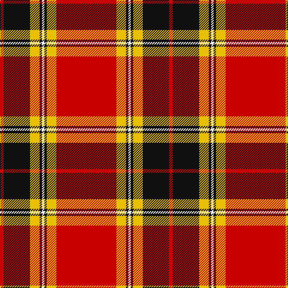

In pattern [RKYKWKYR](/patterns/rkykwkyr/).

This was sourced from tartans-authority.  It is a [8 stripes tartan](/stripes/stripes8/).

Original link http://www.tartansauthority.com/tartan-ferret/display/8741/

## Thread count
R/6 K44 Y16 K4 W4 K4 Y16 R/100

## Palette
Each colour and its ΔE from the base-6 reference it is a variant of.

| Colour | Shade | Base | ΔE (OKLab) |
|---|---|---|---|
| K | <code style="background-color:#101010;">#101010</code> `#101010` | K <code style="background-color:#000000;">#000000</code> | 0.17 |
| R | <code style="background-color:#C80000;">#C80000</code> `#C80000` | R <code style="background-color:#CC0000;">#CC0000</code> | 0.01 |
| W | <code style="background-color:#FCFCFC;">#FCFCFC</code> `#FCFCFC` | W <code style="background-color:#F7F7F7;">#F7F7F7</code> | 0.01 |
| Y | <code style="background-color:#E8C000;">#E8C000</code> `#E8C000` | Y <code style="background-color:#F2BF00;">#F2BF00</code> | 0.02 |

# Sample pattern

## Nearest tartans

The nearest existing variants by ΔTartan distance.

1. [Spens Family Tartan Tartan Number: 1671. Earliest known date: c.1815 The Spens tartan is similar in many respects to the Perthshire District sett, which is in turn, a variation of one of the Drummond tartans. The Perthshire sett was being woven by Wilson's of Bannockburn in the early years of the nineteenth century. The name, Spens, is linked to a specimen preserved in the collection of the Highland Society of London. See products available Copyright © Blair Urquhart, Comrie, 2015](/setts/s8/r56w2b6w2g32r11b6w5-b2c2c80-g006818-rc80000-we0e0e0/) — ΔT 1.13
1. [Lantern, The](/setts/s9/w12k4r64y4k12y4r8k4w6-k101010-rc80000-wc0c0c0-yd09800/) — ΔT 1.15
1. [Motherwell F.C. Fir Park Dress (Spor](/setts/s10/r12w4r80k12y8k8y8k8y24ra12-k000000-rb40000-rac80000-wc8c8c8-yc89800/) — ΔT 1.16
1. [O'Meehan (Name)](/setts/s9/y54k8w8r128w8r8k8r8k24-k101010-rc80050-we0e0e0-ye8c000/) — ΔT 1.18
1. [MacDonell of Keppoch](/setts/s10/g4r4b2r48w2b12r6g24r8b2-b00004c-g004c00-rc80000-wd0d0d0/) — ΔT 1.20
1. [Barbecue Plaid](/setts/s8/r45k2r2k28w16r4k4y2-k000000-rc80000-wfcfcfc-yc88c00/) — ΔT 1.21
1. [Longniddry Burgundy (Dance)](/setts/s8/r84ra4w4ra4r10rb24w64r8-r880000-rae87878-rbc80000-we0e0e0/) — ΔT 1.22
1. [Leach, Leech, Leitch, dress](/setts/s9/r66w2k6w2g26r14k6b6w2-b800080-g008000-k000000-rc00000-we0e0e0/) — ΔT 1.23
1. [Stuart/Stewart of Bute](/setts/s9/r24g12k2g4k2g2k12r48w4-g008000-k000000-rc00000-we0e0e0/) — ΔT 1.23
1. [Livingstone, MacLay MacLeay](/setts/s7/r56g8k8g8k8b12y2-b5480b0-g008000-k000000-rc00000-yf0c000/) — ΔT 1.26

## Neighbour map

Every grey dot is one of 15726 variants placed by the first two principal components of the ΔTartan feature space (44% of its variance). Red is this tartan; blue dots are its nearest — click one to open its page.

<svg viewBox="0 0 640 380" role="img" style="max-width:100%;height:auto;border:1px solid #e0e0e0;border-radius:4px;display:block" xmlns="http://www.w3.org/2000/svg"><image href="/nn/cloud.v1.png" width="640" height="380"/><a href="/setts/s8/r56w2b6w2g32r11b6w5-b2c2c80-g006818-rc80000-we0e0e0/"><circle cx="359.1" cy="123.3" r="4" fill="#3465a4"><title>Spens Family Tartan Tartan Number: 1671. Earliest known date: c.1815 The Spens tartan is similar in many respects to the Perthshire District sett, which is in turn, a variation of one of the Drummond tartans. The Perthshire sett was being woven by Wilson's of Bannockburn in the early years of the nineteenth century. The name, Spens, is linked to a specimen preserved in the collection of the Highland Society of London. See products available Copyright © Blair Urquhart, Comrie, 2015</title></circle></a><a href="/setts/s9/w12k4r64y4k12y4r8k4w6-k101010-rc80000-wc0c0c0-yd09800/"><circle cx="370.0" cy="119.4" r="4" fill="#3465a4"><title>Lantern, The</title></circle></a><a href="/setts/s10/r12w4r80k12y8k8y8k8y24ra12-k000000-rb40000-rac80000-wc8c8c8-yc89800/"><circle cx="284.9" cy="98.4" r="4" fill="#3465a4"><title>Motherwell F.C. Fir Park Dress (Spor</title></circle></a><a href="/setts/s9/y54k8w8r128w8r8k8r8k24-k101010-rc80050-we0e0e0-ye8c000/"><circle cx="326.9" cy="113.0" r="4" fill="#3465a4"><title>O'Meehan (Name)</title></circle></a><a href="/setts/s10/g4r4b2r48w2b12r6g24r8b2-b00004c-g004c00-rc80000-wd0d0d0/"><circle cx="373.6" cy="120.3" r="4" fill="#3465a4"><title>MacDonell of Keppoch</title></circle></a><a href="/setts/s8/r45k2r2k28w16r4k4y2-k000000-rc80000-wfcfcfc-yc88c00/"><circle cx="282.5" cy="117.6" r="4" fill="#3465a4"><title>Barbecue Plaid</title></circle></a><a href="/setts/s8/r84ra4w4ra4r10rb24w64r8-r880000-rae87878-rbc80000-we0e0e0/"><circle cx="301.2" cy="119.2" r="4" fill="#3465a4"><title>Longniddry Burgundy (Dance)</title></circle></a><a href="/setts/s9/r66w2k6w2g26r14k6b6w2-b800080-g008000-k000000-rc00000-we0e0e0/"><circle cx="374.0" cy="83.5" r="4" fill="#3465a4"><title>Leach, Leech, Leitch, dress</title></circle></a><a href="/setts/s9/r24g12k2g4k2g2k12r48w4-g008000-k000000-rc00000-we0e0e0/"><circle cx="396.4" cy="120.1" r="4" fill="#3465a4"><title>Stuart/Stewart of Bute</title></circle></a><a href="/setts/s7/r56g8k8g8k8b12y2-b5480b0-g008000-k000000-rc00000-yf0c000/"><circle cx="308.4" cy="108.6" r="4" fill="#3465a4"><title>Livingstone, MacLay MacLeay</title></circle></a><circle cx="336.9" cy="110.1" r="5" fill="#c00000"/></svg>

ID: /setts/s8/r100y16k4w4k4y16k44r6-k101010-rc80000-wfcfcfc-ye8c000/
