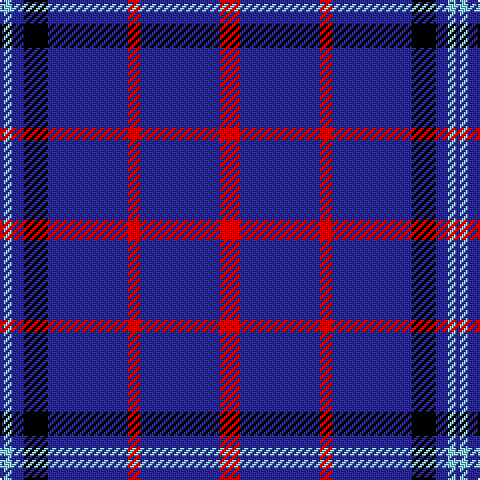

In pattern [BWBKBRBR](/patterns/bwbkbrbr/).

This was sourced from tartans-authority.  It is a [8 stripes tartan](/stripes/stripes8/).

Original link http://www.tartansauthority.com/tartan-ferret/display/7289/

## Thread count
DB/2 LB4 DB6 K12 DB40 R6 DB40 R/10

## Palette
Each colour and its ΔE from the base-6 reference it is a variant of.

| Colour | Shade | Base | ΔE (OKLab) |
|---|---|---|---|
| DB | <code style="background-color:#2C2C80;">#2C2C80</code> `#2C2C80` | B <code style="background-color:#2C4084;">#2C4084</code> | 0.05 |
| K | <code style="background-color:#000000;">#000000</code> `#000000` | K <code style="background-color:#000000;">#000000</code> | 0.00 |
| LB | <code style="background-color:#98C8E8;">#98C8E8</code> `#98C8E8` | W <code style="background-color:#F4F4F0;">#F4F4F0</code> | 0.17 |
| R | <code style="background-color:#C80000;">#C80000</code> `#C80000` | R <code style="background-color:#C80000;">#C80000</code> | 0.00 |

# Sample pattern

## Nearest tartans

The nearest existing variants by ΔTartan distance.

1. [Tokyo Bluebells](/setts/s8/b72r4b4r4b4k28b52w8-b304080-k000000-rc00000-we0e0e0/) — ΔT 0.87
1. [Newton Primary School](/setts/s9/b104r12b12w8b12r12b24r24y8-b2c2c80-rc80000-we0e0e0-ye8c000/) — ΔT 1.27
1. [Calum's Cabin](/setts/s9/b32y4ba12b2ba4b2r16b67y6-b202060-ba2c2c80-r888888-yfccc00/) — ΔT 1.33
1. [Ikelman #5 (Personal)](/setts/s12/b60g8b8w4b4w4b4w4b8g8b60r40-b1c0070-g006818-r880000-we0e0e0/) — ΔT 1.33
1. [Kansas State University](/setts/s9/b60k10b6y6b6w4b4k15b15-b5a008c-k101010-wffffff-yb0b0b0/) — ΔT 1.34
1. [Laidlaw's Highland Drovers (Corp)](/setts/s7/b70k20b8w4b6r4y4-b2c2c80-k101010-rc80000-we0e0e0-ye8c000/) — ΔT 1.37
1. [Hoosier (Fashion)](/setts/s8/b30ba130y14b8y6ba60b30w6-b1474b4-ba1c0070-we0e0e0-ye8c000/) — ΔT 1.41
1. [Steffen, Morris (Personal)](/setts/s6/b140w16b40r12ra12r12-b2c2c80-r901c38-rac80000-we0e0e0/) — ΔT 1.42
1. [Wheadon (Name)](/setts/s6/b80g14y6g14b30r10-b34349c-g008c20-rc80000-ye8c000/) — ΔT 1.46
1. [Stradling (Name)](/setts/s6/b40w7b60k10r25y4-b2c2c80-k101010-r880000-we0e0e0-ye8c000/) — ΔT 1.47

## Neighbour map

Every grey dot is one of 15726 variants placed by the first two principal components of the ΔTartan feature space (44% of its variance). Red is this tartan; blue dots are its nearest — click one to open its page.

<svg viewBox="0 0 640 380" role="img" style="max-width:100%;height:auto;border:1px solid #e0e0e0;border-radius:4px;display:block" xmlns="http://www.w3.org/2000/svg"><image href="/nn/cloud.v1.png" width="640" height="380"/><a href="/setts/s8/b72r4b4r4b4k28b52w8-b304080-k000000-rc00000-we0e0e0/"><circle cx="458.3" cy="167.0" r="4" fill="#3465a4"><title>Tokyo Bluebells</title></circle></a><a href="/setts/s9/b104r12b12w8b12r12b24r24y8-b2c2c80-rc80000-we0e0e0-ye8c000/"><circle cx="425.5" cy="160.7" r="4" fill="#3465a4"><title>Newton Primary School</title></circle></a><a href="/setts/s9/b32y4ba12b2ba4b2r16b67y6-b202060-ba2c2c80-r888888-yfccc00/"><circle cx="464.3" cy="137.2" r="4" fill="#3465a4"><title>Calum's Cabin</title></circle></a><a href="/setts/s12/b60g8b8w4b4w4b4w4b8g8b60r40-b1c0070-g006818-r880000-we0e0e0/"><circle cx="399.8" cy="150.1" r="4" fill="#3465a4"><title>Ikelman #5 (Personal)</title></circle></a><a href="/setts/s9/b60k10b6y6b6w4b4k15b15-b5a008c-k101010-wffffff-yb0b0b0/"><circle cx="453.6" cy="160.7" r="4" fill="#3465a4"><title>Kansas State University</title></circle></a><a href="/setts/s7/b70k20b8w4b6r4y4-b2c2c80-k101010-rc80000-we0e0e0-ye8c000/"><circle cx="449.8" cy="150.5" r="4" fill="#3465a4"><title>Laidlaw's Highland Drovers (Corp)</title></circle></a><a href="/setts/s8/b30ba130y14b8y6ba60b30w6-b1474b4-ba1c0070-we0e0e0-ye8c000/"><circle cx="402.5" cy="159.2" r="4" fill="#3465a4"><title>Hoosier (Fashion)</title></circle></a><a href="/setts/s6/b140w16b40r12ra12r12-b2c2c80-r901c38-rac80000-we0e0e0/"><circle cx="493.7" cy="194.5" r="4" fill="#3465a4"><title>Steffen, Morris (Personal)</title></circle></a><a href="/setts/s6/b80g14y6g14b30r10-b34349c-g008c20-rc80000-ye8c000/"><circle cx="426.3" cy="199.7" r="4" fill="#3465a4"><title>Wheadon (Name)</title></circle></a><a href="/setts/s6/b40w7b60k10r25y4-b2c2c80-k101010-r880000-we0e0e0-ye8c000/"><circle cx="384.0" cy="191.5" r="4" fill="#3465a4"><title>Stradling (Name)</title></circle></a><circle cx="451.3" cy="174.0" r="5" fill="#c00000"/></svg>

ID: /setts/s8/r10b40r6b40k12b6w4b2-b2c2c80-k000000-rc80000-w98c8e8/
