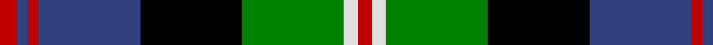

In pattern [RBRBKGWR](/patterns/rbrbkgwr/).

This was sourced from weddslist.  It is a [8 stripes tartan](/stripes/stripes8/).

Original link http://www.weddslist.com/cgi-bin/tartans/pg.pl?source=sts

## Thread count
R/10 B6 R6 B58 K58 G58 LN8 R/8

## Palette
Each colour and its ΔE from the base-6 reference it is a variant of.

| Colour | Shade | Base | ΔE (OKLab) |
|---|---|---|---|
| B | <code style="background-color:#304080;">#304080</code> `#304080` | B <code style="background-color:#2C4084;">#2C4084</code> | 0.01 |
| G | <code style="background-color:#008000;">#008000</code> `#008000` | G <code style="background-color:#006400;">#006400</code> | 0.09 |
| K | <code style="background-color:#000000;">#000000</code> `#000000` | K <code style="background-color:#000000;">#000000</code> | 0.00 |
| LN | <code style="background-color:#E0E0E0;">#E0E0E0</code> `#E0E0E0` | W <code style="background-color:#F4F4F0;">#F4F4F0</code> | 0.06 |
| R | <code style="background-color:#C00000;">#C00000</code> `#C00000` | R <code style="background-color:#C80000;">#C80000</code> | 0.02 |

# Sample pattern

## Nearest tartans

The nearest existing variants by ΔTartan distance.

1. [MacDonald of Borrodale (Clan)](/setts/s8/r12b6r6b64k60g60y6r6-b2c2c80-g006818-k000000-rc80000-ye8c000/) — ΔT 0.60
1. [Colquhoun](/setts/s7/r8g32w4k32b32k4b4-b304080-g008000-k000000-rc00000-we0e0e0/) — ΔT 0.63
1. [Offally](/setts/s10/r14b4g10b36g20b4k48b4g20y6-b304080-g008000-k000000-r900030-yf0c000/) — ΔT 0.67
1. [MacLeod, Macleod of Harris](/setts/s7/r6k4g30k20b40k4y4-b304080-g008000-k000000-rc00000-yf0c000/) — ΔT 0.74
1. [Unnamed, No 22](/setts/s11/b4k2b2ba4g16r4k16ba4b2k2b4-b5480b0-ba304080-g008000-k000000-rc00000/) — ΔT 0.82
1. [Grant, hunting](/setts/s11/b22k4b4k4b4k22g22r4g6k2y6-b304080-g008000-k000000-rc00000-yf0c000/) — ΔT 0.82
1. [MacLaren](/setts/s11/b44k8b8k8b8k44g44r12g12k4y6-b304080-g008000-k000000-rc00000-yf0c000/) — ΔT 0.82
1. [Argyll / MacCorquodale](/setts/s7/b4k2g16k16ba16k2r4-b5480b0-ba304080-g008000-k000000-rc00000/) — ΔT 0.84
1. [Biskup](/setts/s10/b24r8b36r4k38g36r8g6y4g16-b304080-g008000-k000000-rc00000-yf0c000/) — ΔT 0.86
1. [Nelson Mandela (Personal)](/setts/s7/b54g10y16k40y6g30r6-b202060-g006818-k101010-rc80000-ye8c000/) — ΔT 0.89

## Neighbour map

Every grey dot is one of 15726 variants placed by the first two principal components of the ΔTartan feature space (44% of its variance). Red is this tartan; blue dots are its nearest — click one to open its page.

<svg viewBox="0 0 640 380" role="img" style="max-width:100%;height:auto;border:1px solid #e0e0e0;border-radius:4px;display:block" xmlns="http://www.w3.org/2000/svg"><image href="/nn/cloud.v1.png" width="640" height="380"/><a href="/setts/s8/r12b6r6b64k60g60y6r6-b2c2c80-g006818-k000000-rc80000-ye8c000/"><circle cx="133.5" cy="165.7" r="4" fill="#3465a4"><title>MacDonald of Borrodale (Clan)</title></circle></a><a href="/setts/s7/r8g32w4k32b32k4b4-b304080-g008000-k000000-rc00000-we0e0e0/"><circle cx="106.3" cy="191.3" r="4" fill="#3465a4"><title>Colquhoun</title></circle></a><a href="/setts/s10/r14b4g10b36g20b4k48b4g20y6-b304080-g008000-k000000-r900030-yf0c000/"><circle cx="113.5" cy="158.8" r="4" fill="#3465a4"><title>Offally</title></circle></a><a href="/setts/s7/r6k4g30k20b40k4y4-b304080-g008000-k000000-rc00000-yf0c000/"><circle cx="146.9" cy="178.3" r="4" fill="#3465a4"><title>MacLeod, Macleod of Harris</title></circle></a><a href="/setts/s11/b4k2b2ba4g16r4k16ba4b2k2b4-b5480b0-ba304080-g008000-k000000-rc00000/"><circle cx="99.6" cy="161.3" r="4" fill="#3465a4"><title>Unnamed, No 22</title></circle></a><a href="/setts/s11/b22k4b4k4b4k22g22r4g6k2y6-b304080-g008000-k000000-rc00000-yf0c000/"><circle cx="114.6" cy="155.1" r="4" fill="#3465a4"><title>Grant, hunting</title></circle></a><a href="/setts/s11/b44k8b8k8b8k44g44r12g12k4y6-b304080-g008000-k000000-rc00000-yf0c000/"><circle cx="122.4" cy="155.6" r="4" fill="#3465a4"><title>MacLaren</title></circle></a><a href="/setts/s7/b4k2g16k16ba16k2r4-b5480b0-ba304080-g008000-k000000-rc00000/"><circle cx="107.9" cy="198.1" r="4" fill="#3465a4"><title>Argyll / MacCorquodale</title></circle></a><a href="/setts/s10/b24r8b36r4k38g36r8g6y4g16-b304080-g008000-k000000-rc00000-yf0c000/"><circle cx="112.1" cy="175.6" r="4" fill="#3465a4"><title>Biskup</title></circle></a><a href="/setts/s7/b54g10y16k40y6g30r6-b202060-g006818-k101010-rc80000-ye8c000/"><circle cx="117.4" cy="194.4" r="4" fill="#3465a4"><title>Nelson Mandela (Personal)</title></circle></a><circle cx="109.5" cy="167.0" r="5" fill="#c00000"/></svg>

ID: /setts/s8/r10b6r6b58k58g58w8r8-b304080-g008000-k000000-rc00000-we0e0e0/
