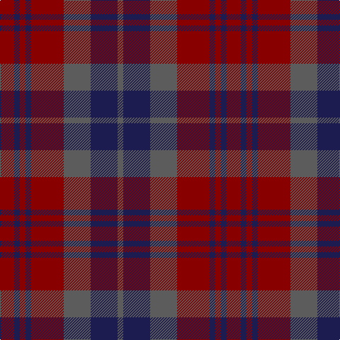

In pattern [BBBRBRBR](/stripes/bbbrbrbr/).

This was sourced from tartans-authority.  It is a [8 stripe tartan](/stripes/stripes8/).

Original link http://www.tartansauthority.com/tartan-ferret/display/10253/

## Thread count
DR/20 DB8 DR8 DB8 DR46 N38 DB38 N/8

## Palette
Each colour and the base-6 reference it is a variant of.

| Colour | Shade | Base |
|---|---|---|
| DB | <code style="background-color:#1C1C50;">#1C1C50</code> `oklch(26.2% 0.093 277.9)` <small>#1C1C50</small> | B <code style="background-color:#2A418A;">#2A418A</code> |
| DR | <code style="background-color:#880000;">#880000</code> `oklch(39.4% 0.162 29.2)` <small>#880000</small> | R <code style="background-color:#CC0000;">#CC0000</code> |
| N | <code style="background-color:#5C5C5C;">#5C5C5C</code> `oklch(47.5% 0.000 89.9)` <small>#5C5C5C</small> | B <code style="background-color:#2A418A;">#2A418A</code> |

# Sample pattern

## Nearest tartans

The nearest existing variants by ΔTartan distance.

1. [Scottish Netball Association](/setts/s7/dp3dg14r2dp10dg2r14dp3~x2/) — ΔT 1.36
1. [Chindecella Gorse (Kemete Heil)](/setts/s8/o9do4o4do4o24dy19do19dy4~x2/) — ΔT 1.38
1. [Clare, County](/setts/s10/r3dp14dg14dp2r14dp2r14dg14dp2ly3~x2/) — ΔT 1.42
1. [Scottish Netball (1986) (Corporate)](/setts/s7/dp3g14m2dp10g2m14dp3~x2/) — ΔT 1.48
1. [MacArthur-Fox, dress](/setts/s6/r2db13r3db3r16t2~x4/) — ΔT 1.58
1. [Ruben Delanghe (Personal)](/setts/s10/dg14k5db2r21dg18k4db18r9k2r12/) — ΔT 1.59
1. [Lindsay (Chisholm Red)](/setts/s9/dg24db3dg3db3dg3db9m24dg3m4~x2/) — ΔT 1.60
1. [Lindsay](/setts/s9/dg24dt3dg3dt3dg3dt9m24dg3m4~x2/) — ΔT 1.62
1. [Roscommon](/setts/s10/r5o3r19dr6o5dr6n12n5n12n3~x2/) — ΔT 1.63
1. [McCall/MacCall](/setts/s11/dr8k5dr8dg27dr13dg3dr13o27dr8o3dr3~x2/) — ΔT 1.68

## Neighbour map

Every grey dot is one of 14299 variants placed by the first two principal components of the ΔTartan feature space (44% of its variance). Red is this tartan; blue dots are its nearest — click one to open its page.

<svg viewBox="0 0 640 380" role="img" style="max-width:100%;height:auto;border:1px solid #e0e0e0;border-radius:4px;display:block" xmlns="http://www.w3.org/2000/svg"><image href="/nn/cloud.v1.png" width="640" height="380"/><a href="/setts/s7/dp3dg14r2dp10dg2r14dp3~x2/"><circle cx="243.6" cy="256.5" r="4" fill="#3465a4"><title>Scottish Netball Association</title></circle></a><a href="/setts/s8/o9do4o4do4o24dy19do19dy4~x2/"><circle cx="281.3" cy="273.8" r="4" fill="#3465a4"><title>Chindecella Gorse (Kemete Heil)</title></circle></a><a href="/setts/s10/r3dp14dg14dp2r14dp2r14dg14dp2ly3~x2/"><circle cx="232.1" cy="236.3" r="4" fill="#3465a4"><title>Clare, County</title></circle></a><a href="/setts/s7/dp3g14m2dp10g2m14dp3~x2/"><circle cx="239.7" cy="250.0" r="4" fill="#3465a4"><title>Scottish Netball (1986) (Corporate)</title></circle></a><a href="/setts/s6/r2db13r3db3r16t2~x4/"><circle cx="348.0" cy="244.8" r="4" fill="#3465a4"><title>MacArthur-Fox, dress</title></circle></a><a href="/setts/s10/dg14k5db2r21dg18k4db18r9k2r12/"><circle cx="242.8" cy="231.8" r="4" fill="#3465a4"><title>Ruben Delanghe (Personal)</title></circle></a><a href="/setts/s9/dg24db3dg3db3dg3db9m24dg3m4~x2/"><circle cx="342.1" cy="251.2" r="4" fill="#3465a4"><title>Lindsay (Chisholm Red)</title></circle></a><a href="/setts/s9/dg24dt3dg3dt3dg3dt9m24dg3m4~x2/"><circle cx="336.5" cy="248.0" r="4" fill="#3465a4"><title>Lindsay</title></circle></a><a href="/setts/s10/r5o3r19dr6o5dr6n12n5n12n3~x2/"><circle cx="232.2" cy="235.8" r="4" fill="#3465a4"><title>Roscommon</title></circle></a><a href="/setts/s11/dr8k5dr8dg27dr13dg3dr13o27dr8o3dr3~x2/"><circle cx="265.6" cy="214.5" r="4" fill="#3465a4"><title>McCall/MacCall</title></circle></a><circle cx="290.6" cy="277.5" r="5" fill="#c00000"/></svg>

ID: /setts/s8/r10db4r4db4r23n19db19n4~x2/
