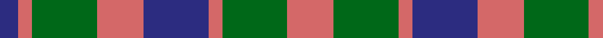
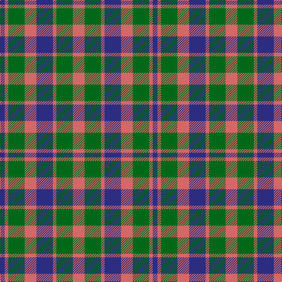

In pattern [BRGRBRGR](/patterns/brgrbrgr/).

This was sourced from house-of-tartan.  It is a [8 stripes tartan](/stripes/stripes8/).

Original link http://www.house-of-tartan.scotland.net/house/TartanViewjs.asp?colr=Def&tnam=534

## Thread count
DB/8 LR6 G28 LR20 DB28 LR6 G28 LR/20

## Palette
Each colour and its ΔE from the base-6 reference it is a variant of.

| Colour | Shade | Base | ΔE (OKLab) |
|---|---|---|---|
| DB | <code style="background-color:#2C2C80;">#2C2C80</code> `#2C2C80` | B <code style="background-color:#2A418A;">#2A418A</code> | 0.06 |
| G | <code style="background-color:#006818;">#006818</code> `#006818` | G <code style="background-color:#006100;">#006100</code> | 0.02 |
| LR | <code style="background-color:#D46868;">#D46868</code> `#D46868` | R <code style="background-color:#CC0000;">#CC0000</code> | 0.14 |

# Sample pattern

## Nearest tartans

The nearest existing variants by ΔTartan distance.

1. [Flora, MacDonald](/setts/s8/r3b3r3b10g10r3g3r3~b304080-g008000-rc00000~x2/) — ΔT 0.95
1. [Fiddes](/setts/s11/g16r12b16r6b4r6b7r20b8g8b12~b304080-g008000-rc00000~x2/) — ΔT 1.12
1. [Flora MacDonald](/setts/s8/r3b3r3b10g10r3g3r3~b2c4084-g005020-rdc0000~x2/) — ΔT 1.15
1. [Wilson's No.214](/setts/s8/b3k1b1r3g4r3b1k1~b2888c4-g006818-k101010-rc80000~x4/) — ΔT 1.23
1. [Holden Monaro Corporate Tartan Tartan Number: 8700. Earliest known date: 1831 Holden Monaro GTS 1978 car seats. Reproduction colours. Warp 162 threads Weft 202 threads. Last weaving went through with slight difference. Sett size = 4 3/8th - 4 3/4 inch (112mm - 120mm) See products available Copyright © Blair Urquhart, Comrie, 2015](/setts/s8/y10b3y3b3y3b11g11r3~b282828-g54381c-r9c4048-yb0a488~x2/) — ΔT 1.25
1. [Hebrides #8](/setts/s8/b7r3g7r1g7r3b7ba1~b2c2c80-ba5c8ca8-g006818-rc80000~x2/) — ΔT 1.31
1. [Gow](/setts/s8/g4r1b4r4b4r1g4r4~b2c2c80-g285800-rc80000~x12/) — ΔT 1.33
1. [Tyndrum](/setts/s10/r6k1r1k1r2k4y6k1r2k2~k101010-r888888-ya08858~x8/) — ΔT 1.34
1. [Stewart (Artefact)](/setts/s7/r2g4b8r9g9k2r2~b2c2c80-g006818-k101010-rc80000~x4/) — ΔT 1.34
1. [Fiddes](/setts/s11/b18g5b6r25b6r5b5r6b18r12g16~b304080-g008000-rc00000~x2/) — ΔT 1.36

## Neighbour map

Every grey dot is one of 15726 variants placed by the first two principal components of the ΔTartan feature space (44% of its variance). Red is this tartan; blue dots are its nearest — click one to open its page.

<svg viewBox="0 0 640 380" role="img" style="max-width:100%;height:auto;border:1px solid #e0e0e0;border-radius:4px;display:block" xmlns="http://www.w3.org/2000/svg"><image href="/nn/cloud.v1.png" width="640" height="380"/><a href="/setts/s8/r3b3r3b10g10r3g3r3~b304080-g008000-rc00000~x2/"><circle cx="168.3" cy="272.5" r="4" fill="#3465a4"><title>Flora, MacDonald</title></circle></a><a href="/setts/s11/g16r12b16r6b4r6b7r20b8g8b12~b304080-g008000-rc00000~x2/"><circle cx="193.9" cy="264.6" r="4" fill="#3465a4"><title>Fiddes</title></circle></a><a href="/setts/s8/r3b3r3b10g10r3g3r3~b2c4084-g005020-rdc0000~x2/"><circle cx="173.4" cy="273.3" r="4" fill="#3465a4"><title>Flora MacDonald</title></circle></a><a href="/setts/s8/b3k1b1r3g4r3b1k1~b2888c4-g006818-k101010-rc80000~x4/"><circle cx="115.2" cy="249.2" r="4" fill="#3465a4"><title>Wilson's No.214</title></circle></a><a href="/setts/s8/y10b3y3b3y3b11g11r3~b282828-g54381c-r9c4048-yb0a488~x2/"><circle cx="139.3" cy="248.7" r="4" fill="#3465a4"><title>Holden Monaro Corporate Tartan Tartan Number: 8700. Earliest known date: 1831 Holden Monaro GTS 1978 car seats. Reproduction colours. Warp 162 threads Weft 202 threads. Last weaving went through with slight difference. Sett size = 4 3/8th - 4 3/4 inch (112mm - 120mm) See products available Copyright © Blair Urquhart, Comrie, 2015</title></circle></a><a href="/setts/s8/b7r3g7r1g7r3b7ba1~b2c2c80-ba5c8ca8-g006818-rc80000~x2/"><circle cx="191.2" cy="243.8" r="4" fill="#3465a4"><title>Hebrides #8</title></circle></a><a href="/setts/s8/g4r1b4r4b4r1g4r4~b2c2c80-g285800-rc80000~x12/"><circle cx="169.5" cy="294.5" r="4" fill="#3465a4"><title>Gow</title></circle></a><a href="/setts/s10/r6k1r1k1r2k4y6k1r2k2~k101010-r888888-ya08858~x8/"><circle cx="200.8" cy="225.8" r="4" fill="#3465a4"><title>Tyndrum</title></circle></a><a href="/setts/s7/r2g4b8r9g9k2r2~b2c2c80-g006818-k101010-rc80000~x4/"><circle cx="158.3" cy="251.4" r="4" fill="#3465a4"><title>Stewart (Artefact)</title></circle></a><a href="/setts/s11/b18g5b6r25b6r5b5r6b18r12g16~b304080-g008000-rc00000~x2/"><circle cx="227.3" cy="248.7" r="4" fill="#3465a4"><title>Fiddes</title></circle></a><circle cx="178.4" cy="272.2" r="5" fill="#c00000"/></svg>

ID: /setts/s8/r10g14r3b14r10g14r3b4~b2c2c80-g006818-rd46868~x2/
