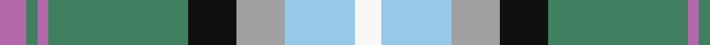

In pattern [RGRGKYWW](/patterns/rgrgkyww/).

This was sourced from register-of-tartans.  It is a [8 stripes tartan](/stripes/stripes8/).

Original link https://www.tartanregister.gov.uk/tartanDetails.aspx?ref=49

## Attestations

This cloth appears in 2 source records; the oldest owns this page.

- 01/01/2002 — Alexander of Menstry Hunting (register-of-tartans, [record](https://www.tartanregister.gov.uk/tartanDetails.aspx?ref=49))
- 2002 — Alexander of Menstry Htg (Personal) (tartans-authority, [record](http://www.tartansauthority.com/tartan-ferret/display/6715/))

## Thread count
P/10 Ga4 P4 Ga52 K18 N18 LB26 W/10

## Palette
Each colour and its ΔE from the base-6 reference it is a variant of.

| Colour | Shade | Base | ΔE (OKLab) |
|---|---|---|---|
| B | <code style="background-color:#5C8CA8;">#5C8CA8</code> `#5C8CA8` | B <code style="background-color:#2C4084;">#2C4084</code> | 0.23 |
| DB | <code style="background-color:#2C2C80;">#2C2C80</code> `#2C2C80` | B <code style="background-color:#2C4084;">#2C4084</code> | 0.05 |
| G | <code style="background-color:#006818;">#006818</code> `#006818` | G <code style="background-color:#006400;">#006400</code> | 0.02 |
| Ga | <code style="background-color:#408060;">#408060</code> `#408060` | G <code style="background-color:#006400;">#006400</code> | 0.13 |
| K | <code style="background-color:#101010;">#101010</code> `#101010` | K <code style="background-color:#000000;">#000000</code> | 0.17 |
| LB | <code style="background-color:#98C8E8;">#98C8E8</code> `#98C8E8` | W <code style="background-color:#F4F4F0;">#F4F4F0</code> | 0.17 |
| LR | <code style="background-color:#E87878;">#E87878</code> `#E87878` | R <code style="background-color:#C80000;">#C80000</code> | 0.19 |
| N | <code style="background-color:#A0A0A0;">#A0A0A0</code> `#A0A0A0` | Y <code style="background-color:#E8C000;">#E8C000</code> | 0.20 |
| Na | <code style="background-color:#888888;">#888888</code> `#888888` | R <code style="background-color:#C80000;">#C80000</code> | 0.24 |
| P | <code style="background-color:#B468AC;">#B468AC</code> `#B468AC` | R <code style="background-color:#C80000;">#C80000</code> | 0.21 |
| Pa | <code style="background-color:#780078;">#780078</code> `#780078` | B <code style="background-color:#2C4084;">#2C4084</code> | 0.16 |
| W | <code style="background-color:#F8F8F8;">#F8F8F8</code> `#F8F8F8` | W <code style="background-color:#F4F4F0;">#F4F4F0</code> | 0.01 |

# Sample pattern

## Nearest tartans

The nearest existing variants by ΔTartan distance.

1. [Morgan in Maryland (USA)](/setts/s9/b8k2y36g4y22g22w36k2r8-b41418c-g645541-k000000-raa3746-wb4bee6-ya5cdb4/) — ΔT 1.05
1. [Crofters (Personal)](/setts/s7/b40r4g18w12y8k4g16-b2c4084-g309c18-k101010-rdc0000-we0e0e0-ye8c000/) — ΔT 1.06
1. [Copar a'Beannichte Dress (Personal)](/setts/s9/g40ga12w30b10w4b30r8b20ra4-b003c64-g006818-ga0098a0-r888888-rac80000-we0e0e0/) — ΔT 1.09
1. [Ohio](/setts/s9/b32w12r16b6y2g2ba6b2g18-b304080-ba8080d0-g008000-rc00000-we0e0e0-yf0c000/) — ΔT 1.09
1. [Chambers, Christopher J (Personal)](/setts/s7/b32r2g32w2ba2w16ra6-b5f749c-ba5d321f-g649848-rca2625-ra86264d-wf9f5ef/) — ΔT 1.10
1. [Coulter Dress (Personal)](/setts/s8/r12w40g24ra6g16b40k4b6-b788cb4-g007800-k000000-r8c0000-raa0783c-wf0f0f0/) — ΔT 1.11
1. [State Seal of Delaware (Fashion)](/setts/s10/w76b36w8y6g20ya6g8w6ya34r8-b003c64-g006818-rc80000-wc0c0c0-yfccc00-yaa08858/) — ΔT 1.13
1. [Cossar (Personal)](/setts/s11/w8b10y6b44ya8k6g32y14k4y14ya4-b2888c4-g289c18-k101010-we0e0e0-yd87c00-yae8c000/) — ΔT 1.14
1. [Swiss Highlander (Corporate)](/setts/s10/g12ga24b48r23w8r23b24y4ga12g12-b489ccc-g003820-ga3c904c-rd40000-we0e0e0-yfcfc00/) — ΔT 1.14
1. [Copar a'Beannichte Dress (Personal)](/setts/s10/g12ga40g12w30b10w4b30r8b20ra4-b003c64-g0098a0-ga006818-r888888-rac80000-we0e0e0/) — ΔT 1.16

## Neighbour map

Every grey dot is one of 15726 variants placed by the first two principal components of the ΔTartan feature space (44% of its variance). Red is this tartan; blue dots are its nearest — click one to open its page.

<svg viewBox="0 0 640 380" role="img" style="max-width:100%;height:auto;border:1px solid #e0e0e0;border-radius:4px;display:block" xmlns="http://www.w3.org/2000/svg"><image href="/nn/cloud.v1.png" width="640" height="380"/><a href="/setts/s9/b8k2y36g4y22g22w36k2r8-b41418c-g645541-k000000-raa3746-wb4bee6-ya5cdb4/"><circle cx="167.7" cy="126.0" r="4" fill="#3465a4"><title>Morgan in Maryland (USA)</title></circle></a><a href="/setts/s7/b40r4g18w12y8k4g16-b2c4084-g309c18-k101010-rdc0000-we0e0e0-ye8c000/"><circle cx="126.6" cy="163.2" r="4" fill="#3465a4"><title>Crofters (Personal)</title></circle></a><a href="/setts/s9/g40ga12w30b10w4b30r8b20ra4-b003c64-g006818-ga0098a0-r888888-rac80000-we0e0e0/"><circle cx="103.1" cy="164.3" r="4" fill="#3465a4"><title>Copar a'Beannichte Dress (Personal)</title></circle></a><a href="/setts/s9/b32w12r16b6y2g2ba6b2g18-b304080-ba8080d0-g008000-rc00000-we0e0e0-yf0c000/"><circle cx="160.2" cy="128.3" r="4" fill="#3465a4"><title>Ohio</title></circle></a><a href="/setts/s7/b32r2g32w2ba2w16ra6-b5f749c-ba5d321f-g649848-rca2625-ra86264d-wf9f5ef/"><circle cx="166.7" cy="135.7" r="4" fill="#3465a4"><title>Chambers, Christopher J (Personal)</title></circle></a><a href="/setts/s8/r12w40g24ra6g16b40k4b6-b788cb4-g007800-k000000-r8c0000-raa0783c-wf0f0f0/"><circle cx="78.5" cy="153.1" r="4" fill="#3465a4"><title>Coulter Dress (Personal)</title></circle></a><a href="/setts/s10/w76b36w8y6g20ya6g8w6ya34r8-b003c64-g006818-rc80000-wc0c0c0-yfccc00-yaa08858/"><circle cx="172.7" cy="121.0" r="4" fill="#3465a4"><title>State Seal of Delaware (Fashion)</title></circle></a><a href="/setts/s11/w8b10y6b44ya8k6g32y14k4y14ya4-b2888c4-g289c18-k101010-we0e0e0-yd87c00-yae8c000/"><circle cx="118.3" cy="134.5" r="4" fill="#3465a4"><title>Cossar (Personal)</title></circle></a><a href="/setts/s10/g12ga24b48r23w8r23b24y4ga12g12-b489ccc-g003820-ga3c904c-rd40000-we0e0e0-yfcfc00/"><circle cx="115.8" cy="158.7" r="4" fill="#3465a4"><title>Swiss Highlander (Corporate)</title></circle></a><a href="/setts/s10/g12ga40g12w30b10w4b30r8b20ra4-b003c64-g0098a0-ga006818-r888888-rac80000-we0e0e0/"><circle cx="86.1" cy="161.4" r="4" fill="#3465a4"><title>Copar a'Beannichte Dress (Personal)</title></circle></a><circle cx="127.9" cy="144.3" r="5" fill="#c00000"/></svg>

ID: /setts/s8/r10g4r4g52k18y18w26wa10-g408060-k101010-rb468ac-w98c8e8-waf8f8f8-ya0a0a0/
