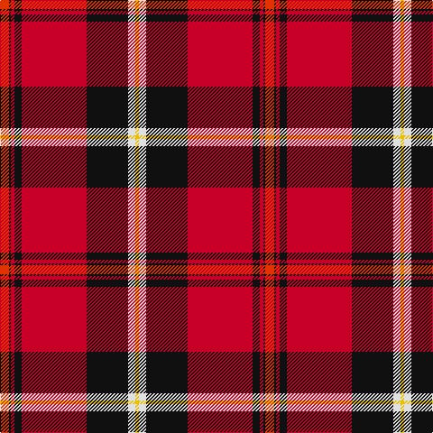

In pattern [RKRKRKWY](/patterns/rkrkrkwy/).

This was sourced from register-of-tartans.  It is a [8 stripes tartan](/stripes/stripes8/).

Original link https://www.tartanregister.gov.uk/tartanDetails.aspx?ref=17

## Thread count
R/10 K2 Ra4 K8 Ra72 K46 LN8 Y/4

## Palette
Each colour and its ΔE from the base-6 reference it is a variant of.

| Colour | Shade | Base | ΔE (OKLab) |
|---|---|---|---|
| K | <code style="background-color:#101010;">#101010</code> `#101010` | K <code style="background-color:#000000;">#000000</code> | 0.17 |
| LN | <code style="background-color:#E0E0E0;">#E0E0E0</code> `#E0E0E0` | W <code style="background-color:#F4F4F0;">#F4F4F0</code> | 0.06 |
| R | <code style="background-color:#E13200;">#E13200</code> `#E13200` | R <code style="background-color:#C80000;">#C80000</code> | 0.07 |
| Ra | <code style="background-color:#C80028;">#C80028</code> `#C80028` | R <code style="background-color:#C80000;">#C80000</code> | 0.02 |
| Y | <code style="background-color:#E8C000;">#E8C000</code> `#E8C000` | Y <code style="background-color:#E8C000;">#E8C000</code> | 0.00 |

# Sample pattern

## Nearest tartans

The nearest existing variants by ΔTartan distance.

1. [Aberdeen F.C.](/setts/s8/r10k2ra4k8ra72k46w8y4-k000000-re06000-rac00020-we0e0e0-yf0c000/) — ΔT 0.85
1. [Aberdeen F.C. Corporate Tartan Tartan Number: 2694. Earliest known date: 1997 The Aberdeen Football Club commissioned this design to include the colours of the teams away strip - navy and gold. See products available Copyright © Blair Urquhart, Comrie, 2015](/setts/s8/y10b2r4b8r72b44w8ya4-b003c64-rc80000-we0e0e0-yd87c00-yae8c000/) — ΔT 0.98
1. [Livingstone MacLay MacLeay](/setts/s7/r56g8k8g8k8b12y2-b3c82af-g005020-k101010-rdc0000-ye8c000/) — ΔT 1.01
1. [Livingstone, MacLay MacLeay](/setts/s7/r56g8k8g8k8b12y2-b5480b0-g008000-k000000-rc00000-yf0c000/) — ΔT 1.03
1. [Marjoribanks (Clan)](/setts/s8/w6k6w6k74r80w2r4y6-k101010-rc80000-wfcfcfc-yd09800/) — ΔT 1.11
1. [Mensah](/setts/s8/y6g18b18k2y4k30r74g4-b2c2c80-g006818-k101010-rc80000-ye8c000/) — ΔT 1.13
1. [MacLeay (Clan)](/setts/s7/r108g16k16g16k16b24y4-b2c2c80-g006818-k101010-rc80000-yd09800/) — ΔT 1.13
1. [Perth - 1819 (District)](/setts/s9/r120w4b16y4g56r24b16wa8w4-b280034-g044028-rc80000-wfcfcfc-wa00fcfc-ydcbc00/) — ΔT 1.22
1. [Livingstone MacLay MacLeay Clan Tartan Tartan Number: 1488. Earliest known date: 1934 Nothing See products available Copyright © Blair Urquhart, Comrie, 2015](/setts/s7/r56g8k8g8k8b12y2-b5c8ca8-g006818-k101010-rc80000-ye8c000/) — ΔT 1.22
1. [Leslie](/setts/s8/r8k12y2k12r8b32r64k2-b304080-k000000-rc00000-yf0c000/) — ΔT 1.23

## Neighbour map

Every grey dot is one of 15726 variants placed by the first two principal components of the ΔTartan feature space (44% of its variance). Red is this tartan; blue dots are its nearest — click one to open its page.

<svg viewBox="0 0 640 380" role="img" style="max-width:100%;height:auto;border:1px solid #e0e0e0;border-radius:4px;display:block" xmlns="http://www.w3.org/2000/svg"><image href="/nn/cloud.v1.png" width="640" height="380"/><a href="/setts/s8/r10k2ra4k8ra72k46w8y4-k000000-re06000-rac00020-we0e0e0-yf0c000/"><circle cx="298.4" cy="86.5" r="4" fill="#3465a4"><title>Aberdeen F.C.</title></circle></a><a href="/setts/s8/y10b2r4b8r72b44w8ya4-b003c64-rc80000-we0e0e0-yd87c00-yae8c000/"><circle cx="326.2" cy="94.8" r="4" fill="#3465a4"><title>Aberdeen F.C. Corporate Tartan Tartan Number: 2694. Earliest known date: 1997 The Aberdeen Football Club commissioned this design to include the colours of the teams away strip - navy and gold. See products available Copyright © Blair Urquhart, Comrie, 2015</title></circle></a><a href="/setts/s7/r56g8k8g8k8b12y2-b3c82af-g005020-k101010-rdc0000-ye8c000/"><circle cx="323.7" cy="111.2" r="4" fill="#3465a4"><title>Livingstone MacLay MacLeay</title></circle></a><a href="/setts/s7/r56g8k8g8k8b12y2-b5480b0-g008000-k000000-rc00000-yf0c000/"><circle cx="308.4" cy="108.6" r="4" fill="#3465a4"><title>Livingstone, MacLay MacLeay</title></circle></a><a href="/setts/s8/w6k6w6k74r80w2r4y6-k101010-rc80000-wfcfcfc-yd09800/"><circle cx="326.3" cy="95.3" r="4" fill="#3465a4"><title>Marjoribanks (Clan)</title></circle></a><a href="/setts/s8/y6g18b18k2y4k30r74g4-b2c2c80-g006818-k101010-rc80000-ye8c000/"><circle cx="277.7" cy="97.4" r="4" fill="#3465a4"><title>Mensah</title></circle></a><a href="/setts/s7/r108g16k16g16k16b24y4-b2c2c80-g006818-k101010-rc80000-yd09800/"><circle cx="324.3" cy="120.5" r="4" fill="#3465a4"><title>MacLeay (Clan)</title></circle></a><a href="/setts/s9/r120w4b16y4g56r24b16wa8w4-b280034-g044028-rc80000-wfcfcfc-wa00fcfc-ydcbc00/"><circle cx="324.2" cy="75.6" r="4" fill="#3465a4"><title>Perth - 1819 (District)</title></circle></a><a href="/setts/s7/r56g8k8g8k8b12y2-b5c8ca8-g006818-k101010-rc80000-ye8c000/"><circle cx="329.5" cy="115.5" r="4" fill="#3465a4"><title>Livingstone MacLay MacLeay Clan Tartan Tartan Number: 1488. Earliest known date: 1934 Nothing See products available Copyright © Blair Urquhart, Comrie, 2015</title></circle></a><a href="/setts/s8/r8k12y2k12r8b32r64k2-b304080-k000000-rc00000-yf0c000/"><circle cx="359.1" cy="120.8" r="4" fill="#3465a4"><title>Leslie</title></circle></a><circle cx="314.6" cy="89.4" r="5" fill="#c00000"/></svg>

ID: /setts/s8/r10k2ra4k8ra72k46w8y4-k101010-re13200-rac80028-we0e0e0-ye8c000/
