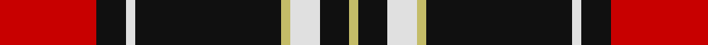

In pattern [RKWKYWKY](/stripes/rkwkywky/).

This was sourced from register-of-tartans.  It is a [8 stripe tartan](/stripes/stripes8/).

Original link https://www.tartanregister.gov.uk/tartanDetails.aspx?ref=11296

## Also known as

This cloth is also recorded under:

- Cunard o' the Clyde

## Attestations

This cloth appears in 2 source records; the oldest owns this page.

- 15/05/2015 — Cunard o' the Clyde (register-of-tartans, [record](https://www.tartanregister.gov.uk/tartanDetails.aspx?ref=11296))
- undated — Cunard O' The Clyde Corporate Tartan Tartan Number: 11296. Earliest known date: 2015 The Cunard on the Clyde tartan has been created to celebrate the historical link between the Cunard and the Clyde as part of the Cunard's 175th anniversary celebrations. It was presented to Cunard by Peel Ports on May 21st 2015. See products available Copyright © Blair Urquhart, Comrie, 2015 (house-of-tartan, [record](http://www.house-of-tartan.scotland.net/house/TartanViewjs.asp?colr=Def&tnam=11296))

## Register references

External register numbers recorded for this tartan.

- Scottish Register of Tartans: [11296](https://www.tartanregister.gov.uk/tartanDetails.aspx?ref=11296)

## Thread count
R/40 K12 LN4 K60 LG4 LN12 K12 LG/4

## Palette
Each colour and the base-6 reference it is a variant of.

| Colour | Shade | Base |
|---|---|---|
| K | <code style="background-color:#101010;">#101010</code> `oklch(17.3% 0.000 89.9)` <small>#101010</small> | K <code style="background-color:#000000;">#000000</code> |
| LG | <code style="background-color:#C4BC68;">#C4BC68</code> `oklch(78.4% 0.107 103.7)` <small>#C4BC68</small> | Y <code style="background-color:#F2BF00;">#F2BF00</code> |
| LN | <code style="background-color:#E0E0E0;">#E0E0E0</code> `oklch(90.7% 0.000 89.9)` <small>#E0E0E0</small> | W <code style="background-color:#F7F7F7;">#F7F7F7</code> |
| R | <code style="background-color:#C80000;">#C80000</code> `oklch(52.3% 0.215 29.2)` <small>#C80000</small> | R <code style="background-color:#CC0000;">#CC0000</code> |

# Sample pattern

## Nearest tartans

The nearest existing variants by ΔTartan distance.

1. [Braemar, or Blair Atholl](/setts/s10/o1w2k5o3k1o5k1o11k1o1~x4/) — ΔT 1.00
1. [Bro-Wened](/setts/s6/k43r10w3k3w15db3~x2/) — ΔT 1.06
1. [Woodberry Forest School (Corporate)](/setts/s10/r6k3w3k3w3k34r6g5r6k5~x2/) — ΔT 1.08
1. [Barbecue Plaid (Fashion)](/setts/s10/ly2k2r2w8k14r1k1r1k1r1~x2/) — ΔT 1.10
1. [Distripress Annual Congress 2012](/setts/s8/r12k2w8k4n16r2k31n2/) — ΔT 1.12
1. [Phantom (Corporate)](/setts/s7/w3dr10k38o11dr6k2w3~x2/) — ΔT 1.17
1. [Ikelman No 4](/setts/s7/r10k15g2k2w1k1w1~x4/) — ΔT 1.20
1. [Campbell 'Camel'](/setts/s10/do1lr2k5do3k1o4k1o10k1o1~x4/) — ΔT 1.21
1. [Phantom](/setts/s7/w3o10k38w11o6k2w3~x2/) — ΔT 1.23
1. [Craigholme (Corporate)](/setts/s9/k24db2k24db14ly3r36k18ly5r3~x2/) — ΔT 1.23

## Neighbour map

Every grey dot is one of 14299 variants placed by the first two principal components of the ΔTartan feature space (44% of its variance). Red is this tartan; blue dots are its nearest — click one to open its page.

<svg viewBox="0 0 640 380" role="img" style="max-width:100%;height:auto;border:1px solid #e0e0e0;border-radius:4px;display:block" xmlns="http://www.w3.org/2000/svg"><image href="/nn/cloud.v1.png" width="640" height="380"/><a href="/setts/s10/o1w2k5o3k1o5k1o11k1o1~x4/"><circle cx="270.3" cy="159.4" r="4" fill="#3465a4"><title>Braemar, or Blair Atholl</title></circle></a><a href="/setts/s6/k43r10w3k3w15db3~x2/"><circle cx="317.2" cy="162.1" r="4" fill="#3465a4"><title>Bro-Wened</title></circle></a><a href="/setts/s10/r6k3w3k3w3k34r6g5r6k5~x2/"><circle cx="325.5" cy="150.1" r="4" fill="#3465a4"><title>Woodberry Forest School (Corporate)</title></circle></a><a href="/setts/s10/ly2k2r2w8k14r1k1r1k1r1~x2/"><circle cx="271.3" cy="127.0" r="4" fill="#3465a4"><title>Barbecue Plaid (Fashion)</title></circle></a><a href="/setts/s8/r12k2w8k4n16r2k31n2/"><circle cx="237.8" cy="150.1" r="4" fill="#3465a4"><title>Distripress Annual Congress 2012</title></circle></a><a href="/setts/s7/w3dr10k38o11dr6k2w3~x2/"><circle cx="314.8" cy="156.8" r="4" fill="#3465a4"><title>Phantom (Corporate)</title></circle></a><a href="/setts/s7/r10k15g2k2w1k1w1~x4/"><circle cx="318.1" cy="158.8" r="4" fill="#3465a4"><title>Ikelman No 4</title></circle></a><a href="/setts/s10/do1lr2k5do3k1o4k1o10k1o1~x4/"><circle cx="241.6" cy="162.0" r="4" fill="#3465a4"><title>Campbell 'Camel'</title></circle></a><a href="/setts/s7/w3o10k38w11o6k2w3~x2/"><circle cx="286.7" cy="140.2" r="4" fill="#3465a4"><title>Phantom</title></circle></a><a href="/setts/s9/k24db2k24db14ly3r36k18ly5r3~x2/"><circle cx="276.4" cy="168.1" r="4" fill="#3465a4"><title>Craigholme (Corporate)</title></circle></a><circle cx="303.3" cy="152.0" r="5" fill="#c00000"/></svg>

ID: /setts/s8/r10k3w1k15ly1w3k3ly1~x4/
