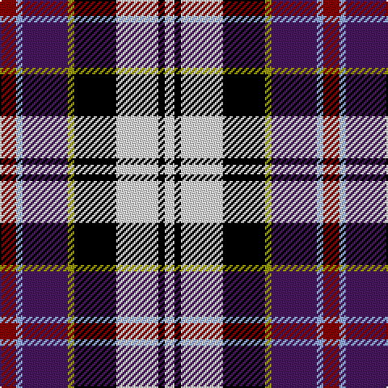

In pattern [RWBYKWKW](/patterns/rwbykwkw/).

This was sourced from register-of-tartans.  It is a [8 stripes tartan](/stripes/stripes8/).

Original link https://www.tartanregister.gov.uk/tartanDetails.aspx?ref=823

## Thread count
DR/10 LP4 DP28 LG4 K26 LNa26 K4 LNa/6

## Palette
Each colour and its ΔE from the base-6 reference it is a variant of.

| Colour | Shade | Base | ΔE (OKLab) |
|---|---|---|---|
| DP | <code style="background-color:#481860;">#481860</code> `#481860` | B <code style="background-color:#2C4084;">#2C4084</code> | 0.12 |
| DR | <code style="background-color:#880000;">#880000</code> `#880000` | R <code style="background-color:#C80000;">#C80000</code> | 0.14 |
| K | <code style="background-color:#000000;">#000000</code> `#000000` | K <code style="background-color:#000000;">#000000</code> | 0.00 |
| LG | <code style="background-color:#9C9C00;">#9C9C00</code> `#9C9C00` | Y <code style="background-color:#E8C000;">#E8C000</code> | 0.16 |
| LN | <code style="background-color:#E0E0E0;">#E0E0E0</code> `#E0E0E0` | W <code style="background-color:#F4F4F0;">#F4F4F0</code> | 0.06 |
| LNa | <code style="background-color:#E0E0E0;">#E0E0E0</code> `#E0E0E0` | W <code style="background-color:#F4F4F0;">#F4F4F0</code> | 0.06 |
| LP | <code style="background-color:#94ACFC;">#94ACFC</code> `#94ACFC` | W <code style="background-color:#F4F4F0;">#F4F4F0</code> | 0.24 |

# Sample pattern

ID: /setts/s8/r10w4b28y4k26wa26k4wa6-b481860-k000000-r880000-w94acfc-wae0e0e0-y9c9c00/
