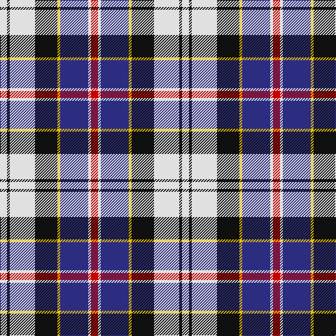

In pattern [RWBYKWKW](/patterns/rwbykwkw/).

This was sourced from house-of-tartan.  It is a [8 stripes tartan](/stripes/stripes8/).

Original link http://www.house-of-tartan.scotland.net/house/TartanViewjs.asp?colr=Def&tnam=1673

## Thread count
LN/10 K4 LN36 K32 Y4 DB40 LN4 R/10

## Palette
Each colour and its ΔE from the base-6 reference it is a variant of.

| Colour | Shade | Base | ΔE (OKLab) |
|---|---|---|---|
| DB | <code style="background-color:#2C2C80;">#2C2C80</code> `#2C2C80` | B <code style="background-color:#2A418A;">#2A418A</code> | 0.06 |
| K | <code style="background-color:#101010;">#101010</code> `#101010` | K <code style="background-color:#000000;">#000000</code> | 0.17 |
| LN | <code style="background-color:#E0E0E0;">#E0E0E0</code> `#E0E0E0` | W <code style="background-color:#F7F7F7;">#F7F7F7</code> | 0.07 |
| R | <code style="background-color:#C80000;">#C80000</code> `#C80000` | R <code style="background-color:#CC0000;">#CC0000</code> | 0.01 |
| Y | <code style="background-color:#E8C000;">#E8C000</code> `#E8C000` | Y <code style="background-color:#F2BF00;">#F2BF00</code> | 0.02 |

# Sample pattern

## Nearest tartans

The nearest existing variants by ΔTartan distance.

1. [Ailsa, Craig](/setts/s8/r10w4b40y4k32w36k4w10-b304080-k000000-rc00000-we0e0e0-yf0c000/) — ΔT 0.39
1. [Culloden Dress Ancient](/setts/s8/r12b4ba42w6g38w52g6w10-b2c4084-ba5a008c-g002814-rdc0000-we0e0e0/) — ΔT 0.66
1. [Davidson, Bride's](/setts/s7/r8b56k24g4w48g4w8-b304080-g008000-k000000-rc00000-we0e0e0/) — ΔT 0.76
1. [Thom(p)son](/setts/s10/r4k4w8k8w8k4w16k4b36y4-b304080-k000000-rc00000-we0e0e0-yf0c000/) — ΔT 0.78
1. [Davidson (Wedding) (Personal)](/setts/s7/r8b56k24g4w48g4w8-b2c2c80-g006818-k101010-rc80000-wfcfcfc/) — ΔT 0.85
1. [Culloden Dress Old Tartan Tartan Number: 1322. Earliest known date: 1983 Worn by a member of Prince Charles' staff during the battle but it is not known with which family or district it was first connected. It was first illustrated in Old & Rare in 1893 by D W Stewart whose son D C Stewart was a founder member of the Scottish Tartans Society. Now firmly established as a district tartan. See products available Copyright © Blair Urquhart, Comrie, 2015](/setts/s8/r12b4ba42w6g38w52g6w10-b2c2c80-ba780078-g003820-rc80000-we0e0e0/) — ΔT 0.88
1. [Culloden, dress Ancient](/setts/s8/r12b4ba42w6g38w52g6w10-b304080-ba800080-g003000-rc00000-we0e0e0/) — ΔT 0.90
1. [Sibbald Blue (2014)](/setts/s9/g8b44ba12w20b6w12bb8ba6w8-b141e46-ba003c64-bb64008c-g003c14-wfcfcfc/) — ΔT 0.91
1. [Pengelly, The Cornish (Name)](/setts/s7/w10k52y8w48b16k6r8-b780078-k101010-rc80000-wcccccc-ye8c000/) — ΔT 0.92
1. [Thompson Variant](/setts/s10/r4k4w8k8w8k4w16k4b36y4-b2c2c80-k101010-rc80000-wc0c0c0-yd09800/) — ΔT 0.92

## Neighbour map

Every grey dot is one of 15726 variants placed by the first two principal components of the ΔTartan feature space (44% of its variance). Red is this tartan; blue dots are its nearest — click one to open its page.

<svg viewBox="0 0 640 380" role="img" style="max-width:100%;height:auto;border:1px solid #e0e0e0;border-radius:4px;display:block" xmlns="http://www.w3.org/2000/svg"><image href="/nn/cloud.v1.png" width="640" height="380"/><a href="/setts/s8/r10w4b40y4k32w36k4w10-b304080-k000000-rc00000-we0e0e0-yf0c000/"><circle cx="113.3" cy="155.8" r="4" fill="#3465a4"><title>Ailsa, Craig</title></circle></a><a href="/setts/s8/r12b4ba42w6g38w52g6w10-b2c4084-ba5a008c-g002814-rdc0000-we0e0e0/"><circle cx="149.4" cy="143.3" r="4" fill="#3465a4"><title>Culloden Dress Ancient</title></circle></a><a href="/setts/s7/r8b56k24g4w48g4w8-b304080-g008000-k000000-rc00000-we0e0e0/"><circle cx="147.7" cy="143.6" r="4" fill="#3465a4"><title>Davidson, Bride's</title></circle></a><a href="/setts/s10/r4k4w8k8w8k4w16k4b36y4-b304080-k000000-rc00000-we0e0e0-yf0c000/"><circle cx="128.6" cy="140.1" r="4" fill="#3465a4"><title>Thom(p)son</title></circle></a><a href="/setts/s7/r8b56k24g4w48g4w8-b2c2c80-g006818-k101010-rc80000-wfcfcfc/"><circle cx="145.6" cy="140.4" r="4" fill="#3465a4"><title>Davidson (Wedding) (Personal)</title></circle></a><a href="/setts/s8/r12b4ba42w6g38w52g6w10-b2c2c80-ba780078-g003820-rc80000-we0e0e0/"><circle cx="154.2" cy="142.7" r="4" fill="#3465a4"><title>Culloden Dress Old Tartan Tartan Number: 1322. Earliest known date: 1983 Worn by a member of Prince Charles' staff during the battle but it is not known with which family or district it was first connected. It was first illustrated in Old &amp; Rare in 1893 by D W Stewart whose son D C Stewart was a founder member of the Scottish Tartans Society. Now firmly established as a district tartan. See products available Copyright © Blair Urquhart, Comrie, 2015</title></circle></a><a href="/setts/s8/r12b4ba42w6g38w52g6w10-b304080-ba800080-g003000-rc00000-we0e0e0/"><circle cx="152.8" cy="142.1" r="4" fill="#3465a4"><title>Culloden, dress Ancient</title></circle></a><a href="/setts/s9/g8b44ba12w20b6w12bb8ba6w8-b141e46-ba003c64-bb64008c-g003c14-wfcfcfc/"><circle cx="119.6" cy="166.0" r="4" fill="#3465a4"><title>Sibbald Blue (2014)</title></circle></a><a href="/setts/s7/w10k52y8w48b16k6r8-b780078-k101010-rc80000-wcccccc-ye8c000/"><circle cx="150.1" cy="164.4" r="4" fill="#3465a4"><title>Pengelly, The Cornish (Name)</title></circle></a><a href="/setts/s10/r4k4w8k8w8k4w16k4b36y4-b2c2c80-k101010-rc80000-wc0c0c0-yd09800/"><circle cx="145.0" cy="147.0" r="4" fill="#3465a4"><title>Thompson Variant</title></circle></a><circle cx="118.2" cy="156.0" r="5" fill="#c00000"/></svg>

ID: /setts/s8/r10w4b40y4k32w36k4w10-b2c2c80-k101010-rc80000-we0e0e0-ye8c000/
