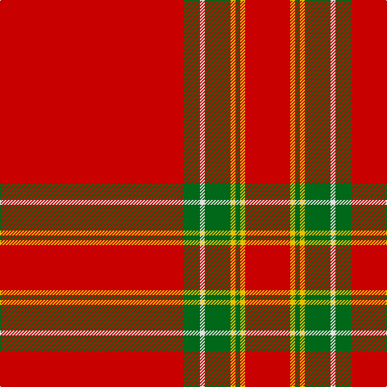

In pattern [RGWGYGYR](/stripes/rgwgygyr/).

This was sourced from logan-1831.  It is a [8 stripe tartan](/stripes/stripes8/).

Original link /posts/logans-scottish-gael/

## Provenance

James Logan recorded the **Duke of Sussex (Earl of Inverness)** sett in 1831, on the hand-coloured plate facing page 401 in *The Scottish Gaël* — the earliest systematic published collection of clan setts. Logan gives the stripe widths in eighths of an inch, measured across the cloth and reflected about each end (a half-sett):

> 28½ red · 2½ green · ¾ white · 4 green · ¾ yellow · ¾ green · ¾ yellow · 7 red

In threads (at 8 to the eighth-inch) that is `R/228 G20 W6 G32 Y6 G6 Y6 R/56`. Logan named his colours rather than dyeing to a standard, so the palette here is the Dictionary's modern reading of his names.

See [Logan's Scottish Gaël](/posts/logans-scottish-gael/) for the full table and method.

## Related setts

Later records of the **Duke of Sussex** name adjusted Logan's counts: [Duke of Sussex](/setts/s7/r18g1k5g1k1g1r9~g289c18-k000000-rc80000~x2/). Compare their thread counts with Logan's above.

## Thread count
R/228 G20 LN6 G32 Y6 G6 Y6 R/56

## Palette
Each colour and its ΔE from the base-6 reference it is a variant of.

| Colour | Shade | Base | ΔE (OKLab) |
|---|---|---|---|
| G | <code style="background-color:#006818;">#006818</code> `#006818` | G <code style="background-color:#006100;">#006100</code> | 0.02 |
| LN | <code style="background-color:#E0E0E0;">#E0E0E0</code> `#E0E0E0` | W <code style="background-color:#F7F7F7;">#F7F7F7</code> | 0.07 |
| R | <code style="background-color:#C80000;">#C80000</code> `#C80000` | R <code style="background-color:#CC0000;">#CC0000</code> | 0.01 |
| Y | <code style="background-color:#E8C000;">#E8C000</code> `#E8C000` | Y <code style="background-color:#F2BF00;">#F2BF00</code> | 0.02 |

# Sample pattern

## Nearest tartans

The nearest existing variants by ΔTartan distance.

1. [Gudbrandsdalen, Rondastakken](/setts/s8/r65w2r3r4g11r3g3r11~x2/) — ΔT 0.60
1. [Gudbrandsdalen, Rondastakken](/setts/s8/r65w2r3r4dg11r3dg3r11/) — ΔT 0.63
1. [Inverness Earl of](/setts/s8/r42db4ly1db6dg1db1dg1r12~x2/) — ΔT 0.85
1. [Inverness, Earl of](/setts/s8/r42db4ly1db6g1db1g1r12~x2/) — ΔT 0.90
1. [Gudbrandsdalen, Rondastakken #2](/setts/s8/r65w1r6k8g8r6k3r11~x2/) — ΔT 0.90
1. [MacAndrew Dress (Name)](/setts/s6/r72k8r4g16r7o2~x2/) — ΔT 0.99
1. [Earl of Inverness (Artefact)](/setts/s8/r42dp4ly1dp6g1dp1g1r12~x2/) — ΔT 1.02
1. [O'Malley (Name?)](/setts/s11/r45k3ly4k3r45k1dp2k1r2g8r2~x2/) — ΔT 1.23
1. [Inverness](/setts/s8/r36db3w1db6g1k1g1r9~x2/) — ΔT 1.23
1. [Inverness #2](/setts/s8/r114db10w3db16ly3k3ly3r28~x2/) — ΔT 1.27

## Neighbour map

Every grey dot is one of 14299 variants placed by the first two principal components of the ΔTartan feature space (44% of its variance). Red is this tartan; blue dots are its nearest — click one to open its page.

<svg viewBox="0 0 640 380" role="img" style="max-width:100%;height:auto;border:1px solid #e0e0e0;border-radius:4px;display:block" xmlns="http://www.w3.org/2000/svg"><image href="/nn/cloud.v1.png" width="640" height="380"/><a href="/setts/s8/r65w2r3r4g11r3g3r11~x2/"><circle cx="620.9" cy="122.0" r="4" fill="#3465a4"><title>Gudbrandsdalen, Rondastakken</title></circle></a><a href="/setts/s8/r65w2r3r4dg11r3dg3r11/"><circle cx="613.6" cy="120.0" r="4" fill="#3465a4"><title>Gudbrandsdalen, Rondastakken</title></circle></a><a href="/setts/s8/r42db4ly1db6dg1db1dg1r12~x2/"><circle cx="607.5" cy="103.0" r="4" fill="#3465a4"><title>Inverness Earl of</title></circle></a><a href="/setts/s8/r42db4ly1db6g1db1g1r12~x2/"><circle cx="623.0" cy="116.0" r="4" fill="#3465a4"><title>Inverness, Earl of</title></circle></a><a href="/setts/s8/r65w1r6k8g8r6k3r11~x2/"><circle cx="616.9" cy="101.3" r="4" fill="#3465a4"><title>Gudbrandsdalen, Rondastakken #2</title></circle></a><a href="/setts/s6/r72k8r4g16r7o2~x2/"><circle cx="563.5" cy="132.8" r="4" fill="#3465a4"><title>MacAndrew Dress (Name)</title></circle></a><a href="/setts/s8/r42dp4ly1dp6g1dp1g1r12~x2/"><circle cx="623.4" cy="111.9" r="4" fill="#3465a4"><title>Earl of Inverness (Artefact)</title></circle></a><a href="/setts/s11/r45k3ly4k3r45k1dp2k1r2g8r2~x2/"><circle cx="593.5" cy="73.7" r="4" fill="#3465a4"><title>O'Malley (Name?)</title></circle></a><a href="/setts/s8/r36db3w1db6g1k1g1r9~x2/"><circle cx="563.0" cy="96.6" r="4" fill="#3465a4"><title>Inverness</title></circle></a><a href="/setts/s8/r114db10w3db16ly3k3ly3r28~x2/"><circle cx="571.3" cy="83.5" r="4" fill="#3465a4"><title>Inverness #2</title></circle></a><circle cx="601.4" cy="109.6" r="5" fill="#c00000"/></svg>

ID: /setts/s8/r114g10w3g16ly3g3ly3r28~x2/
