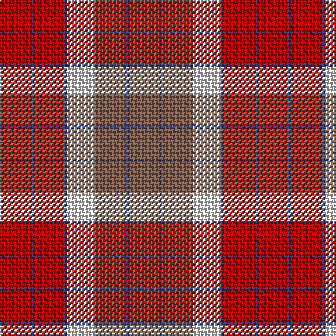

In pattern [RBRBWRBR](/stripes/rbrbwrbr/).

This was sourced from weddslist.  It is a [8 stripe tartan](/stripes/stripes8/).

Original link http://www.weddslist.com/cgi-bin/tartans/pg.pl?source=sts

## Thread count
R/22 B2 R22 B2 LN20 LT22 B2 LT/22

## Palette
Each colour and the base-6 reference it is a variant of.

| Colour | Shade | Base |
|---|---|---|
| B | <code style="background-color:#304080;">#304080</code> `oklch(39.4% 0.109 270.2)` <small>#304080</small> | B <code style="background-color:#2A418A;">#2A418A</code> |
| LN | <code style="background-color:#E0E0E0;">#E0E0E0</code> `oklch(90.7% 0.000 89.9)` <small>#E0E0E0</small> | W <code style="background-color:#F7F7F7;">#F7F7F7</code> |
| LT | <code style="background-color:#806050;">#806050</code> `oklch(51.7% 0.049 47.8)` <small>#806050</small> | R <code style="background-color:#CC0000;">#CC0000</code> |
| R | <code style="background-color:#C00000;">#C00000</code> `oklch(50.7% 0.208 29.2)` <small>#C00000</small> | R <code style="background-color:#CC0000;">#CC0000</code> |

# Sample pattern

## Nearest tartans

The nearest existing variants by ΔTartan distance, with this tartan at the top so the swatches line up against it.

ΔTartan

Tartan

Sett

—

<a href="/ttd/edit/#slug=r11db1r11db1w10o11db1o11~x2">St Andrews</a> <a class="nn-out" href="/setts/s8/r11db1r11db1w10o11db1o11~x2/" title="open its dictionary page">↗</a>

0.77

<a href="/ttd/edit/#slug=o72dr30o18lr62y10dr7lr32">Manhattan Ethnic</a> <a class="nn-out" href="/setts/s7/o72dr30o18lr62y10dr7lr32/" title="open its dictionary page">↗</a>

0.84

<a href="/ttd/edit/#slug=r24n5o9n2o9lb9~x4">Plaid Wine</a> <a class="nn-out" href="/setts/s6/r24n5o9n2o9lb9~x4/" title="open its dictionary page">↗</a>

0.86

<a href="/ttd/edit/#slug=dy11db1dy11w10db1r11db1r11~x2">St. Andrews (Queens University) (Cor</a> <a class="nn-out" href="/setts/s8/dy11db1dy11w10db1r11db1r11~x2/" title="open its dictionary page">↗</a>

0.95

<a href="/ttd/edit/#slug=r16o2r11o6k4w2k4o16~x2">Sidney (Nova Scotia) Canadian Tartan Tartan Number: 1291. Earliest known date: 1986 The Falkirk Tartan. An ornamental twill weave check of natural light and dark wool was discovered at Falkirk in the neck of a jar containing Roman coins. The find is thought to have been buried about 260 A.D. The black and white check is woven today as the Shepherd tartan. See products available Copyright © Blair Urquhart, Comrie, 2015</a> <a class="nn-out" href="/setts/s8/r16o2r11o6k4w2k4o16~x2/" title="open its dictionary page">↗</a>

1.11

<a href="/ttd/edit/#slug=lo36do15lo9r31lo5do4r16~x2">Manhattan Ethnic</a> <a class="nn-out" href="/setts/s7/lo36do15lo9r31lo5do4r16~x2/" title="open its dictionary page">↗</a>

1.12

<a href="/ttd/edit/#slug=o16k4w2k4o6o11o2o16~x2">Sydney (Nova Scotia) (District)</a> <a class="nn-out" href="/setts/s8/o16k4w2k4o6o11o2o16~x2/" title="open its dictionary page">↗</a>

1.16

<a href="/ttd/edit/#slug=lr2dy1r10o12dy10lr6r10dy1lr2~x2">Unidentified Sett</a> <a class="nn-out" href="/setts/s9/lr2dy1r10o12dy10lr6r10dy1lr2~x2/" title="open its dictionary page">↗</a>

1.17

<a href="/ttd/edit/#slug=g12r11p12r3r32p8g8p8~x2">Fiddes</a> <a class="nn-out" href="/setts/s8/g12r11p12r3r32p8g8p8~x2/" title="open its dictionary page">↗</a>

1.27

<a href="/ttd/edit/#slug=db8ly1dg12r10o2r6o2r4~x4">Indiana &quot;Cardinal&quot;</a> <a class="nn-out" href="/setts/s8/db8ly1dg12r10o2r6o2r4~x4/" title="open its dictionary page">↗</a>

1.32

<a href="/ttd/edit/#slug=y28k3r22k8w3k8r22k3y28k3~x2">Henkel</a> <a class="nn-out" href="/setts/s10/y28k3r22k8w3k8r22k3y28k3~x2/" title="open its dictionary page">↗</a>

## Neighbour map

Every grey dot is one of 14299 variants placed by the first two principal components of the ΔTartan feature space (44% of its variance). Red is this tartan; blue dots are its nearest — click one to open its page.

<svg viewBox="0 0 640 380" role="img" style="max-width:100%;height:auto;border:1px solid #e0e0e0;border-radius:4px;display:block" xmlns="http://www.w3.org/2000/svg"><image href="/nn/cloud.v1.png" width="640" height="380"/><a href="/setts/s7/o72dr30o18lr62y10dr7lr32/"><circle cx="227.1" cy="203.8" r="4" fill="#3465a4"><title>Manhattan Ethnic</title></circle></a><a href="/setts/s6/r24n5o9n2o9lb9~x4/"><circle cx="234.3" cy="206.4" r="4" fill="#3465a4"><title>Plaid Wine</title></circle></a><a href="/setts/s8/dy11db1dy11w10db1r11db1r11~x2/"><circle cx="200.6" cy="190.2" r="4" fill="#3465a4"><title>St. Andrews (Queens University) (Cor</title></circle></a><a href="/setts/s8/r16o2r11o6k4w2k4o16~x2/"><circle cx="236.5" cy="202.4" r="4" fill="#3465a4"><title>Sidney (Nova Scotia) Canadian Tartan Tartan Number: 1291. Earliest known date: 1986 The Falkirk Tartan. An ornamental twill weave check of natural light and dark wool was discovered at Falkirk in the neck of a jar containing Roman coins. The find is thought to have been buried about 260 A.D. The black and white check is woven today as the Shepherd tartan. See products available Copyright © Blair Urquhart, Comrie, 2015</title></circle></a><a href="/setts/s7/lo36do15lo9r31lo5do4r16~x2/"><circle cx="245.0" cy="220.1" r="4" fill="#3465a4"><title>Manhattan Ethnic</title></circle></a><a href="/setts/s8/o16k4w2k4o6o11o2o16~x2/"><circle cx="244.3" cy="213.2" r="4" fill="#3465a4"><title>Sydney (Nova Scotia) (District)</title></circle></a><a href="/setts/s9/lr2dy1r10o12dy10lr6r10dy1lr2~x2/"><circle cx="214.9" cy="191.1" r="4" fill="#3465a4"><title>Unidentified Sett</title></circle></a><a href="/setts/s8/g12r11p12r3r32p8g8p8~x2/"><circle cx="264.9" cy="205.4" r="4" fill="#3465a4"><title>Fiddes</title></circle></a><a href="/setts/s8/db8ly1dg12r10o2r6o2r4~x4/"><circle cx="212.2" cy="181.7" r="4" fill="#3465a4"><title>Indiana &quot;Cardinal&quot;</title></circle></a><a href="/setts/s10/y28k3r22k8w3k8r22k3y28k3~x2/"><circle cx="226.4" cy="180.6" r="4" fill="#3465a4"><title>Henkel</title></circle></a><circle cx="217.7" cy="198.1" r="5" fill="#c00000"/></svg>

ID: /setts/s8/r11db1r11db1w10o11db1o11~x2/
