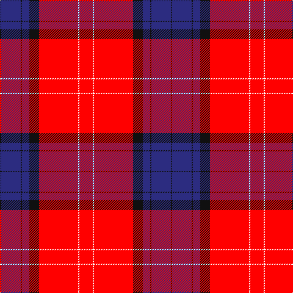

In pattern [KBKBKRWR](/stripes/kbkbkrwr/).

This was sourced from register-of-tartans.  It is a [8 stripe tartan](/stripes/stripes8/).

Original link https://www.tartanregister.gov.uk/tartanDetails.aspx?ref=11364

## Register references

External register numbers recorded for this tartan.

- Scottish Register of Tartans: [11364](https://www.tartanregister.gov.uk/tartanDetails.aspx?ref=11364)

## Thread count
R/22 W2 R64 K16 DB12 K2 DB32 K/2

## Palette
Each colour and the base-6 reference it is a variant of.

| Colour | Shade | Base |
|---|---|---|
| DB | <code style="background-color:#2C2C80;">#2C2C80</code> `oklch(35.0% 0.138 276.6)` <small>#2C2C80</small> | B <code style="background-color:#2A418A;">#2A418A</code> |
| K | <code style="background-color:#101010;">#101010</code> `oklch(17.3% 0.000 89.9)` <small>#101010</small> | K <code style="background-color:#000000;">#000000</code> |
| R | <code style="background-color:#FF0000;">#FF0000</code> `oklch(62.8% 0.258 29.2)` <small>#FF0000</small> | R <code style="background-color:#CC0000;">#CC0000</code> |
| W | <code style="background-color:#FFFFFF;">#FFFFFF</code> `oklch(100.0% 0.000 89.9)` <small>#FFFFFF</small> | W <code style="background-color:#F7F7F7;">#F7F7F7</code> |

# Sample pattern

## Nearest tartans

The nearest existing variants by ΔTartan distance.

1. [Leslie](/setts/s8/r4k6ly1k6r4db16r32k1~x2/) — ΔT 1.08
1. [Texas Lone Star (Fashion)](/setts/s7/r50db14w6db9lo3db4r4~x2/) — ΔT 1.26
1. [Solberg-Wormald (Personal)](/setts/s7/r155lb16k34db48r18ly6r9/) — ΔT 1.28
1. [Leslie Dress](/setts/s8/r4k6ly1k6r4db16r32db1~x2/) — ΔT 1.28
1. [Robberstad](/setts/s9/r60b15r4dt10w2dt10w2dt10r4~x2/) — ΔT 1.32
1. [Brock University Alumni Association](/setts/s6/r52lo2db16lo2db3w5~x2/) — ΔT 1.35
1. [Texas Lone Star](/setts/s7/r50db14w6db9ly3db4r4~x2/) — ΔT 1.37
1. [Chrysanthemum (Japanese Four Seasons)](/setts/s12/w5dr1r20dr4w2dr4w2dr24o2dr1o4dr4~x2/) — ΔT 1.37
1. [Nisbet Dress Rose (Dance)](/setts/s6/m3w1m20k8w8g2~x4/) — ΔT 1.40
1. [Unidentified Plaid #7](/setts/s10/w8r100k42dg42r5k3r5t42r100w8/) — ΔT 1.43

## Neighbour map

Every grey dot is one of 14299 variants placed by the first two principal components of the ΔTartan feature space (44% of its variance). Red is this tartan; blue dots are its nearest — click one to open its page.

<svg viewBox="0 0 640 380" role="img" style="max-width:100%;height:auto;border:1px solid #e0e0e0;border-radius:4px;display:block" xmlns="http://www.w3.org/2000/svg"><image href="/nn/cloud.v1.png" width="640" height="380"/><a href="/setts/s8/r4k6ly1k6r4db16r32k1~x2/"><circle cx="360.2" cy="119.4" r="4" fill="#3465a4"><title>Leslie</title></circle></a><a href="/setts/s7/r50db14w6db9lo3db4r4~x2/"><circle cx="372.5" cy="138.9" r="4" fill="#3465a4"><title>Texas Lone Star (Fashion)</title></circle></a><a href="/setts/s7/r155lb16k34db48r18ly6r9/"><circle cx="382.5" cy="110.9" r="4" fill="#3465a4"><title>Solberg-Wormald (Personal)</title></circle></a><a href="/setts/s8/r4k6ly1k6r4db16r32db1~x2/"><circle cx="353.0" cy="117.3" r="4" fill="#3465a4"><title>Leslie Dress</title></circle></a><a href="/setts/s9/r60b15r4dt10w2dt10w2dt10r4~x2/"><circle cx="387.0" cy="110.8" r="4" fill="#3465a4"><title>Robberstad</title></circle></a><a href="/setts/s6/r52lo2db16lo2db3w5~x2/"><circle cx="420.6" cy="119.5" r="4" fill="#3465a4"><title>Brock University Alumni Association</title></circle></a><a href="/setts/s7/r50db14w6db9ly3db4r4~x2/"><circle cx="350.1" cy="123.4" r="4" fill="#3465a4"><title>Texas Lone Star</title></circle></a><a href="/setts/s12/w5dr1r20dr4w2dr4w2dr24o2dr1o4dr4~x2/"><circle cx="319.9" cy="105.1" r="4" fill="#3465a4"><title>Chrysanthemum (Japanese Four Seasons)</title></circle></a><a href="/setts/s6/m3w1m20k8w8g2~x4/"><circle cx="301.4" cy="152.0" r="4" fill="#3465a4"><title>Nisbet Dress Rose (Dance)</title></circle></a><a href="/setts/s10/w8r100k42dg42r5k3r5t42r100w8/"><circle cx="337.6" cy="96.5" r="4" fill="#3465a4"><title>Unidentified Plaid #7</title></circle></a><circle cx="352.7" cy="113.8" r="5" fill="#c00000"/></svg>

ID: /setts/s8/r11w1r32k8db6k1db16k1~x2/
