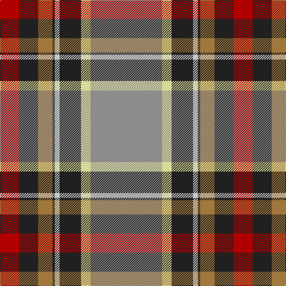

In pattern [RBRBWBYR](/patterns/rbrbwbyr/).

This was sourced from register-of-tartans.  It is a [8 stripes tartan](/stripes/stripes8/).

Original link https://www.tartanregister.gov.uk/tartanDetails.aspx?ref=3165

## Thread count
DR/32 K32 LT24 K4 Na8 K36 LY16 N/120

## Palette
Each colour and its ΔE from the base-6 reference it is a variant of.

| Colour | Shade | Base | ΔE (OKLab) |
|---|---|---|---|
| DR | <code style="background-color:#B00000;">#B00000</code> `#B00000` | R <code style="background-color:#C80000;">#C80000</code> | 0.05 |
| K | <code style="background-color:#202020;">#202020</code> `#202020` | B <code style="background-color:#2C4084;">#2C4084</code> | 0.19 |
| LT | <code style="background-color:#A0783C;">#A0783C</code> `#A0783C` | R <code style="background-color:#C80000;">#C80000</code> | 0.18 |
| LY | <code style="background-color:#D8D898;">#D8D898</code> `#D8D898` | Y <code style="background-color:#E8C000;">#E8C000</code> | 0.10 |
| N | <code style="background-color:#8C8C8C;">#8C8C8C</code> `#8C8C8C` | R <code style="background-color:#C80000;">#C80000</code> | 0.24 |
| Na | <code style="background-color:#C8C8C8;">#C8C8C8</code> `#C8C8C8` | W <code style="background-color:#F4F4F0;">#F4F4F0</code> | 0.13 |

# Sample pattern

ID: /setts/s8/r120y16b36w8b4ra24b32rb32-b202020-r8c8c8c-raa0783c-rbb00000-wc8c8c8-yd8d898/
