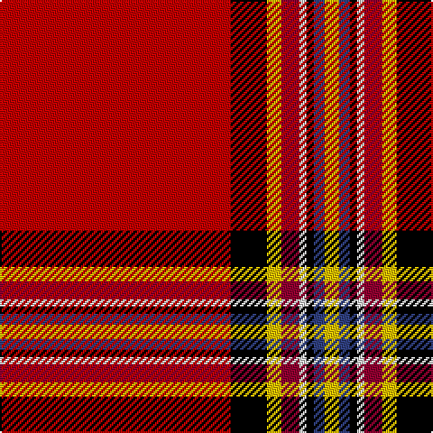

In pattern [RKYRWKBY](/patterns/rkyrwkby/).

This was sourced from weddslist.  It is a [8 stripes tartan](/stripes/stripes8/).

Original link http://www.weddslist.com/cgi-bin/tartans/pg.pl?source=sts

## Thread count
R/128 K20 Y8 DR10 LN4 K4 B6 Y/8

## Palette
Each colour and its ΔE from the base-6 reference it is a variant of.

| Colour | Shade | Base | ΔE (OKLab) |
|---|---|---|---|
| B | <code style="background-color:#304080;">#304080</code> `#304080` | B <code style="background-color:#2C4084;">#2C4084</code> | 0.01 |
| DR | <code style="background-color:#900030;">#900030</code> `#900030` | R <code style="background-color:#C80000;">#C80000</code> | 0.13 |
| K | <code style="background-color:#000000;">#000000</code> `#000000` | K <code style="background-color:#000000;">#000000</code> | 0.00 |
| LN | <code style="background-color:#E0E0E0;">#E0E0E0</code> `#E0E0E0` | W <code style="background-color:#F4F4F0;">#F4F4F0</code> | 0.06 |
| R | <code style="background-color:#C00000;">#C00000</code> `#C00000` | R <code style="background-color:#C80000;">#C80000</code> | 0.02 |
| Y | <code style="background-color:#F0C000;">#F0C000</code> `#F0C000` | Y <code style="background-color:#E8C000;">#E8C000</code> | 0.01 |

# Sample pattern

## Nearest tartans

The nearest existing variants by ΔTartan distance.

1. [Conroy Family Tartan Tartan Number: 1626. Earliest known date: 1986 See products available Copyright © Blair Urquhart, Comrie, 2015](/setts/s8/r128k20y8ra10w4k4b6y8-b2c2c80-k101010-rc80000-raa00048-we0e0e0-ye8c000/) — ΔT 0.68
1. [Tilted Kilt (Corporate)](/setts/s12/r66b2k11y4k2w4k11g2r8k2r8w2-b2c2c80-g006818-k101010-rc80000-wfcfcfc-yfccc00/) — ΔT 0.87
1. [Royal Stewart](/setts/s12/r87b8k11y2k3w2k3g13r11k2r5w3-b304080-g008000-k000000-rc00000-we0e0e0-yf0c000/) — ΔT 1.07
1. [Prince Charles Cloak](/setts/s8/r96b6y2g28r16b6w8ya2-b00004c-g004c00-rc80000-wd0d0d0-yc8c800-yab0b0b0/) — ΔT 1.12
1. [Conroy (Personal)](/setts/s8/r128k20y8ra10w4k4b6y8-b00008c-k000000-r8c0000-raa00048-wc8c8c8-yc88c00/) — ΔT 1.13
1. [TIlted Kilt](/setts/s12/r66b2k11y4k2w4k11g2r8k2r8w2-b0000cd-g006400-k101010-rff0000-wffffff-yffe600/) — ΔT 1.18
1. [Braemar Castle](/setts/s9/r104k10y10ya10b10k4r12k2y4-b441800-k000000-rc80000-ye8c000-yaa08858/) — ΔT 1.20
1. [Stewart/Stuart, Royal](/setts/s12/r87b8k11y2k3w2k3g13r11k2r5w3-b2c2c80-g006818-k101010-rc80000-we0e0e0-ye8c000/) — ΔT 1.20
1. [Stewart Royal](/setts/s12/r72b8k12y2k2w2k2g16r8k2r4w2-b000064-g004c00-k000000-rc80000-wd0d0d0-yffc800/) — ΔT 1.25
1. [Braemar, Castle](/setts/s10/r104k10y10k16ra10b10k4r12k2y4-b401000-k000000-rc00000-ra906030-yf0c000/) — ΔT 1.36

## Neighbour map

Every grey dot is one of 15726 variants placed by the first two principal components of the ΔTartan feature space (44% of its variance). Red is this tartan; blue dots are its nearest — click one to open its page.

<svg viewBox="0 0 640 380" role="img" style="max-width:100%;height:auto;border:1px solid #e0e0e0;border-radius:4px;display:block" xmlns="http://www.w3.org/2000/svg"><image href="/nn/cloud.v1.png" width="640" height="380"/><a href="/setts/s8/r128k20y8ra10w4k4b6y8-b2c2c80-k101010-rc80000-raa00048-we0e0e0-ye8c000/"><circle cx="437.2" cy="61.7" r="4" fill="#3465a4"><title>Conroy Family Tartan Tartan Number: 1626. Earliest known date: 1986 See products available Copyright © Blair Urquhart, Comrie, 2015</title></circle></a><a href="/setts/s12/r66b2k11y4k2w4k11g2r8k2r8w2-b2c2c80-g006818-k101010-rc80000-wfcfcfc-yfccc00/"><circle cx="412.8" cy="39.9" r="4" fill="#3465a4"><title>Tilted Kilt (Corporate)</title></circle></a><a href="/setts/s12/r87b8k11y2k3w2k3g13r11k2r5w3-b304080-g008000-k000000-rc00000-we0e0e0-yf0c000/"><circle cx="429.4" cy="27.1" r="4" fill="#3465a4"><title>Royal Stewart</title></circle></a><a href="/setts/s8/r96b6y2g28r16b6w8ya2-b00004c-g004c00-rc80000-wd0d0d0-yc8c800-yab0b0b0/"><circle cx="443.5" cy="61.9" r="4" fill="#3465a4"><title>Prince Charles Cloak</title></circle></a><a href="/setts/s8/r128k20y8ra10w4k4b6y8-b00008c-k000000-r8c0000-raa00048-wc8c8c8-yc88c00/"><circle cx="435.5" cy="71.5" r="4" fill="#3465a4"><title>Conroy (Personal)</title></circle></a><a href="/setts/s12/r66b2k11y4k2w4k11g2r8k2r8w2-b0000cd-g006400-k101010-rff0000-wffffff-yffe600/"><circle cx="402.4" cy="28.1" r="4" fill="#3465a4"><title>TIlted Kilt</title></circle></a><a href="/setts/s9/r104k10y10ya10b10k4r12k2y4-b441800-k000000-rc80000-ye8c000-yaa08858/"><circle cx="470.3" cy="55.2" r="4" fill="#3465a4"><title>Braemar Castle</title></circle></a><a href="/setts/s12/r87b8k11y2k3w2k3g13r11k2r5w3-b2c2c80-g006818-k101010-rc80000-we0e0e0-ye8c000/"><circle cx="447.1" cy="32.4" r="4" fill="#3465a4"><title>Stewart/Stuart, Royal</title></circle></a><a href="/setts/s12/r72b8k12y2k2w2k2g16r8k2r4w2-b000064-g004c00-k000000-rc80000-wd0d0d0-yffc800/"><circle cx="376.4" cy="35.8" r="4" fill="#3465a4"><title>Stewart Royal</title></circle></a><a href="/setts/s10/r104k10y10k16ra10b10k4r12k2y4-b401000-k000000-rc00000-ra906030-yf0c000/"><circle cx="410.2" cy="51.1" r="4" fill="#3465a4"><title>Braemar, Castle</title></circle></a><circle cx="419.6" cy="56.5" r="5" fill="#c00000"/></svg>

ID: /setts/s8/r128k20y8ra10w4k4b6y8-b304080-k000000-rc00000-ra900030-we0e0e0-yf0c000/
