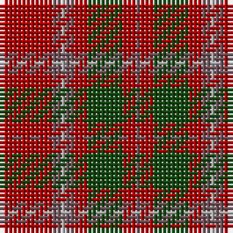

In pattern [BRGRBYBR](/patterns/brgrbybr/).

This was sourced from weddslist.  It is a [8 stripes tartan](/stripes/stripes8/).

Original link http://www.weddslist.com/cgi-bin/tartans/pg.pl?source=x

## Thread count
DR/12 N2 Na1 N2 DR3 DG8 DR3 N/1

## Palette
Each colour and its ΔE from the base-6 reference it is a variant of.

| Colour | Shade | Base | ΔE (OKLab) |
|---|---|---|---|
| DG | <code style="background-color:#11450D;">#11450D</code> `#11450D` | G <code style="background-color:#006100;">#006100</code> | 0.09 |
| DR | <code style="background-color:#AA0000;">#AA0000</code> `#AA0000` | R <code style="background-color:#CC0000;">#CC0000</code> | 0.07 |
| N | <code style="background-color:#6E5058;">#6E5058</code> `#6E5058` | B <code style="background-color:#2A418A;">#2A418A</code> | 0.15 |
| Na | <code style="background-color:#AAAAAA;">#AAAAAA</code> `#AAAAAA` | Y <code style="background-color:#F2BF00;">#F2BF00</code> | 0.19 |

# Sample pattern

## Nearest tartans

The nearest existing variants by ΔTartan distance.

1. [Chisholm](/setts/s8/r12b2y1b2r3g8r3b1~b6e5058-g11450d-raa0000-yaaaaaa~x2/) — ΔT 0.00
1. [Unidentified Scarlett #17](/setts/s12/r12ra2g4ra2r2g6r2ra2g4ra2r12k1~g006818-k101010-ra00000-rac80000~x2/) — ΔT 0.96
1. [MacIver of Strathendry Htg (Personal](/setts/s9/r3ra28b5ra5b33ra5b5ra28y3~b441800-r880000-ra98481c-ybc8c00~x2/) — ΔT 0.98
1. [Rice Welsh Name Tartan Tartan Number: 5754. Earliest known date: 2002 The tartan for this Welsh surname and its variations, Brice, Bryce, Price, Pryce, Rice, Rhys, Ryce, is actually woven in Wales at the Cambrian Woollen Mill, weaving on the same site since 1830. This tartan differs from many traditional patterns in that the warp and weft differ, giving the finished worsted wool cloth more of a predominant stripe, noticeable in the finished Kilt, or Cilt in Wales. See products available Copyright © Blair Urquhart, Comrie, 2015](/setts/s10/y4r21y1r21g8b4g5b4g4y4~b202060-g5c6428-r901c38-ybc8c00/) — ΔT 1.17
1. [MacNab VS](/setts/s7/g6r2b2g4b2r12k1~b59110d-g11450d-k000000-raa0000~x2/) — ΔT 1.17
1. [Cairn O'Mount (Personal)](/setts/s6/r58b12r5g28r7y5~b647480-g648468-rb40000-ybc8c00~x2/) — ΔT 1.18
1. [Hubbard (2016)](/setts/s9/b5r19ba2g8r3g18ba2g9ba2~b003c64-ba1c1c1c-g5c6428-rc80000~x2/) — ΔT 1.21
1. [Scottish Piping Soc. of London (Corp](/setts/s7/r30g3b5g21r3g21b2~b202060-g5c6428-rc8002c~x2/) — ΔT 1.28
1. [Cetoloni](/setts/s6/b2r22g11ga2g11b2~b304080-g604000-ga908000-rc00020~x2/) — ΔT 1.35
1. [Burnett of Powis (Personal)](/setts/s8/b3r21g3r3g19y3g19r3~b2888c4-g5c6428-rc80000-ye8c000~x2/) — ΔT 1.40

## Neighbour map

Every grey dot is one of 15726 variants placed by the first two principal components of the ΔTartan feature space (44% of its variance). Red is this tartan; blue dots are its nearest — click one to open its page.

<svg viewBox="0 0 640 380" role="img" style="max-width:100%;height:auto;border:1px solid #e0e0e0;border-radius:4px;display:block" xmlns="http://www.w3.org/2000/svg"><image href="/nn/cloud.v1.png" width="640" height="380"/><a href="/setts/s8/r12b2y1b2r3g8r3b1~b6e5058-g11450d-raa0000-yaaaaaa~x2/"><circle cx="377.6" cy="203.2" r="4" fill="#3465a4"><title>Chisholm</title></circle></a><a href="/setts/s12/r12ra2g4ra2r2g6r2ra2g4ra2r12k1~g006818-k101010-ra00000-rac80000~x2/"><circle cx="360.5" cy="187.8" r="4" fill="#3465a4"><title>Unidentified Scarlett #17</title></circle></a><a href="/setts/s9/r3ra28b5ra5b33ra5b5ra28y3~b441800-r880000-ra98481c-ybc8c00~x2/"><circle cx="421.3" cy="211.9" r="4" fill="#3465a4"><title>MacIver of Strathendry Htg (Personal</title></circle></a><a href="/setts/s10/y4r21y1r21g8b4g5b4g4y4~b202060-g5c6428-r901c38-ybc8c00/"><circle cx="372.5" cy="171.7" r="4" fill="#3465a4"><title>Rice Welsh Name Tartan Tartan Number: 5754. Earliest known date: 2002 The tartan for this Welsh surname and its variations, Brice, Bryce, Price, Pryce, Rice, Rhys, Ryce, is actually woven in Wales at the Cambrian Woollen Mill, weaving on the same site since 1830. This tartan differs from many traditional patterns in that the warp and weft differ, giving the finished worsted wool cloth more of a predominant stripe, noticeable in the finished Kilt, or Cilt in Wales. See products available Copyright © Blair Urquhart, Comrie, 2015</title></circle></a><a href="/setts/s7/g6r2b2g4b2r12k1~b59110d-g11450d-k000000-raa0000~x2/"><circle cx="319.7" cy="208.8" r="4" fill="#3465a4"><title>MacNab VS</title></circle></a><a href="/setts/s6/r58b12r5g28r7y5~b647480-g648468-rb40000-ybc8c00~x2/"><circle cx="429.0" cy="212.0" r="4" fill="#3465a4"><title>Cairn O'Mount (Personal)</title></circle></a><a href="/setts/s9/b5r19ba2g8r3g18ba2g9ba2~b003c64-ba1c1c1c-g5c6428-rc80000~x2/"><circle cx="317.0" cy="208.7" r="4" fill="#3465a4"><title>Hubbard (2016)</title></circle></a><a href="/setts/s7/r30g3b5g21r3g21b2~b202060-g5c6428-rc8002c~x2/"><circle cx="390.4" cy="217.1" r="4" fill="#3465a4"><title>Scottish Piping Soc. of London (Corp</title></circle></a><a href="/setts/s6/b2r22g11ga2g11b2~b304080-g604000-ga908000-rc00020~x2/"><circle cx="354.9" cy="226.9" r="4" fill="#3465a4"><title>Cetoloni</title></circle></a><a href="/setts/s8/b3r21g3r3g19y3g19r3~b2888c4-g5c6428-rc80000-ye8c000~x2/"><circle cx="352.4" cy="222.8" r="4" fill="#3465a4"><title>Burnett of Powis (Personal)</title></circle></a><circle cx="377.6" cy="203.2" r="5" fill="#c00000"/></svg>

ID: /setts/s8/r12b2y1b2r3g8r3b1~b6e5058-g11450d-raa0000-yaaaaaa/
