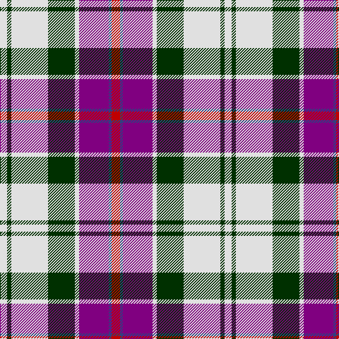

In pattern [RBBWGWGW](/patterns/rbbwgwgw/).

This was sourced from weddslist.  It is a [8 stripes tartan](/stripes/stripes8/).

Original link http://www.weddslist.com/cgi-bin/tartans/pg.pl?source=sts

## Thread count
LN/10 DG6 LN52 DG38 LN6 P42 B4 R/12

## Palette
Each colour and its ΔE from the base-6 reference it is a variant of.

| Colour | Shade | Base | ΔE (OKLab) |
|---|---|---|---|
| B | <code style="background-color:#304080;">#304080</code> `#304080` | B <code style="background-color:#2A418A;">#2A418A</code> | 0.02 |
| DG | <code style="background-color:#003000;">#003000</code> `#003000` | G <code style="background-color:#006100;">#006100</code> | 0.17 |
| LN | <code style="background-color:#E0E0E0;">#E0E0E0</code> `#E0E0E0` | W <code style="background-color:#F7F7F7;">#F7F7F7</code> | 0.07 |
| P | <code style="background-color:#800080;">#800080</code> `#800080` | B <code style="background-color:#2A418A;">#2A418A</code> | 0.17 |
| R | <code style="background-color:#C00000;">#C00000</code> `#C00000` | R <code style="background-color:#CC0000;">#CC0000</code> | 0.03 |

# Sample pattern

## Nearest tartans

The nearest existing variants by ΔTartan distance.

1. [Culloden Dress Old Tartan Tartan Number: 1322. Earliest known date: 1983 Worn by a member of Prince Charles' staff during the battle but it is not known with which family or district it was first connected. It was first illustrated in Old & Rare in 1893 by D W Stewart whose son D C Stewart was a founder member of the Scottish Tartans Society. Now firmly established as a district tartan. See products available Copyright © Blair Urquhart, Comrie, 2015](/setts/s8/r12b4ba42w6g38w52g6w10-b2c2c80-ba780078-g003820-rc80000-we0e0e0/) — ΔT 0.16
1. [Culloden Dress Ancient](/setts/s8/r12b4ba42w6g38w52g6w10-b2c4084-ba5a008c-g002814-rdc0000-we0e0e0/) — ΔT 0.47
1. [MacDuff Dress #5](/setts/s7/w78b18k20g22r14k6r14-b2c4084-g005020-k101010-rdc0000-we0e0e0/) — ΔT 0.80
1. [MacDuff Dress Clan Tartan Tartan Number: 1601. Earliest known date: pre 2003 From Scott Adie pattern. See products available Copyright © Blair Urquhart, Comrie, 2015](/setts/s7/w78b18k20g22r14k6r14-b2c2c80-g006818-k101010-rc80000-we0e0e0/) — ΔT 0.83
1. [Ailsa Craig Trade Tartan Tartan Number: 1673. Earliest known date: 1972 Nothing See products available Copyright © Blair Urquhart, Comrie, 2015](/setts/s8/r10w4b40y4k32w36k4w10-b2c2c80-k101010-rc80000-we0e0e0-ye8c000/) — ΔT 0.90
1. [Ailsa Craig](/setts/s8/r10w4ra40y4k32w36k4w10-k101010-rc80000-ra888888-wf8f8f8-ye8c000/) — ΔT 0.93
1. [MacDuff dress](/setts/s7/w78b18k20g22r14k6r14-b304080-g008000-k000000-rc00000-we0e0e0/) — ΔT 0.94
1. [Shiel, Purple (Dance)](/setts/s7/w16g10b20ba48w60g4wa4-b5c8ca8-ba440044-g006818-wf0e0c8-wac49cd8/) — ΔT 0.94
1. [Ailsa Craig (District)](/setts/s8/r10w4b40y4k32w36k4w10-b7490a4-k101010-rc80000-wf8f8f8-ye8c000/) — ΔT 0.96
1. [Walker, Dress (Personal)](/setts/s12/y8b4r14b30r6b6r6b14w56g14w12g4-b1c0070-g604000-rc80000-wf0f0d8-yd09800/) — ΔT 0.97

## Neighbour map

Every grey dot is one of 15726 variants placed by the first two principal components of the ΔTartan feature space (44% of its variance). Red is this tartan; blue dots are its nearest — click one to open its page.

<svg viewBox="0 0 640 380" role="img" style="max-width:100%;height:auto;border:1px solid #e0e0e0;border-radius:4px;display:block" xmlns="http://www.w3.org/2000/svg"><image href="/nn/cloud.v1.png" width="640" height="380"/><a href="/setts/s8/r12b4ba42w6g38w52g6w10-b2c2c80-ba780078-g003820-rc80000-we0e0e0/"><circle cx="154.2" cy="142.7" r="4" fill="#3465a4"><title>Culloden Dress Old Tartan Tartan Number: 1322. Earliest known date: 1983 Worn by a member of Prince Charles' staff during the battle but it is not known with which family or district it was first connected. It was first illustrated in Old &amp; Rare in 1893 by D W Stewart whose son D C Stewart was a founder member of the Scottish Tartans Society. Now firmly established as a district tartan. See products available Copyright © Blair Urquhart, Comrie, 2015</title></circle></a><a href="/setts/s8/r12b4ba42w6g38w52g6w10-b2c4084-ba5a008c-g002814-rdc0000-we0e0e0/"><circle cx="149.4" cy="143.3" r="4" fill="#3465a4"><title>Culloden Dress Ancient</title></circle></a><a href="/setts/s7/w78b18k20g22r14k6r14-b2c4084-g005020-k101010-rdc0000-we0e0e0/"><circle cx="168.9" cy="141.2" r="4" fill="#3465a4"><title>MacDuff Dress #5</title></circle></a><a href="/setts/s7/w78b18k20g22r14k6r14-b2c2c80-g006818-k101010-rc80000-we0e0e0/"><circle cx="168.4" cy="141.6" r="4" fill="#3465a4"><title>MacDuff Dress Clan Tartan Tartan Number: 1601. Earliest known date: pre 2003 From Scott Adie pattern. See products available Copyright © Blair Urquhart, Comrie, 2015</title></circle></a><a href="/setts/s8/r10w4b40y4k32w36k4w10-b2c2c80-k101010-rc80000-we0e0e0-ye8c000/"><circle cx="118.2" cy="156.0" r="4" fill="#3465a4"><title>Ailsa Craig Trade Tartan Tartan Number: 1673. Earliest known date: 1972 Nothing See products available Copyright © Blair Urquhart, Comrie, 2015</title></circle></a><a href="/setts/s8/r10w4ra40y4k32w36k4w10-k101010-rc80000-ra888888-wf8f8f8-ye8c000/"><circle cx="115.2" cy="149.5" r="4" fill="#3465a4"><title>Ailsa Craig</title></circle></a><a href="/setts/s7/w78b18k20g22r14k6r14-b304080-g008000-k000000-rc00000-we0e0e0/"><circle cx="162.7" cy="140.6" r="4" fill="#3465a4"><title>MacDuff dress</title></circle></a><a href="/setts/s7/w16g10b20ba48w60g4wa4-b5c8ca8-ba440044-g006818-wf0e0c8-wac49cd8/"><circle cx="196.6" cy="139.7" r="4" fill="#3465a4"><title>Shiel, Purple (Dance)</title></circle></a><a href="/setts/s8/r10w4b40y4k32w36k4w10-b7490a4-k101010-rc80000-wf8f8f8-ye8c000/"><circle cx="113.4" cy="150.1" r="4" fill="#3465a4"><title>Ailsa Craig (District)</title></circle></a><a href="/setts/s12/y8b4r14b30r6b6r6b14w56g14w12g4-b1c0070-g604000-rc80000-wf0f0d8-yd09800/"><circle cx="144.3" cy="108.9" r="4" fill="#3465a4"><title>Walker, Dress (Personal)</title></circle></a><circle cx="152.8" cy="142.1" r="5" fill="#c00000"/></svg>

ID: /setts/s8/r12b4ba42w6g38w52g6w10-b304080-ba800080-g003000-rc00000-we0e0e0/
