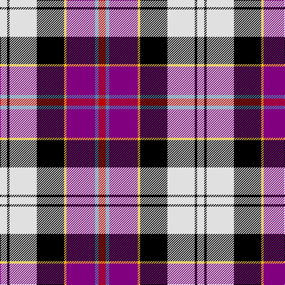

In pattern [RBBYKWKW](/patterns/rbbykwkw/).

This was sourced from weddslist.  It is a [8 stripes tartan](/stripes/stripes8/).

Original link http://www.weddslist.com/cgi-bin/tartans/pg.pl?source=sts

## Thread count
LN/12 K4 LN46 K46 Y4 P48 B6 R/12

## Palette
Each colour and its ΔE from the base-6 reference it is a variant of.

| Colour | Shade | Base | ΔE (OKLab) |
|---|---|---|---|
| B | <code style="background-color:#5480B0;">#5480B0</code> `#5480B0` | B <code style="background-color:#2C4084;">#2C4084</code> | 0.20 |
| K | <code style="background-color:#000000;">#000000</code> `#000000` | K <code style="background-color:#000000;">#000000</code> | 0.00 |
| LN | <code style="background-color:#E0E0E0;">#E0E0E0</code> `#E0E0E0` | W <code style="background-color:#F4F4F0;">#F4F4F0</code> | 0.06 |
| P | <code style="background-color:#800080;">#800080</code> `#800080` | B <code style="background-color:#2C4084;">#2C4084</code> | 0.17 |
| R | <code style="background-color:#C00000;">#C00000</code> `#C00000` | R <code style="background-color:#C80000;">#C80000</code> | 0.02 |
| Y | <code style="background-color:#F0C000;">#F0C000</code> `#F0C000` | Y <code style="background-color:#E8C000;">#E8C000</code> | 0.01 |

# Sample pattern

## Nearest tartans

The nearest existing variants by ΔTartan distance.

1. [Culloden Dress](/setts/s8/r12b6ba48y4k46w46k4w12-b5c8ca8-ba780078-k101010-rc80000-wfcfcfc-ye8c000/) — ΔT 0.62
1. [Humming Bird (Fashion)](/setts/s8/r12b6ra40y4k40w40k4w10-b5c8ca8-k101010-rc80000-raa00470-we0e0e0-ye8c000/) — ΔT 0.79
1. [Hatcher (Texas) (Personal)](/setts/s7/w66r14b18ba14y24ra6k58-b003053-ba6b3fa0-k000000-rb22222-raff0000-wee82ee-y00ff00/) — ΔT 1.05
1. [Culloden, Grey](/setts/s8/g12k4g46k46w4b48ba6r12-b800080-ba304080-g808080-k000000-rc00000-we0e0e0/) — ΔT 1.06
1. [Dean/Dundas (Personal)](/setts/s9/r34k10w8k12y10b62k10g12w6-b2c2c80-g289c18-k101010-rc80000-we0e0e0-yfccc00/) — ΔT 1.08
1. [Culloden, Stirling](/setts/s8/r8ra4b30y4k28w28k4w8-b8080d0-k000000-rd03030-ra806050-we0e0e0-yf0c000/) — ΔT 1.18
1. [Pengelly, The Cornish](/setts/s7/w10k52y8wa48b16k6r8-b5a008c-k101010-rdc0000-we0e0e0-wac0c0c0-yfadc00/) — ΔT 1.18
1. [Iowa Dress (District)](/setts/s8/r8y6w24k32g10b40k8w4-b2c2c80-g006818-k101010-rc80000-wf8f8f8-ye8c000/) — ΔT 1.19
1. [Casey (Personal)](/setts/s7/r10b4ba32k26y26k4w6-b5c8ca8-ba9058d8-k101010-rc80000-we0e0e0-ye8c000/) — ΔT 1.20
1. [Christian Dress (Personal)](/setts/s7/r6w4b54k38w54ba4y6-b2c2c80-ba780078-k101010-rc80000-wf8f8f8-ye8c000/) — ΔT 1.22

## Neighbour map

Every grey dot is one of 15726 variants placed by the first two principal components of the ΔTartan feature space (44% of its variance). Red is this tartan; blue dots are its nearest — click one to open its page.

<svg viewBox="0 0 640 380" role="img" style="max-width:100%;height:auto;border:1px solid #e0e0e0;border-radius:4px;display:block" xmlns="http://www.w3.org/2000/svg"><image href="/nn/cloud.v1.png" width="640" height="380"/><a href="/setts/s8/r12b6ba48y4k46w46k4w12-b5c8ca8-ba780078-k101010-rc80000-wfcfcfc-ye8c000/"><circle cx="93.9" cy="124.7" r="4" fill="#3465a4"><title>Culloden Dress</title></circle></a><a href="/setts/s8/r12b6ra40y4k40w40k4w10-b5c8ca8-k101010-rc80000-raa00470-we0e0e0-ye8c000/"><circle cx="87.9" cy="135.5" r="4" fill="#3465a4"><title>Humming Bird (Fashion)</title></circle></a><a href="/setts/s7/w66r14b18ba14y24ra6k58-b003053-ba6b3fa0-k000000-rb22222-raff0000-wee82ee-y00ff00/"><circle cx="54.3" cy="129.6" r="4" fill="#3465a4"><title>Hatcher (Texas) (Personal)</title></circle></a><a href="/setts/s8/g12k4g46k46w4b48ba6r12-b800080-ba304080-g808080-k000000-rc00000-we0e0e0/"><circle cx="115.6" cy="141.0" r="4" fill="#3465a4"><title>Culloden, Grey</title></circle></a><a href="/setts/s9/r34k10w8k12y10b62k10g12w6-b2c2c80-g289c18-k101010-rc80000-we0e0e0-yfccc00/"><circle cx="118.2" cy="132.1" r="4" fill="#3465a4"><title>Dean/Dundas (Personal)</title></circle></a><a href="/setts/s8/r8ra4b30y4k28w28k4w8-b8080d0-k000000-rd03030-ra806050-we0e0e0-yf0c000/"><circle cx="58.2" cy="150.2" r="4" fill="#3465a4"><title>Culloden, Stirling</title></circle></a><a href="/setts/s7/w10k52y8wa48b16k6r8-b5a008c-k101010-rdc0000-we0e0e0-wac0c0c0-yfadc00/"><circle cx="115.3" cy="148.4" r="4" fill="#3465a4"><title>Pengelly, The Cornish</title></circle></a><a href="/setts/s8/r8y6w24k32g10b40k8w4-b2c2c80-g006818-k101010-rc80000-wf8f8f8-ye8c000/"><circle cx="64.1" cy="149.5" r="4" fill="#3465a4"><title>Iowa Dress (District)</title></circle></a><a href="/setts/s7/r10b4ba32k26y26k4w6-b5c8ca8-ba9058d8-k101010-rc80000-we0e0e0-ye8c000/"><circle cx="59.5" cy="160.9" r="4" fill="#3465a4"><title>Casey (Personal)</title></circle></a><a href="/setts/s7/r6w4b54k38w54ba4y6-b2c2c80-ba780078-k101010-rc80000-wf8f8f8-ye8c000/"><circle cx="115.2" cy="125.7" r="4" fill="#3465a4"><title>Christian Dress (Personal)</title></circle></a><circle cx="94.5" cy="127.7" r="5" fill="#c00000"/></svg>

ID: /setts/s8/r12b6ba48y4k46w46k4w12-b5480b0-ba800080-k000000-rc00000-we0e0e0-yf0c000/
