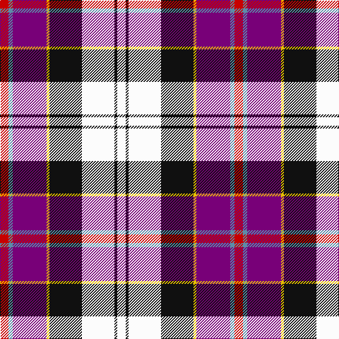

In pattern [RBBYKWKW](/patterns/rbbykwkw/).

This was sourced from register-of-tartans.  It is a [8 stripes tartan](/stripes/stripes8/).

Original link https://www.tartanregister.gov.uk/tartanDetails.aspx?ref=822

## Thread count
R/12 B6 P48 Y4 K46 W46 K4 W/12

## Palette
Each colour and its ΔE from the base-6 reference it is a variant of.

| Colour | Shade | Base | ΔE (OKLab) |
|---|---|---|---|
| B | <code style="background-color:#5C8CA8;">#5C8CA8</code> `#5C8CA8` | B <code style="background-color:#2C4084;">#2C4084</code> | 0.23 |
| K | <code style="background-color:#101010;">#101010</code> `#101010` | K <code style="background-color:#000000;">#000000</code> | 0.17 |
| P | <code style="background-color:#780078;">#780078</code> `#780078` | B <code style="background-color:#2C4084;">#2C4084</code> | 0.16 |
| R | <code style="background-color:#C80000;">#C80000</code> `#C80000` | R <code style="background-color:#C80000;">#C80000</code> | 0.00 |
| W | <code style="background-color:#FCFCFC;">#FCFCFC</code> `#FCFCFC` | W <code style="background-color:#F4F4F0;">#F4F4F0</code> | 0.03 |
| Y | <code style="background-color:#E8C000;">#E8C000</code> `#E8C000` | Y <code style="background-color:#E8C000;">#E8C000</code> | 0.00 |

# Sample pattern

## Nearest tartans

The nearest existing variants by ΔTartan distance.

1. [Humming Bird (Fashion)](/setts/s8/r12b6ra40y4k40w40k4w10-b5c8ca8-k101010-rc80000-raa00470-we0e0e0-ye8c000/) — ΔT 0.53
1. [Culloden, Dress](/setts/s8/r12b6ba48y4k46w46k4w12-b5480b0-ba800080-k000000-rc00000-we0e0e0-yf0c000/) — ΔT 0.62
1. [Christian Dress (Personal)](/setts/s7/r6w4b54k38w54ba4y6-b2c2c80-ba780078-k101010-rc80000-wf8f8f8-ye8c000/) — ΔT 1.03
1. [Casey (Personal)](/setts/s7/r10b4ba32k26y26k4w6-b5c8ca8-ba9058d8-k101010-rc80000-we0e0e0-ye8c000/) — ΔT 1.05
1. [Culloden, Stirling](/setts/s8/r8ra4b30y4k28w28k4w8-b8080d0-k000000-rd03030-ra806050-we0e0e0-yf0c000/) — ΔT 1.05
1. [Pengelly, The Cornish](/setts/s7/w10k52y8wa48b16k6r8-b5a008c-k101010-rdc0000-we0e0e0-wac0c0c0-yfadc00/) — ΔT 1.16
1. [Culloden Dress Old Tartan Tartan Number: 1322. Earliest known date: 1983 Worn by a member of Prince Charles' staff during the battle but it is not known with which family or district it was first connected. It was first illustrated in Old & Rare in 1893 by D W Stewart whose son D C Stewart was a founder member of the Scottish Tartans Society. Now firmly established as a district tartan. See products available Copyright © Blair Urquhart, Comrie, 2015](/setts/s8/r12b4ba42w6g38w52g6w10-b2c2c80-ba780078-g003820-rc80000-we0e0e0/) — ΔT 1.20
1. [Culloden, dress Ancient](/setts/s8/r12b4ba42w6g38w52g6w10-b304080-ba800080-g003000-rc00000-we0e0e0/) — ΔT 1.21
1. [Galvez-Brown](/setts/s7/b72y10r24ra18ba10w24y14-b212160-ba551a8b-re3170d-raff0000-wffffff-yffb90f/) — ΔT 1.22
1. [Culloden Dress Ancient](/setts/s8/r12b4ba42w6bb38w52bb6w10-b2c4084-ba5a008c-bb002814-rdc0000-we0e0e0/) — ΔT 1.23

## Neighbour map

Every grey dot is one of 15726 variants placed by the first two principal components of the ΔTartan feature space (44% of its variance). Red is this tartan; blue dots are its nearest — click one to open its page.

<svg viewBox="0 0 640 380" role="img" style="max-width:100%;height:auto;border:1px solid #e0e0e0;border-radius:4px;display:block" xmlns="http://www.w3.org/2000/svg"><image href="/nn/cloud.v1.png" width="640" height="380"/><a href="/setts/s8/r12b6ra40y4k40w40k4w10-b5c8ca8-k101010-rc80000-raa00470-we0e0e0-ye8c000/"><circle cx="87.9" cy="135.5" r="4" fill="#3465a4"><title>Humming Bird (Fashion)</title></circle></a><a href="/setts/s8/r12b6ba48y4k46w46k4w12-b5480b0-ba800080-k000000-rc00000-we0e0e0-yf0c000/"><circle cx="94.5" cy="127.7" r="4" fill="#3465a4"><title>Culloden, Dress</title></circle></a><a href="/setts/s7/r6w4b54k38w54ba4y6-b2c2c80-ba780078-k101010-rc80000-wf8f8f8-ye8c000/"><circle cx="115.2" cy="125.7" r="4" fill="#3465a4"><title>Christian Dress (Personal)</title></circle></a><a href="/setts/s7/r10b4ba32k26y26k4w6-b5c8ca8-ba9058d8-k101010-rc80000-we0e0e0-ye8c000/"><circle cx="59.5" cy="160.9" r="4" fill="#3465a4"><title>Casey (Personal)</title></circle></a><a href="/setts/s8/r8ra4b30y4k28w28k4w8-b8080d0-k000000-rd03030-ra806050-we0e0e0-yf0c000/"><circle cx="58.2" cy="150.2" r="4" fill="#3465a4"><title>Culloden, Stirling</title></circle></a><a href="/setts/s7/w10k52y8wa48b16k6r8-b5a008c-k101010-rdc0000-we0e0e0-wac0c0c0-yfadc00/"><circle cx="115.3" cy="148.4" r="4" fill="#3465a4"><title>Pengelly, The Cornish</title></circle></a><a href="/setts/s8/r12b4ba42w6g38w52g6w10-b2c2c80-ba780078-g003820-rc80000-we0e0e0/"><circle cx="154.2" cy="142.7" r="4" fill="#3465a4"><title>Culloden Dress Old Tartan Tartan Number: 1322. Earliest known date: 1983 Worn by a member of Prince Charles' staff during the battle but it is not known with which family or district it was first connected. It was first illustrated in Old &amp; Rare in 1893 by D W Stewart whose son D C Stewart was a founder member of the Scottish Tartans Society. Now firmly established as a district tartan. See products available Copyright © Blair Urquhart, Comrie, 2015</title></circle></a><a href="/setts/s8/r12b4ba42w6g38w52g6w10-b304080-ba800080-g003000-rc00000-we0e0e0/"><circle cx="152.8" cy="142.1" r="4" fill="#3465a4"><title>Culloden, dress Ancient</title></circle></a><a href="/setts/s7/b72y10r24ra18ba10w24y14-b212160-ba551a8b-re3170d-raff0000-wffffff-yffb90f/"><circle cx="109.0" cy="153.1" r="4" fill="#3465a4"><title>Galvez-Brown</title></circle></a><a href="/setts/s8/r12b4ba42w6bb38w52bb6w10-b2c4084-ba5a008c-bb002814-rdc0000-we0e0e0/"><circle cx="149.4" cy="143.3" r="4" fill="#3465a4"><title>Culloden Dress Ancient</title></circle></a><circle cx="93.9" cy="124.7" r="5" fill="#c00000"/></svg>

ID: /setts/s8/r12b6ba48y4k46w46k4w12-b5c8ca8-ba780078-k101010-rc80000-wfcfcfc-ye8c000/
