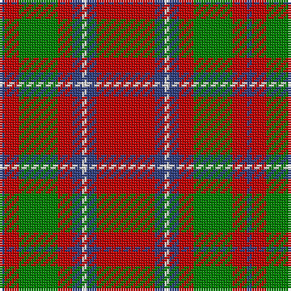

In pattern [BRGRBWBR](/stripes/brgrbwbr/).

This was sourced from weddslist.  It is a [8 stripe tartan](/stripes/stripes8/).

Original link http://www.weddslist.com/cgi-bin/tartans/pg.pl?source=sts

## Also known as

This cloth is also recorded under:

- Chisholm, The

## Attestations

This cloth appears in 2 source records; the oldest owns this page.

- undated — Chisholm, The (weddslist, [record](http://www.weddslist.com/cgi-bin/tartans/pg.pl?source=sts))
- undated — Chisholm (Portrait) The.. Clan Tartan Tartan Number: 532. Earliest known date: 1800 This is without doubt the oldest of the Chisholm tartans, dating from around 1800 and which appears in a portrait of the clan heroine 'Mary Chisholm' of about that date. She was famous for having sided with the clansmen during the clearances. D.C.Stewart says it is a variation of one of the MacIntosh setts, said to have been found in a cave at Achnacarry in 1746. Cockburn Collection No.40 (1800 - 10). Logan (1831) See products available Copyright © Blair Urquhart, Comrie, 2015 (house-of-tartan, [record](http://www.house-of-tartan.scotland.net/house/TartanViewjs.asp?colr=Def&tnam=532))

## Thread count
R/24 B4 LN2 B4 R6 G16 R6 B/2

## Palette
Each colour and the base-6 reference it is a variant of.

| Colour | Shade | Base |
|---|---|---|
| B | <code style="background-color:#304080;">#304080</code> `oklch(39.4% 0.109 270.2)` <small>#304080</small> | B <code style="background-color:#2A418A;">#2A418A</code> |
| G | <code style="background-color:#008000;">#008000</code> `oklch(52.0% 0.177 142.5)` <small>#008000</small> | G <code style="background-color:#006100;">#006100</code> |
| LN | <code style="background-color:#E0E0E0;">#E0E0E0</code> `oklch(90.7% 0.000 89.9)` <small>#E0E0E0</small> | W <code style="background-color:#F7F7F7;">#F7F7F7</code> |
| R | <code style="background-color:#C00000;">#C00000</code> `oklch(50.7% 0.208 29.2)` <small>#C00000</small> | R <code style="background-color:#CC0000;">#CC0000</code> |

# Sample pattern

## Nearest tartans

The nearest existing variants by ΔTartan distance, with this tartan at the top so the swatches line up against it.

ΔTartan

Tartan

Sett

—

<a href="/ttd/edit/#slug=r12db2w1db2r3g8r3db1~x2">Chisholm, The</a> <a class="nn-out" href="/setts/s8/r12db2w1db2r3g8r3db1~x2/" title="open its dictionary page">↗</a>

0.20

<a href="/ttd/edit/#slug=r12b2w1b2r3g8r3b1~x4">Chisholm, The</a> <a class="nn-out" href="/setts/s8/r12b2w1b2r3g8r3b1~x4/" title="open its dictionary page">↗</a>

0.65

<a href="/ttd/edit/#slug=r12dp2lb1dp2r3dg8r3dp1">Chisholm</a> <a class="nn-out" href="/setts/s8/r12dp2lb1dp2r3dg8r3dp1/" title="open its dictionary page">↗</a>

0.72

<a href="/ttd/edit/#slug=r3g16r4k6r28g2lo3~x2">McInally (Name)</a> <a class="nn-out" href="/setts/s7/r3g16r4k6r28g2lo3~x2/" title="open its dictionary page">↗</a>

0.77

<a href="/ttd/edit/#slug=db10r2w2r16g6r1g2r1g3r6~x2">Harkness</a> <a class="nn-out" href="/setts/s10/db10r2w2r16g6r1g2r1g3r6~x2/" title="open its dictionary page">↗</a>

0.87

<a href="/ttd/edit/#slug=b10r2w2r16g6r1g2r1g3r6~x4">Harkness Dress (Name)</a> <a class="nn-out" href="/setts/s10/b10r2w2r16g6r1g2r1g3r6~x4/" title="open its dictionary page">↗</a>

0.91

<a href="/ttd/edit/#slug=r2db10r2g10r25w2~x2">Grant of Lurg</a> <a class="nn-out" href="/setts/s6/r2db10r2g10r25w2~x2/" title="open its dictionary page">↗</a>

0.92

<a href="/ttd/edit/#slug=dg28r7m7dg14m7r48k4~x2">MacNab (Crimson)</a> <a class="nn-out" href="/setts/s7/dg28r7m7dg14m7r48k4~x2/" title="open its dictionary page">↗</a>

0.92

<a href="/ttd/edit/#slug=g3r2db2r13t1db4r2g7r2db2~x2">MacKillop</a> <a class="nn-out" href="/setts/s10/g3r2db2r13t1db4r2g7r2db2~x2/" title="open its dictionary page">↗</a>

0.94

<a href="/ttd/edit/#slug=r8w2m30g12m3g12m3~x2">Wasko (Personal)</a> <a class="nn-out" href="/setts/s7/r8w2m30g12m3g12m3~x2/" title="open its dictionary page">↗</a>

0.96

<a href="/ttd/edit/#slug=db2r30g8r3g8r6db4r3db12w2~x2">Jenkins (Name)</a> <a class="nn-out" href="/setts/s10/db2r30g8r3g8r6db4r3db12w2~x2/" title="open its dictionary page">↗</a>

## Neighbour map

Every grey dot is one of 14299 variants placed by the first two principal components of the ΔTartan feature space (44% of its variance). Red is this tartan; blue dots are its nearest — click one to open its page.

<svg viewBox="0 0 640 380" role="img" style="max-width:100%;height:auto;border:1px solid #e0e0e0;border-radius:4px;display:block" xmlns="http://www.w3.org/2000/svg"><image href="/nn/cloud.v1.png" width="640" height="380"/><a href="/setts/s8/r12b2w1b2r3g8r3b1~x4/"><circle cx="321.2" cy="176.2" r="4" fill="#3465a4"><title>Chisholm, The</title></circle></a><a href="/setts/s8/r12dp2lb1dp2r3dg8r3dp1/"><circle cx="330.1" cy="178.1" r="4" fill="#3465a4"><title>Chisholm</title></circle></a><a href="/setts/s7/r3g16r4k6r28g2lo3~x2/"><circle cx="345.5" cy="171.4" r="4" fill="#3465a4"><title>McInally (Name)</title></circle></a><a href="/setts/s10/db10r2w2r16g6r1g2r1g3r6~x2/"><circle cx="306.5" cy="155.6" r="4" fill="#3465a4"><title>Harkness</title></circle></a><a href="/setts/s10/b10r2w2r16g6r1g2r1g3r6~x4/"><circle cx="302.0" cy="153.1" r="4" fill="#3465a4"><title>Harkness Dress (Name)</title></circle></a><a href="/setts/s6/r2db10r2g10r25w2~x2/"><circle cx="328.3" cy="179.0" r="4" fill="#3465a4"><title>Grant of Lurg</title></circle></a><a href="/setts/s7/dg28r7m7dg14m7r48k4~x2/"><circle cx="298.1" cy="187.8" r="4" fill="#3465a4"><title>MacNab (Crimson)</title></circle></a><a href="/setts/s10/g3r2db2r13t1db4r2g7r2db2~x2/"><circle cx="292.2" cy="172.3" r="4" fill="#3465a4"><title>MacKillop</title></circle></a><a href="/setts/s7/r8w2m30g12m3g12m3~x2/"><circle cx="331.5" cy="186.3" r="4" fill="#3465a4"><title>Wasko (Personal)</title></circle></a><a href="/setts/s10/db2r30g8r3g8r6db4r3db12w2~x2/"><circle cx="315.4" cy="150.0" r="4" fill="#3465a4"><title>Jenkins (Name)</title></circle></a><circle cx="324.2" cy="178.1" r="5" fill="#c00000"/></svg>

ID: /setts/s8/r12db2w1db2r3g8r3db1~x2/
