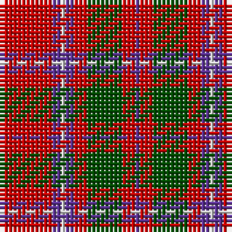

In pattern [BRGRBWBR](/stripes/brgrbwbr/).

This was sourced from weddslist.  It is a [8 stripe tartan](/stripes/stripes8/).

Original link http://www.weddslist.com/cgi-bin/tartans/pg.pl?source=rb

## Register references

External register numbers recorded for this tartan.

- Scottish Register of Tartans: [1166](https://www.tartanregister.gov.uk/tartanDetails.aspx?ref=1166)
- Scottish Register of Tartans: [1758](https://www.tartanregister.gov.uk/tartanDetails.aspx?ref=1758)
- Scottish Register of Tartans: [2307](https://www.tartanregister.gov.uk/tartanDetails.aspx?ref=2307)
- Scottish Register of Tartans: [2540](https://www.tartanregister.gov.uk/tartanDetails.aspx?ref=2540)
- Scottish Register of Tartans: [2666](https://www.tartanregister.gov.uk/tartanDetails.aspx?ref=2666)
- Scottish Register of Tartans: [2862](https://www.tartanregister.gov.uk/tartanDetails.aspx?ref=2862)
- Scottish Register of Tartans: [3808](https://www.tartanregister.gov.uk/tartanDetails.aspx?ref=3808)
- Scottish Register of Tartans: [982](https://www.tartanregister.gov.uk/tartanDetails.aspx?ref=982)
- Scottish Tartans Authority (ITI): 218
- Scottish Tartans World Register: 1010
- Scottish Tartans World Register: 1042
- Scottish Tartans World Register: 127
- Scottish Tartans World Register: 1585
- Scottish Tartans World Register: 218
- Scottish Tartans World Register: 2218
- Scottish Tartans World Register: 737
- Scottish Tartans World Register: 897

## Thread count
R/12 P2 N1 P2 R3 G8 R3 P/1

## Palette
Each colour and its ΔE from the base-6 reference it is a variant of.

| Colour | Shade | Base | ΔE (OKLab) |
|---|---|---|---|
| G | <code style="background-color:#004C00;">#004C00</code> `#004C00` | G <code style="background-color:#006100;">#006100</code> | 0.07 |
| N | <code style="background-color:#D0D0D0;">#D0D0D0</code> `#D0D0D0` | W <code style="background-color:#F7F7F7;">#F7F7F7</code> | 0.12 |
| P | <code style="background-color:#5A3094;">#5A3094</code> `#5A3094` | B <code style="background-color:#2A418A;">#2A418A</code> | 0.08 |
| R | <code style="background-color:#C80000;">#C80000</code> `#C80000` | R <code style="background-color:#CC0000;">#CC0000</code> | 0.01 |

# Sample pattern

## Nearest tartans

The nearest existing variants by ΔTartan distance.

1. [Chisholm, The](/setts/s8/r12db2w1db2r3g8r3db1~x2/) — ΔT 0.65
1. [Chisholm, The](/setts/s8/r12b2w1b2r3g8r3b1~x4/) — ΔT 0.68
1. [Grant of Lurg](/setts/s6/r2db10r2g10r25w2~x2/) — ΔT 0.77
1. [Jenkins (Name)](/setts/s10/db2r30g8r3g8r6db4r3db12w2~x2/) — ΔT 0.85
1. [Wasko (Personal)](/setts/s7/r8w2m30g12m3g12m3~x2/) — ΔT 0.86
1. [Carrick (Strathmore) District Tartan Tartan Number: 3216. Earliest known date: c.1999 Sales help Princess Diana Memorial Trust See products available Copyright © Blair Urquhart, Comrie, 2015](/setts/s7/r28db12r3dg20t2dg2r7~x2/) — ΔT 0.87
1. [MacDuff - 1819 (Clan)](/setts/s7/r36db9k12g17r10k3r10~x2/) — ΔT 0.91
1. [MacNab (Crimson)](/setts/s7/dg28r7m7dg14m7r48k4~x2/) — ΔT 0.93
1. [MacDuff #4](/setts/s7/r4k2r24k6db6dg16r3~x2/) — ΔT 0.93
1. [Dobrain (Personal)](/setts/s10/r24o2r4n2k6o2r14k3o4n8~x2/) — ΔT 0.94

## Neighbour map

Every grey dot is one of 14299 variants placed by the first two principal components of the ΔTartan feature space (44% of its variance). Red is this tartan; blue dots are its nearest — click one to open its page.

<svg viewBox="0 0 640 380" role="img" style="max-width:100%;height:auto;border:1px solid #e0e0e0;border-radius:4px;display:block" xmlns="http://www.w3.org/2000/svg"><image href="/nn/cloud.v1.png" width="640" height="380"/><a href="/setts/s8/r12db2w1db2r3g8r3db1~x2/"><circle cx="324.2" cy="178.1" r="4" fill="#3465a4"><title>Chisholm, The</title></circle></a><a href="/setts/s8/r12b2w1b2r3g8r3b1~x4/"><circle cx="321.2" cy="176.2" r="4" fill="#3465a4"><title>Chisholm, The</title></circle></a><a href="/setts/s6/r2db10r2g10r25w2~x2/"><circle cx="328.3" cy="179.0" r="4" fill="#3465a4"><title>Grant of Lurg</title></circle></a><a href="/setts/s10/db2r30g8r3g8r6db4r3db12w2~x2/"><circle cx="315.4" cy="150.0" r="4" fill="#3465a4"><title>Jenkins (Name)</title></circle></a><a href="/setts/s7/r8w2m30g12m3g12m3~x2/"><circle cx="331.5" cy="186.3" r="4" fill="#3465a4"><title>Wasko (Personal)</title></circle></a><a href="/setts/s7/r28db12r3dg20t2dg2r7~x2/"><circle cx="308.9" cy="185.2" r="4" fill="#3465a4"><title>Carrick (Strathmore) District Tartan Tartan Number: 3216. Earliest known date: c.1999 Sales help Princess Diana Memorial Trust See products available Copyright © Blair Urquhart, Comrie, 2015</title></circle></a><a href="/setts/s7/r36db9k12g17r10k3r10~x2/"><circle cx="309.8" cy="199.6" r="4" fill="#3465a4"><title>MacDuff - 1819 (Clan)</title></circle></a><a href="/setts/s7/dg28r7m7dg14m7r48k4~x2/"><circle cx="298.1" cy="187.8" r="4" fill="#3465a4"><title>MacNab (Crimson)</title></circle></a><a href="/setts/s7/r4k2r24k6db6dg16r3~x2/"><circle cx="279.0" cy="182.9" r="4" fill="#3465a4"><title>MacDuff #4</title></circle></a><a href="/setts/s10/r24o2r4n2k6o2r14k3o4n8~x2/"><circle cx="333.6" cy="155.2" r="4" fill="#3465a4"><title>Dobrain (Personal)</title></circle></a><circle cx="330.1" cy="178.1" r="5" fill="#c00000"/></svg>

ID: /setts/s8/r12dp2lb1dp2r3dg8r3dp1/
