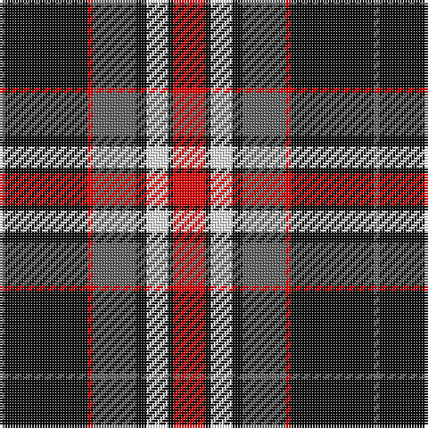

In pattern [BKRBKWKR](/stripes/bkrbkwkr/).

This was sourced from register-of-tartans.  It is a [8 stripe tartan](/stripes/stripes8/).

Original link https://www.tartanregister.gov.uk/tartanDetails.aspx?ref=10697

## Attestations

This cloth appears in 2 source records; the oldest owns this page.

- 22/08/2012 — Distripress Annual Congress 2012 (register-of-tartans, [record](https://www.tartanregister.gov.uk/tartanDetails.aspx?ref=10697))
- undated — Distripress Annual Congress 2012 Corporate Tartan Tartan Number: 10697. Earliest known date: 13 September 2012 Designed for the 2012 Distripress Annual Congress held in Glasgow, Scotland. Distripress (association for the promotion of the global circulation of the press) is a non-political and nonprofit making association of companies, non profit organisations and individuals of repute, engaged in the national and international circulation of publications (newspapers, magazines, periodicals and paperback books etc). The Distripress association colours of black, red and white are used here with added greys. The central broad red line is twelve threads wide denoting the conference year 2012. See products available Copyright © Blair Urquhart, Comrie, 2015 (house-of-tartan, [record](http://www.house-of-tartan.scotland.net/house/TartanViewjs.asp?colr=Def&tnam=10697))

## Register references

External register numbers recorded for this tartan.

- Scottish Register of Tartans: [10697](https://www.tartanregister.gov.uk/tartanDetails.aspx?ref=10697)

## Thread count
R/12 K2 W8 K4 N16 R2 K31 N/2

## Palette
Each colour and the base-6 reference it is a variant of.

| Colour | Shade | Base |
|---|---|---|
| K | <code style="background-color:#101010;">#101010</code> `oklch(17.3% 0.000 89.9)` <small>#101010</small> | K <code style="background-color:#000000;">#000000</code> |
| N | <code style="background-color:#666666;">#666666</code> `oklch(51.0% 0.000 89.9)` <small>#666666</small> | B <code style="background-color:#2A418A;">#2A418A</code> |
| R | <code style="background-color:#FF0000;">#FF0000</code> `oklch(62.8% 0.258 29.2)` <small>#FF0000</small> | R <code style="background-color:#CC0000;">#CC0000</code> |
| W | <code style="background-color:#FFFFFF;">#FFFFFF</code> `oklch(100.0% 0.000 89.9)` <small>#FFFFFF</small> | W <code style="background-color:#F7F7F7;">#F7F7F7</code> |

# Sample pattern

## Nearest tartans

The nearest existing variants by ΔTartan distance.

1. [Merric, Dark Camel..](/setts/s7/r2w8k14o25w2k2w2~x2/) — ΔT 0.75
1. [Braemar or Blair Atholl](/setts/s8/do2w2k6do3k2o14k1o1~x4/) — ΔT 0.81
1. [Loch Ness](/setts/s6/r10w2k10w10o35k5~x2/) — ΔT 0.82
1. [Merric Dark Camel.. Trade Tartan Tartan Number: 1688. Earliest known date: 1985 School colours. See products available Copyright © Blair Urquhart, Comrie, 2015](/setts/s7/r2w8k14dy25w2k2w2~x2/) — ΔT 0.89
1. [Burberry (Counterfeit #4)](/setts/s9/k10w10k10o32k2w2k2w2r5~x2/) — ΔT 0.93
1. [Virginia Commonwealth University](/setts/s7/k30w2lr4lo10w9k3lr5~x2/) — ΔT 0.95
1. [Loch Ness](/setts/s6/r10w2k10w10dy35k5~x2/) — ΔT 0.96
1. [Memery (Reston, USA)](/setts/s9/w4k6r3k15r3k6r27db9w2~x2/) — ΔT 0.99
1. [Southdown (Fashion)](/setts/s9/k3r1k3w5k5w3k5dy23r3~x2/) — ΔT 0.99
1. [Buchanan Old Dress](/setts/s9/k40w25k10ly8k3ly8k10r25w4~x2/) — ΔT 0.99

## Neighbour map

Every grey dot is one of 14299 variants placed by the first two principal components of the ΔTartan feature space (44% of its variance). Red is this tartan; blue dots are its nearest — click one to open its page.

<svg viewBox="0 0 640 380" role="img" style="max-width:100%;height:auto;border:1px solid #e0e0e0;border-radius:4px;display:block" xmlns="http://www.w3.org/2000/svg"><image href="/nn/cloud.v1.png" width="640" height="380"/><a href="/setts/s7/r2w8k14o25w2k2w2~x2/"><circle cx="221.6" cy="156.4" r="4" fill="#3465a4"><title>Merric, Dark Camel..</title></circle></a><a href="/setts/s8/do2w2k6do3k2o14k1o1~x4/"><circle cx="256.5" cy="154.6" r="4" fill="#3465a4"><title>Braemar or Blair Atholl</title></circle></a><a href="/setts/s6/r10w2k10w10o35k5~x2/"><circle cx="241.0" cy="160.8" r="4" fill="#3465a4"><title>Loch Ness</title></circle></a><a href="/setts/s7/r2w8k14dy25w2k2w2~x2/"><circle cx="234.2" cy="162.9" r="4" fill="#3465a4"><title>Merric Dark Camel.. Trade Tartan Tartan Number: 1688. Earliest known date: 1985 School colours. See products available Copyright © Blair Urquhart, Comrie, 2015</title></circle></a><a href="/setts/s9/k10w10k10o32k2w2k2w2r5~x2/"><circle cx="213.2" cy="130.5" r="4" fill="#3465a4"><title>Burberry (Counterfeit #4)</title></circle></a><a href="/setts/s7/k30w2lr4lo10w9k3lr5~x2/"><circle cx="248.2" cy="152.4" r="4" fill="#3465a4"><title>Virginia Commonwealth University</title></circle></a><a href="/setts/s6/r10w2k10w10dy35k5~x2/"><circle cx="253.1" cy="169.2" r="4" fill="#3465a4"><title>Loch Ness</title></circle></a><a href="/setts/s9/w4k6r3k15r3k6r27db9w2~x2/"><circle cx="225.6" cy="151.2" r="4" fill="#3465a4"><title>Memery (Reston, USA)</title></circle></a><a href="/setts/s9/k3r1k3w5k5w3k5dy23r3~x2/"><circle cx="253.5" cy="127.2" r="4" fill="#3465a4"><title>Southdown (Fashion)</title></circle></a><a href="/setts/s9/k40w25k10ly8k3ly8k10r25w4~x2/"><circle cx="200.0" cy="157.1" r="4" fill="#3465a4"><title>Buchanan Old Dress</title></circle></a><circle cx="237.8" cy="150.1" r="5" fill="#c00000"/></svg>

ID: /setts/s8/r12k2w8k4n16r2k31n2/
