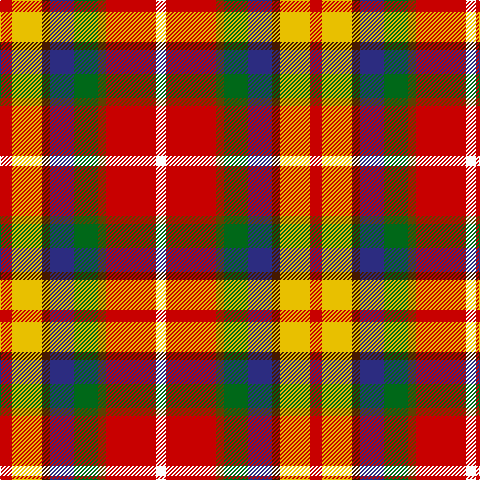

In pattern [RYBBGGRW](/patterns/rybbggrw/).

This was sourced from register-of-tartans.  It is a [8 stripes tartan](/stripes/stripes8/).

Original link https://www.tartanregister.gov.uk/tartanDetails.aspx?ref=4798

## Thread count
R/12 Y30 DR8 DB24 G24 T8 R50 W/10

## Palette
Each colour and its ΔE from the base-6 reference it is a variant of.

| Colour | Shade | Base | ΔE (OKLab) |
|---|---|---|---|
| DB | <code style="background-color:#2C2C80;">#2C2C80</code> `#2C2C80` | B <code style="background-color:#2C4084;">#2C4084</code> | 0.05 |
| DR | <code style="background-color:#441800;">#441800</code> `#441800` | B <code style="background-color:#2C4084;">#2C4084</code> | 0.22 |
| G | <code style="background-color:#006818;">#006818</code> `#006818` | G <code style="background-color:#006400;">#006400</code> | 0.02 |
| LT | <code style="background-color:#A08858;">#A08858</code> `#A08858` | Y <code style="background-color:#E8C000;">#E8C000</code> | 0.21 |
| R | <code style="background-color:#C80000;">#C80000</code> `#C80000` | R <code style="background-color:#C80000;">#C80000</code> | 0.00 |
| T | <code style="background-color:#604000;">#604000</code> `#604000` | G <code style="background-color:#006400;">#006400</code> | 0.14 |
| W | <code style="background-color:#FCFCFC;">#FCFCFC</code> `#FCFCFC` | W <code style="background-color:#F4F4F0;">#F4F4F0</code> | 0.03 |
| Y | <code style="background-color:#E8C000;">#E8C000</code> `#E8C000` | Y <code style="background-color:#E8C000;">#E8C000</code> | 0.00 |

# Sample pattern

## Nearest tartans

The nearest existing variants by ΔTartan distance.

1. [Barrington Municipality](/setts/s7/y5ya3b6r8w5ra17k2-b00008c-k101010-r98481c-radc0000-wf8f8f8-yffe600-yaa0a0a0/) — ΔT 0.97
1. [Thirkill](/setts/s9/w8k4r30k4r10g14ga14k4y8-g5c6428-ga003820-k101010-rc80000-we0e0e0-ye8c000/) — ΔT 1.15
1. [Culloden (Old and Rare) District Tartan Tartan Number: 1328. Earliest known date: 1746 Worn by a member of Prince Charles' staff during the battle but it is not known with which family or district it was first connected. It was first illustrated in Old & Rare in 1893 by D W Stewart whose son D C Stewart was a founder member of the Scottish Tartans Society. Now firmly established as a district tartan. See products available Copyright © Blair Urquhart, Comrie, 2015](/setts/s8/r10b4ra28w4k26y26k4y6-b5c8ca8-k101010-rc80000-rab468ac-we0e0e0-ye8c000/) — ΔT 1.19
1. [Unidentified Silk scarf](/setts/s10/w12r40g24y32b32ga128ra32r40ra24w12-b3c82af-g503c14-ga005020-rdc0000-rac82828-we0e0e0-ye8c000/) — ΔT 1.41
1. [Wilson's, No 121](/setts/s7/b16ba12g4ga36w4r32k4-b5480b0-ba800080-g30a010-ga008000-k000000-rc00000-we0e0e0/) — ΔT 1.46
1. [Walter (Personal)](/setts/s7/r48w6y8g36b36ga6ba8-b780078-ba5c8ca8-g003820-ga5c6428-rc80000-wfcfcfc-ye8c000/) — ΔT 1.46
1. [Culloden](/setts/s8/r10b4ba28w4k26y26k4ya6-b5c8ca8-ba780078-k101010-rc80000-wfcfcfc-ybc8c00-yae8c000/) — ΔT 1.47
1. [Walter](/setts/s7/r48w6y8g36b36ga6ba8-b800080-ba5480b0-g003000-ga505020-rc00000-we0e0e0-yf0c000/) — ΔT 1.49
1. [De Maynard (Personal)](/setts/s8/b8r36g32r16y4r16ba40w8-b440044-ba2c2c80-g006818-re86000-wfcfcfc-ye8c000/) — ΔT 1.49
1. [Khosla, Sarah and Jatin (Personal)](/setts/s9/r8b20ra36y6ra6y10rb16b18w8-b1c1c1c-rb458ac-raa00048-rbe87878-wf8f4d0-yf8e38c/) — ΔT 1.49

## Neighbour map

Every grey dot is one of 15726 variants placed by the first two principal components of the ΔTartan feature space (44% of its variance). Red is this tartan; blue dots are its nearest — click one to open its page.

<svg viewBox="0 0 640 380" role="img" style="max-width:100%;height:auto;border:1px solid #e0e0e0;border-radius:4px;display:block" xmlns="http://www.w3.org/2000/svg"><image href="/nn/cloud.v1.png" width="640" height="380"/><a href="/setts/s7/y5ya3b6r8w5ra17k2-b00008c-k101010-r98481c-radc0000-wf8f8f8-yffe600-yaa0a0a0/"><circle cx="70.0" cy="139.2" r="4" fill="#3465a4"><title>Barrington Municipality</title></circle></a><a href="/setts/s9/w8k4r30k4r10g14ga14k4y8-g5c6428-ga003820-k101010-rc80000-we0e0e0-ye8c000/"><circle cx="119.3" cy="158.7" r="4" fill="#3465a4"><title>Thirkill</title></circle></a><a href="/setts/s8/r10b4ra28w4k26y26k4y6-b5c8ca8-k101010-rc80000-rab468ac-we0e0e0-ye8c000/"><circle cx="28.1" cy="138.8" r="4" fill="#3465a4"><title>Culloden (Old and Rare) District Tartan Tartan Number: 1328. Earliest known date: 1746 Worn by a member of Prince Charles' staff during the battle but it is not known with which family or district it was first connected. It was first illustrated in Old &amp; Rare in 1893 by D W Stewart whose son D C Stewart was a founder member of the Scottish Tartans Society. Now firmly established as a district tartan. See products available Copyright © Blair Urquhart, Comrie, 2015</title></circle></a><a href="/setts/s10/w12r40g24y32b32ga128ra32r40ra24w12-b3c82af-g503c14-ga005020-rdc0000-rac82828-we0e0e0-ye8c000/"><circle cx="89.2" cy="122.5" r="4" fill="#3465a4"><title>Unidentified Silk scarf</title></circle></a><a href="/setts/s7/b16ba12g4ga36w4r32k4-b5480b0-ba800080-g30a010-ga008000-k000000-rc00000-we0e0e0/"><circle cx="93.7" cy="149.2" r="4" fill="#3465a4"><title>Wilson's, No 121</title></circle></a><a href="/setts/s7/r48w6y8g36b36ga6ba8-b780078-ba5c8ca8-g003820-ga5c6428-rc80000-wfcfcfc-ye8c000/"><circle cx="91.0" cy="150.0" r="4" fill="#3465a4"><title>Walter (Personal)</title></circle></a><a href="/setts/s8/r10b4ba28w4k26y26k4ya6-b5c8ca8-ba780078-k101010-rc80000-wfcfcfc-ybc8c00-yae8c000/"><circle cx="39.9" cy="145.4" r="4" fill="#3465a4"><title>Culloden</title></circle></a><a href="/setts/s7/r48w6y8g36b36ga6ba8-b800080-ba5480b0-g003000-ga505020-rc00000-we0e0e0-yf0c000/"><circle cx="92.3" cy="151.0" r="4" fill="#3465a4"><title>Walter</title></circle></a><a href="/setts/s8/b8r36g32r16y4r16ba40w8-b440044-ba2c2c80-g006818-re86000-wfcfcfc-ye8c000/"><circle cx="139.4" cy="163.2" r="4" fill="#3465a4"><title>De Maynard (Personal)</title></circle></a><a href="/setts/s9/r8b20ra36y6ra6y10rb16b18w8-b1c1c1c-rb458ac-raa00048-rbe87878-wf8f4d0-yf8e38c/"><circle cx="60.2" cy="168.0" r="4" fill="#3465a4"><title>Khosla, Sarah and Jatin (Personal)</title></circle></a><circle cx="63.3" cy="157.9" r="5" fill="#c00000"/></svg>

ID: /setts/s8/r12y30b8ba24g24ga8r50w10-b441800-ba2c2c80-g006818-ga604000-rc80000-wfcfcfc-ye8c000/
