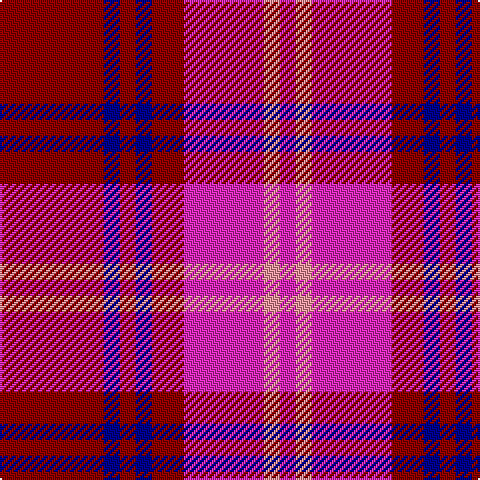

In pattern [RBRBRRYR](/patterns/rbrbrryr/).

This was sourced from tartans-authority.  It is a [8 stripes tartan](/stripes/stripes8/).

Original link http://www.tartansauthority.com/tartan-ferret/display/5531/

## Thread count
DR/52 DB8 DR8 DB8 DR16 LRa40 LR8 LRa/8

## Palette
Each colour and its ΔE from the base-6 reference it is a variant of.

| Colour | Shade | Base | ΔE (OKLab) |
|---|---|---|---|
| DB | <code style="background-color:#00008C;">#00008C</code> `#00008C` | B <code style="background-color:#2A418A;">#2A418A</code> | 0.13 |
| DR | <code style="background-color:#8C0000;">#8C0000</code> `#8C0000` | R <code style="background-color:#CC0000;">#CC0000</code> | 0.14 |
| LR | <code style="background-color:#FC949C;">#FC949C</code> `#FC949C` | Y <code style="background-color:#F2BF00;">#F2BF00</code> | 0.19 |
| LRa | <code style="background-color:#E02CB8;">#E02CB8</code> `#E02CB8` | R <code style="background-color:#CC0000;">#CC0000</code> | 0.22 |

# Sample pattern

## Nearest tartans

The nearest existing variants by ΔTartan distance.

1. [Fiddes](/setts/s8/g12r11b12ra3r32b8g8b8x2~b5a008c-g005020-rdc0000-rac82828/) — ΔT 1.58
1. [Red Chapeau](/setts/s9/r9k1g1k1b6k1b6y1k2x6~b780078-g006818-k101010-rc80000-ye8c000/) — ΔT 1.61
1. [Cameron of Lochiel (Smith) Clan Tartan Tartan Number: 1398. Earliest known date: 1764 According to I.B. Cameron Taylor from a portrait in Achnacarry of the Gentle Lochiel painted by George Chalmers in 1764. He wrote, "Of the unknown Cameron tartans in existence today, the Chief's personal tartan, the Cameron of Locheil, is undoubtably the oldest." See products available Copyright © Blair Urquhart, Comrie, 2015](/setts/s9/r6g3r6b1w1b1r2b8r4x2~b2c2c80-g006818-rc80000-we0e0e0/) — ΔT 1.64
1. [FC Barcelona (Corporate)](/setts/s10/r3b3r18ra2r2ra3r2ra4b18y2x2~b3850c8-r880000-rac80000-ye8c000/) — ΔT 1.79
1. [Suntan (Masai Shuka) (District?)](/setts/s6/k3r11b3w1b3w1x4~b38409c-k101010-rc80000-we0e0e0/) — ΔT 1.80
1. [Hamilton](/setts/s8/r15b8r2b8r2b8r15w2x4~b2c2c80-rc80000-we0e0e0/) — ΔT 1.81
1. [Unnamed C21st (Lady's Jacket) (Fash)](/setts/s7/r3g8r3b8r20w2r2x4~b202060-g285800-rc04094-wfcfcfc/) — ΔT 1.82
1. [Cameron of Lochiel](/setts/s9/r6g3r6b1w1b1r2b8r4x2~b304080-g008000-rc00000-we0e0e0/) — ΔT 1.89
1. [Finnigan (Estimated threadcount)](/setts/s6/r3b15r3g8r20k2x2~b2c2c80-g006818-k101010-rc80000/) — ΔT 1.94
1. [Cutter (Name)](/setts/s12/r2ra2r14b2r2b5r2b2r2b12r1y1x4~b2c2c80-rc80000-racc4438-ye8c000/) — ΔT 1.95

## Neighbour map

Every grey dot is one of 15726 variants placed by the first two principal components of the ΔTartan feature space (44% of its variance). Red is this tartan; blue dots are its nearest — click one to open its page.

<svg viewBox="0 0 640 380" role="img" style="max-width:100%;height:auto;border:1px solid #e0e0e0;border-radius:4px;display:block" xmlns="http://www.w3.org/2000/svg"><image href="/nn/cloud.v1.png" width="640" height="380"/><a href="/setts/s8/g12r11b12ra3r32b8g8b8x2~b5a008c-g005020-rdc0000-rac82828/"><circle cx="247.9" cy="198.9" r="4" fill="#3465a4"><title>Fiddes</title></circle></a><a href="/setts/s9/r9k1g1k1b6k1b6y1k2x6~b780078-g006818-k101010-rc80000-ye8c000/"><circle cx="225.7" cy="164.3" r="4" fill="#3465a4"><title>Red Chapeau</title></circle></a><a href="/setts/s9/r6g3r6b1w1b1r2b8r4x2~b2c2c80-g006818-rc80000-we0e0e0/"><circle cx="292.7" cy="207.1" r="4" fill="#3465a4"><title>Cameron of Lochiel (Smith) Clan Tartan Tartan Number: 1398. Earliest known date: 1764 According to I.B. Cameron Taylor from a portrait in Achnacarry of the Gentle Lochiel painted by George Chalmers in 1764. He wrote, &quot;Of the unknown Cameron tartans in existence today, the Chief's personal tartan, the Cameron of Locheil, is undoubtably the oldest.&quot; See products available Copyright © Blair Urquhart, Comrie, 2015</title></circle></a><a href="/setts/s10/r3b3r18ra2r2ra3r2ra4b18y2x2~b3850c8-r880000-rac80000-ye8c000/"><circle cx="267.8" cy="170.3" r="4" fill="#3465a4"><title>FC Barcelona (Corporate)</title></circle></a><a href="/setts/s6/k3r11b3w1b3w1x4~b38409c-k101010-rc80000-we0e0e0/"><circle cx="265.1" cy="182.2" r="4" fill="#3465a4"><title>Suntan (Masai Shuka) (District?)</title></circle></a><a href="/setts/s8/r15b8r2b8r2b8r15w2x4~b2c2c80-rc80000-we0e0e0/"><circle cx="332.8" cy="234.0" r="4" fill="#3465a4"><title>Hamilton</title></circle></a><a href="/setts/s7/r3g8r3b8r20w2r2x4~b202060-g285800-rc04094-wfcfcfc/"><circle cx="333.8" cy="188.9" r="4" fill="#3465a4"><title>Unnamed C21st (Lady's Jacket) (Fash)</title></circle></a><a href="/setts/s9/r6g3r6b1w1b1r2b8r4x2~b304080-g008000-rc00000-we0e0e0/"><circle cx="300.6" cy="211.1" r="4" fill="#3465a4"><title>Cameron of Lochiel</title></circle></a><a href="/setts/s6/r3b15r3g8r20k2x2~b2c2c80-g006818-k101010-rc80000/"><circle cx="285.9" cy="209.2" r="4" fill="#3465a4"><title>Finnigan (Estimated threadcount)</title></circle></a><a href="/setts/s12/r2ra2r14b2r2b5r2b2r2b12r1y1x4~b2c2c80-rc80000-racc4438-ye8c000/"><circle cx="327.1" cy="148.7" r="4" fill="#3465a4"><title>Cutter (Name)</title></circle></a><circle cx="282.5" cy="196.2" r="5" fill="#c00000"/></svg>

ID: /setts/s8/r13b2r2b2r4ra10y2ra2x4~b00008c-r8c0000-rae02cb8-yfc949c/
