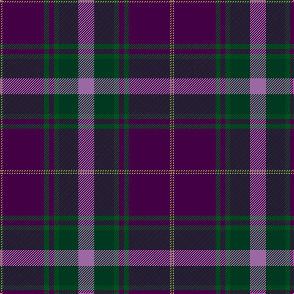

In pattern [BYBGBGGR](/patterns/bybgbggr/).

This was sourced from register-of-tartans.  It is a [8 stripes tartan](/stripes/stripes8/).

Original link https://www.tartanregister.gov.uk/tartanDetails.aspx?ref=10967

## Thread count
DP/2 LT2 DP68 G8 DP8 G8 DG32 LP/26

## Palette
Each colour and its ΔE from the base-6 reference it is a variant of.

| Colour | Shade | Base | ΔE (OKLab) |
|---|---|---|---|
| DG | <code style="background-color:#003820;">#003820</code> `#003820` | G <code style="background-color:#006100;">#006100</code> | 0.15 |
| DP | <code style="background-color:#440044;">#440044</code> `#440044` | B <code style="background-color:#2A418A;">#2A418A</code> | 0.18 |
| G | <code style="background-color:#005020;">#005020</code> `#005020` | G <code style="background-color:#006100;">#006100</code> | 0.07 |
| LP | <code style="background-color:#9C68A4;">#9C68A4</code> `#9C68A4` | R <code style="background-color:#CC0000;">#CC0000</code> | 0.21 |
| LT | <code style="background-color:#A08858;">#A08858</code> `#A08858` | Y <code style="background-color:#F2BF00;">#F2BF00</code> | 0.21 |

# Sample pattern

## Nearest tartans

The nearest existing variants by ΔTartan distance.

1. [Heather Mead (Personal)](/setts/s8/b13g16ga4ba1ga4ba34y1ba1~b780078-ba440044-g003820-ga006818-ye8c000~x2/) — ΔT 0.70
1. [Thomson, Reona Ellen (Personal)](/setts/s7/w2b5r34k5ba9k12b1~b5a008c-ba646464-k101010-r781c38-wffffff~x2/) — ΔT 1.00
1. [McClafferty](/setts/s10/r3g10k12b3k2b2k2b30r4w1~b202060-g006818-k101010-r880000-we0e0e0~x2/) — ΔT 1.13
1. [St. Margaret Youth Group (Corporate)](/setts/s8/r30b5r3b33g8k3b8w2~b202060-g006818-k101010-r901c38-we0e0e0~x2/) — ΔT 1.24
1. [Ferguson Unidentified](/setts/s7/b72k40g23r4g23k2w4~b5a008c-g005020-k101010-rdc0000-we0e0e0~x2/) — ΔT 1.27
1. [Kinfauns Castle](/setts/s10/r4b10g2b2g24ba2g2ba16g2w1~b2c2c80-ba783055-g003820-rc80000-we0e0e0~x2/) — ΔT 1.29
1. [Hebridean Heather Fashion Tartan Tartan Number: 6820. Earliest known date: 2005 Designed for new House of Edgar Collection in wedding grays. Originally called Balmoral but this was disallowed in recording as Balmoral tartans are restricted to the Royal Family. See products available Copyright © Blair Urquhart, Comrie, 2015](/setts/s9/b4ba2b7bb30b8bb7r5ba1w2~b5c5c5c-ba003c64-bb1c1c1c-r800028-we0e0e0~x2/) — ΔT 1.30
1. [Hebridean Heather](/setts/s9/b4ba2b7bb30b8bb7r5ba1w2~b5c5c5c-ba003c64-bb1c1c1c-r800028-wf8f8f8~x2/) — ΔT 1.34
1. [Royal Marines Condor](/setts/s7/k8r4k36b48r6g3y2~b1c0070-g006818-k101010-rc80000-yd09800~x2/) — ΔT 1.36
1. [Diaspora](/setts/s6/b3g1r22k12b28w3~b003478-g003800-k000034-r8c0000-wc8c8c8~x2/) — ΔT 1.37

## Neighbour map

Every grey dot is one of 15726 variants placed by the first two principal components of the ΔTartan feature space (44% of its variance). Red is this tartan; blue dots are its nearest — click one to open its page.

<svg viewBox="0 0 640 380" role="img" style="max-width:100%;height:auto;border:1px solid #e0e0e0;border-radius:4px;display:block" xmlns="http://www.w3.org/2000/svg"><image href="/nn/cloud.v1.png" width="640" height="380"/><a href="/setts/s8/b13g16ga4ba1ga4ba34y1ba1~b780078-ba440044-g003820-ga006818-ye8c000~x2/"><circle cx="349.9" cy="139.6" r="4" fill="#3465a4"><title>Heather Mead (Personal)</title></circle></a><a href="/setts/s7/w2b5r34k5ba9k12b1~b5a008c-ba646464-k101010-r781c38-wffffff~x2/"><circle cx="331.0" cy="134.5" r="4" fill="#3465a4"><title>Thomson, Reona Ellen (Personal)</title></circle></a><a href="/setts/s10/r3g10k12b3k2b2k2b30r4w1~b202060-g006818-k101010-r880000-we0e0e0~x2/"><circle cx="338.4" cy="132.9" r="4" fill="#3465a4"><title>McClafferty</title></circle></a><a href="/setts/s8/r30b5r3b33g8k3b8w2~b202060-g006818-k101010-r901c38-we0e0e0~x2/"><circle cx="320.1" cy="166.4" r="4" fill="#3465a4"><title>St. Margaret Youth Group (Corporate)</title></circle></a><a href="/setts/s7/b72k40g23r4g23k2w4~b5a008c-g005020-k101010-rdc0000-we0e0e0~x2/"><circle cx="278.8" cy="140.8" r="4" fill="#3465a4"><title>Ferguson Unidentified</title></circle></a><a href="/setts/s10/r4b10g2b2g24ba2g2ba16g2w1~b2c2c80-ba783055-g003820-rc80000-we0e0e0~x2/"><circle cx="317.9" cy="145.3" r="4" fill="#3465a4"><title>Kinfauns Castle</title></circle></a><a href="/setts/s9/b4ba2b7bb30b8bb7r5ba1w2~b5c5c5c-ba003c64-bb1c1c1c-r800028-we0e0e0~x2/"><circle cx="374.0" cy="140.8" r="4" fill="#3465a4"><title>Hebridean Heather Fashion Tartan Tartan Number: 6820. Earliest known date: 2005 Designed for new House of Edgar Collection in wedding grays. Originally called Balmoral but this was disallowed in recording as Balmoral tartans are restricted to the Royal Family. See products available Copyright © Blair Urquhart, Comrie, 2015</title></circle></a><a href="/setts/s9/b4ba2b7bb30b8bb7r5ba1w2~b5c5c5c-ba003c64-bb1c1c1c-r800028-wf8f8f8~x2/"><circle cx="366.9" cy="138.0" r="4" fill="#3465a4"><title>Hebridean Heather</title></circle></a><a href="/setts/s7/k8r4k36b48r6g3y2~b1c0070-g006818-k101010-rc80000-yd09800~x2/"><circle cx="318.0" cy="158.4" r="4" fill="#3465a4"><title>Royal Marines Condor</title></circle></a><a href="/setts/s6/b3g1r22k12b28w3~b003478-g003800-k000034-r8c0000-wc8c8c8~x2/"><circle cx="279.5" cy="162.6" r="4" fill="#3465a4"><title>Diaspora</title></circle></a><circle cx="340.9" cy="137.9" r="5" fill="#c00000"/></svg>

ID: /setts/s8/r13g16ga4b4ga4b34y1b1~b440044-g003820-ga005020-r9c68a4-ya08858~x2/
