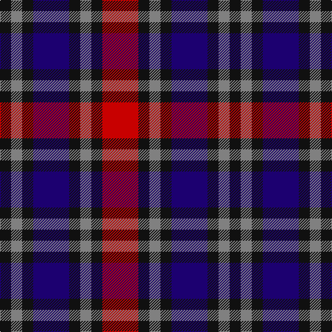

**Bands:** [KGKBKGKR](/stripes/kgkbkgkr/) · **Stripes:** [K Y K DB K Y K R](/stripes/stripes8/) K Y K DB K Y K R

This was sourced from register-of-tartans.  It is a [8 band tartan](/bands/bands8/).

Original link https://www.tartanregister.gov.uk/tartanDetails.aspx?ref=668

## Register references

External register numbers recorded for this tartan.

- Scottish Register of Tartans: [668](https://www.tartanregister.gov.uk/tartanDetails.aspx?ref=668)
- Scottish Tartans Authority (ITI): 4094

## Thread count
K/16 N16 K16 DB52 K16 N16 K16 R/52

## Palette
Each colour and its ΔE from the base-6 reference it is a variant of.

| Colour | Shade | Base | ΔE (OKLab) |
|---|---|---|---|
| DB | <code style="background-color:#1C0070;">#1C0070</code> `#1C0070` | B <code style="background-color:#2A418A;">#2A418A</code> | 0.14 |
| K | <code style="background-color:#101010;">#101010</code> `#101010` | K <code style="background-color:#000000;">#000000</code> | 0.17 |
| N | <code style="background-color:#808080;">#808080</code> `#808080` | G <code style="background-color:#006100;">#006100</code> | 0.23 |
| R | <code style="background-color:#C80000;">#C80000</code> `#C80000` | R <code style="background-color:#CC0000;">#CC0000</code> | 0.01 |

# Sample pattern

## Nearest tartans

The nearest existing variants by ΔTartan distance.

1. [MacKean Red (Personal)](/setts/s8/r2k4r2k4db1lb1db4r1~x4/) — ΔT 1.06
1. [MacInroy](/setts/s10/k1dg3k3r1db3r1db1r3dg1k1~x4/) — ΔT 1.09
1. [MacInroy (Clan)](/setts/s10/k1g3k3r1db3r1db1r3g1k1~x8/) — ΔT 1.12
1. [MacInroy Clan Tartan Tartan Number: 1081. Earliest known date: 1819 The pattern books of the old firm of weavers, Wilson's of Bannockburn, provide a reliable early source for this tartan. Wilson's were in business with a monopoly to supply tartan to the regiments in the second half of the 18th century before this pattern was recorded. See products available Copyright © Blair Urquhart, Comrie, 2015](/setts/s10/k1g3k3r1dp3r1dp1r3g1k1~x4/) — ΔT 1.15
1. [Clark](/setts/s5/b3k1dg1k1r3~x8/) — ΔT 1.21
1. [Clark](/setts/s5/b3k1dg1k1r3~x4/) — ΔT 1.21
1. [Stewart /Stuart- Fragment Cf 1452 & 1445](/setts/s7/r3t4k11r11g11do3r3~x4/) — ΔT 1.42
1. [Clerk](/setts/s6/db5k1dg1k1r3k1~x4/) — ΔT 1.44
1. [Williamson (Personal)](/setts/s6/r7db20r4k18o20dp5~x2/) — ΔT 1.47
1. [Chaudhri, Zafar Iqbal](/setts/s8/dp13n8w5dg24w5n10w5n10~x2/) — ΔT 1.49

## Neighbour map

Every grey dot is one of 14313 variants placed by the first two principal components of the ΔTartan feature space (44% of its variance). Red is this tartan; blue dots are its nearest — click one to open its page.

<svg viewBox="0 0 640 380" role="img" style="max-width:100%;height:auto;border:1px solid #e0e0e0;border-radius:4px;display:block" xmlns="http://www.w3.org/2000/svg"><image href="/nn/cloud.v1.png" width="640" height="380"/><a href="/setts/s8/r2k4r2k4db1lb1db4r1~x4/"><circle cx="156.6" cy="253.4" r="4" fill="#3465a4"><title>MacKean Red (Personal)</title></circle></a><a href="/setts/s10/k1dg3k3r1db3r1db1r3dg1k1~x4/"><circle cx="77.1" cy="257.9" r="4" fill="#3465a4"><title>MacInroy</title></circle></a><a href="/setts/s10/k1g3k3r1db3r1db1r3g1k1~x8/"><circle cx="76.8" cy="258.8" r="4" fill="#3465a4"><title>MacInroy (Clan)</title></circle></a><a href="/setts/s10/k1g3k3r1dp3r1dp1r3g1k1~x4/"><circle cx="80.6" cy="253.7" r="4" fill="#3465a4"><title>MacInroy Clan Tartan Tartan Number: 1081. Earliest known date: 1819 The pattern books of the old firm of weavers, Wilson's of Bannockburn, provide a reliable early source for this tartan. Wilson's were in business with a monopoly to supply tartan to the regiments in the second half of the 18th century before this pattern was recorded. See products available Copyright © Blair Urquhart, Comrie, 2015</title></circle></a><a href="/setts/s5/b3k1dg1k1r3~x8/"><circle cx="100.4" cy="277.5" r="4" fill="#3465a4"><title>Clark</title></circle></a><a href="/setts/s5/b3k1dg1k1r3~x4/"><circle cx="100.4" cy="277.5" r="4" fill="#3465a4"><title>Clark</title></circle></a><a href="/setts/s7/r3t4k11r11g11do3r3~x4/"><circle cx="97.5" cy="233.3" r="4" fill="#3465a4"><title>Stewart /Stuart- Fragment Cf 1452 &amp; 1445</title></circle></a><a href="/setts/s6/db5k1dg1k1r3k1~x4/"><circle cx="195.4" cy="242.1" r="4" fill="#3465a4"><title>Clerk</title></circle></a><a href="/setts/s6/r7db20r4k18o20dp5~x2/"><circle cx="79.3" cy="239.6" r="4" fill="#3465a4"><title>Williamson (Personal)</title></circle></a><a href="/setts/s8/dp13n8w5dg24w5n10w5n10~x2/"><circle cx="108.6" cy="231.1" r="4" fill="#3465a4"><title>Chaudhri, Zafar Iqbal</title></circle></a><circle cx="104.8" cy="251.6" r="5" fill="#c00000"/></svg>

ID: /setts/s8/r13k4y4k4db13k4y4k4~x4/
