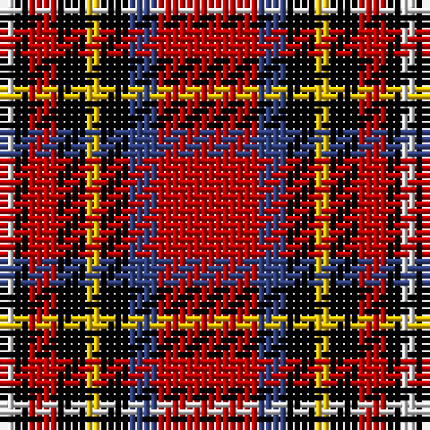

In pattern [RBKYKRKW](/patterns/rbkykrkw/).

This was sourced from weddslist.  It is a [8 stripes tartan](/stripes/stripes8/).

Original link http://www.weddslist.com/cgi-bin/tartans/pg.pl?source=sts

## Thread count
LN/2 K2 R4 K4 Y2 K4 B4 R/14

## Palette
Each colour and its ΔE from the base-6 reference it is a variant of.

| Colour | Shade | Base | ΔE (OKLab) |
|---|---|---|---|
| B | <code style="background-color:#304080;">#304080</code> `#304080` | B <code style="background-color:#2C4084;">#2C4084</code> | 0.01 |
| K | <code style="background-color:#000000;">#000000</code> `#000000` | K <code style="background-color:#000000;">#000000</code> | 0.00 |
| LN | <code style="background-color:#E0E0E0;">#E0E0E0</code> `#E0E0E0` | W <code style="background-color:#F4F4F0;">#F4F4F0</code> | 0.06 |
| R | <code style="background-color:#C00000;">#C00000</code> `#C00000` | R <code style="background-color:#C80000;">#C80000</code> | 0.02 |
| Y | <code style="background-color:#F0C000;">#F0C000</code> `#F0C000` | Y <code style="background-color:#E8C000;">#E8C000</code> | 0.01 |

# Sample pattern

## Nearest tartans

The nearest existing variants by ΔTartan distance.

1. [Royal Stuart/Stewart](/setts/s8/r14b4k4y2k4r4k2w2-b2c4084-k101010-rdc0000-we0e0e0-ye8c000/) — ΔT 0.77
1. [Hoffman Texas German](/setts/s7/k46r54b6r10w6k28y12-b0000cd-k1c1714-rca2625-wffffff-yffe700/) — ΔT 0.88
1. [Carlow County Crest (Fashion)](/setts/s10/w15g8k12g14r64k12r16k10y8k14-g006818-k101010-rc80000-we0e0e0-ye8c000/) — ΔT 1.15
1. [Alexander](/setts/s9/r24b4r8b8k30g8r8g4r24-b304080-g008000-k000000-rc00000/) — ΔT 1.16
1. [Dean Brae](/setts/s8/k44r8k8g8k32ra72ga6ra12-g447438-ga789484-k000000-rb07430-rafc2020/) — ΔT 1.21
1. [Nakayama (Personal)](/setts/s8/b6r6k12r42k42r6k12w6-b2c4084-k101010-rdc0000-we0e0e0/) — ΔT 1.23
1. [Castle Stewart (District)](/setts/s9/y14k6b8k6r42k4r8k4w8-b2c2c80-k101010-r880000-we0e0e0-yd87c00/) — ΔT 1.28
1. [Golfers](/setts/s10/y8r4k18r50k6r4k6r8b30w6-b304080-k000000-rc00000-we0e0e0-yd08010/) — ΔT 1.28
1. [Craigmoor (Fashion)](/setts/s8/k4r28k8r4k8b4g12y4-b441800-g006818-k101010-rc80000-ye8c000/) — ΔT 1.28
1. [Mangles, Peter and Annette (Personal)](/setts/s7/r80k20g20r20w20b12g12-b686468-g00643c-k000000-re01c18-we8e8e8/) — ΔT 1.29

## Neighbour map

Every grey dot is one of 15726 variants placed by the first two principal components of the ΔTartan feature space (44% of its variance). Red is this tartan; blue dots are its nearest — click one to open its page.

<svg viewBox="0 0 640 380" role="img" style="max-width:100%;height:auto;border:1px solid #e0e0e0;border-radius:4px;display:block" xmlns="http://www.w3.org/2000/svg"><image href="/nn/cloud.v1.png" width="640" height="380"/><a href="/setts/s8/r14b4k4y2k4r4k2w2-b2c4084-k101010-rdc0000-we0e0e0-ye8c000/"><circle cx="208.1" cy="171.4" r="4" fill="#3465a4"><title>Royal Stuart/Stewart</title></circle></a><a href="/setts/s7/k46r54b6r10w6k28y12-b0000cd-k1c1714-rca2625-wffffff-yffe700/"><circle cx="206.5" cy="175.4" r="4" fill="#3465a4"><title>Hoffman Texas German</title></circle></a><a href="/setts/s10/w15g8k12g14r64k12r16k10y8k14-g006818-k101010-rc80000-we0e0e0-ye8c000/"><circle cx="188.6" cy="152.0" r="4" fill="#3465a4"><title>Carlow County Crest (Fashion)</title></circle></a><a href="/setts/s9/r24b4r8b8k30g8r8g4r24-b304080-g008000-k000000-rc00000/"><circle cx="243.2" cy="197.2" r="4" fill="#3465a4"><title>Alexander</title></circle></a><a href="/setts/s8/k44r8k8g8k32ra72ga6ra12-g447438-ga789484-k000000-rb07430-rafc2020/"><circle cx="223.9" cy="145.5" r="4" fill="#3465a4"><title>Dean Brae</title></circle></a><a href="/setts/s8/b6r6k12r42k42r6k12w6-b2c4084-k101010-rdc0000-we0e0e0/"><circle cx="262.0" cy="190.9" r="4" fill="#3465a4"><title>Nakayama (Personal)</title></circle></a><a href="/setts/s9/y14k6b8k6r42k4r8k4w8-b2c2c80-k101010-r880000-we0e0e0-yd87c00/"><circle cx="236.8" cy="146.6" r="4" fill="#3465a4"><title>Castle Stewart (District)</title></circle></a><a href="/setts/s10/y8r4k18r50k6r4k6r8b30w6-b304080-k000000-rc00000-we0e0e0-yd08010/"><circle cx="216.1" cy="129.8" r="4" fill="#3465a4"><title>Golfers</title></circle></a><a href="/setts/s8/k4r28k8r4k8b4g12y4-b441800-g006818-k101010-rc80000-ye8c000/"><circle cx="190.2" cy="179.6" r="4" fill="#3465a4"><title>Craigmoor (Fashion)</title></circle></a><a href="/setts/s7/r80k20g20r20w20b12g12-b686468-g00643c-k000000-re01c18-we8e8e8/"><circle cx="222.9" cy="173.9" r="4" fill="#3465a4"><title>Mangles, Peter and Annette (Personal)</title></circle></a><circle cx="198.1" cy="172.0" r="5" fill="#c00000"/></svg>

ID: /setts/s8/r14b4k4y2k4r4k2w2-b304080-k000000-rc00000-we0e0e0-yf0c000/
