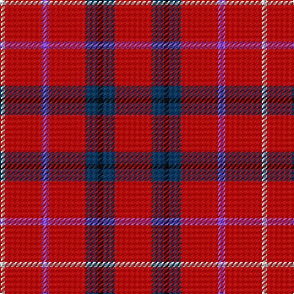

**Bands:** [RBKBRBRW](/stripes/rbkbrbrw/) · **Stripes:** [R DT K DT R P R W](/stripes/stripes8/) R DT K DT R P R W

This was sourced from tartans-authority.  It is a [8 band tartan](/bands/bands8/).

Original link http://www.tartansauthority.com/tartan-ferret/display/7673/

## Attestations

This cloth appears in 2 source records; the oldest owns this page.

- pre 2008 — Goodwillie (Fashion) (tartans-authority, [record](http://www.tartansauthority.com/tartan-ferret/display/7673/))
- undated — Goodwillie (register-of-tartans, [record](https://www.tartanregister.gov.uk/tartanDetails.aspx?ref=5676))

## Register references

External register numbers recorded for this tartan.

- Scottish Register of Tartans: [5676](https://www.tartanregister.gov.uk/tartanDetails.aspx?ref=5676)
- Scottish Tartans Authority (ITI): 7673

## Thread count
R/30 DB10 K4 DB10 R30 P6 R30 LN/4

## Palette
Each colour and its ΔE from the base-6 reference it is a variant of.

| Colour | Shade | Base | ΔE (OKLab) |
|---|---|---|---|
| DB | <code style="background-color:#003C64;">#003C64</code> `#003C64` | B <code style="background-color:#2A418A;">#2A418A</code> | 0.08 |
| K | <code style="background-color:#101010;">#101010</code> `#101010` | K <code style="background-color:#000000;">#000000</code> | 0.17 |
| LN | <code style="background-color:#E0E0E0;">#E0E0E0</code> `#E0E0E0` | W <code style="background-color:#F7F7F7;">#F7F7F7</code> | 0.07 |
| P | <code style="background-color:#9050D8;">#9050D8</code> `#9050D8` | B <code style="background-color:#2A418A;">#2A418A</code> | 0.21 |
| R | <code style="background-color:#C80000;">#C80000</code> `#C80000` | R <code style="background-color:#CC0000;">#CC0000</code> | 0.01 |

# Sample pattern

## Nearest tartans

The nearest existing variants by ΔTartan distance.

1. [Fearns McIntosh Millennium (Personal)](/setts/s10/r8dt2lb1o1r8dt2lb1o1r8g2~x6/) — ΔT 1.44
1. [Hackston or Halkerston Family Tartan Tartan Number: 907. Earliest known date: 1987 Taken from a portrait (c. 1746) Red pivot reduced by half for display. Should read R112. See products available Copyright © Blair Urquhart, Comrie, 2015](/setts/s8/r28w2k12ly3r12ly3r12g3~x2/) — ΔT 1.56
1. [Sinclair](/setts/s6/r30dg12k5lr2b6r30~x2/) — ΔT 1.57
1. [Sinclair](/setts/s6/r30dg12k5lr2b6r30/) — ΔT 1.57
1. [Sinclair](/setts/s6/r30g12k5w2t6r30/) — ΔT 1.59
1. [Ploysongsang, Edward Thiravej (Personal)](/setts/s6/r34w4t7lo10t7r18~x2/) — ΔT 1.73
1. [Cornell (Corporate)](/setts/s8/r74w27r13lr7r13w13r74k7/) — ΔT 1.75
1. [Sinclair](/setts/s5/r30dg12k5lb8r30/) — ΔT 1.76
1. [Rose](/setts/s9/g4r32db9r6db2r3db2r12w3~x2/) — ΔT 1.87
1. [Ploysongsang, Edward Thiravej (Pers](/setts/s6/r34w4t7ly10t7r18~x2/) — ΔT 1.88

## Neighbour map

Every grey dot is one of 14299 variants placed by the first two principal components of the ΔTartan feature space (44% of its variance). Red is this tartan; blue dots are its nearest — click one to open its page.

<svg viewBox="0 0 640 380" role="img" style="max-width:100%;height:auto;border:1px solid #e0e0e0;border-radius:4px;display:block" xmlns="http://www.w3.org/2000/svg"><image href="/nn/cloud.v1.png" width="640" height="380"/><a href="/setts/s10/r8dt2lb1o1r8dt2lb1o1r8g2~x6/"><circle cx="414.3" cy="187.4" r="4" fill="#3465a4"><title>Fearns McIntosh Millennium (Personal)</title></circle></a><a href="/setts/s8/r28w2k12ly3r12ly3r12g3~x2/"><circle cx="384.4" cy="147.8" r="4" fill="#3465a4"><title>Hackston or Halkerston Family Tartan Tartan Number: 907. Earliest known date: 1987 Taken from a portrait (c. 1746) Red pivot reduced by half for display. Should read R112. See products available Copyright © Blair Urquhart, Comrie, 2015</title></circle></a><a href="/setts/s6/r30dg12k5lr2b6r30~x2/"><circle cx="419.7" cy="182.6" r="4" fill="#3465a4"><title>Sinclair</title></circle></a><a href="/setts/s6/r30dg12k5lr2b6r30/"><circle cx="419.7" cy="182.6" r="4" fill="#3465a4"><title>Sinclair</title></circle></a><a href="/setts/s6/r30g12k5w2t6r30/"><circle cx="400.8" cy="169.2" r="4" fill="#3465a4"><title>Sinclair</title></circle></a><a href="/setts/s6/r34w4t7lo10t7r18~x2/"><circle cx="374.1" cy="210.7" r="4" fill="#3465a4"><title>Ploysongsang, Edward Thiravej (Personal)</title></circle></a><a href="/setts/s8/r74w27r13lr7r13w13r74k7/"><circle cx="451.0" cy="173.4" r="4" fill="#3465a4"><title>Cornell (Corporate)</title></circle></a><a href="/setts/s5/r30dg12k5lb8r30/"><circle cx="364.7" cy="234.4" r="4" fill="#3465a4"><title>Sinclair</title></circle></a><a href="/setts/s9/g4r32db9r6db2r3db2r12w3~x2/"><circle cx="463.5" cy="145.3" r="4" fill="#3465a4"><title>Rose</title></circle></a><a href="/setts/s6/r34w4t7ly10t7r18~x2/"><circle cx="353.4" cy="200.3" r="4" fill="#3465a4"><title>Ploysongsang, Edward Thiravej (Pers</title></circle></a><circle cx="397.3" cy="193.5" r="5" fill="#c00000"/></svg>

ID: /setts/s8/r15dt5k2dt5r15p3r15w2~x2/
