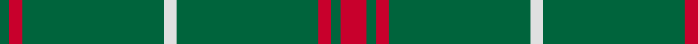
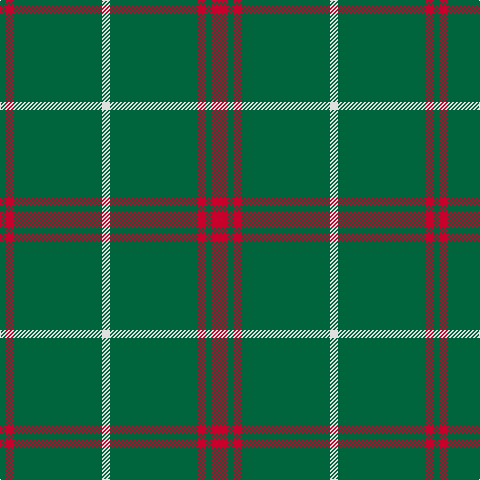

In pattern [GRGWGRGR](/patterns/grgwgrgr/).

This was sourced from register-of-tartans.  It is a [8 stripes tartan](/stripes/stripes8/).

Original link https://www.tartanregister.gov.uk/tartanDetails.aspx?ref=4597

## Thread count
G/6 R8 G88 LN8 G88 R8 G6 R/16

## Palette
Each colour and its ΔE from the base-6 reference it is a variant of.

| Colour | Shade | Base | ΔE (OKLab) |
|---|---|---|---|
| G | <code style="background-color:#00643C;">#00643C</code> `#00643C` | G <code style="background-color:#006400;">#006400</code> | 0.06 |
| LN | <code style="background-color:#E0E0E0;">#E0E0E0</code> `#E0E0E0` | W <code style="background-color:#F4F4F0;">#F4F4F0</code> | 0.06 |
| R | <code style="background-color:#C8002C;">#C8002C</code> `#C8002C` | R <code style="background-color:#C80000;">#C80000</code> | 0.03 |

# Sample pattern

## Nearest tartans

The nearest existing variants by ΔTartan distance.

1. [Highland Hospice (Fashion)](/setts/s10/g102b6g10y6g10b10g10b10g10y6-b28003c-g006818-ybc8c00/) — ΔT 1.32
1. [Loch Laggan District Tartan Tartan Number: 796. Earliest known date: pre 1820 Loch Laggan lies on the historic route between Lochaber and the Great Glen and the Central Highlands of Badenoch at the head of Glen Spean. See products available Copyright © Blair Urquhart, Comrie, 2015](/setts/s6/r19g6r7g101k7g7-g006818-k101010-rc80000/) — ΔT 1.34
1. [Welsh National (District)](/setts/s5/r16g6r8g88w8-g00643c-rc8002c-we0e0e0/) — ΔT 1.72
1. [Owen (Welsh Name)](/setts/s10/g6r2g4b2g6r6g4r4g36r4-b002048-g006818-rc80000/) — ΔT 1.76
1. [Menzies](/setts/s8/g96r8g4r8g12r4g6r18-g006818-rc80000/) — ΔT 1.79
1. [Connell (Dalgliesh) (Personal)](/setts/s10/r12g48r4g8r8g8r4g48r12k4-g006818-k101010-rc80000/) — ΔT 1.84
1. [Highland Spring (1997)](/setts/s6/g46r6g14r6g46b14-b440044-g006818-rc80000/) — ΔT 1.85
1. [Menzies Hunting](/setts/s8/g48r4g2r4g6r2g3r9-g004c00-rc80000/) — ΔT 1.90
1. [Loch Laggan](/setts/s6/r19g6r7g101k7g7-g008000-k000000-rc00000/) — ΔT 1.90
1. [Welsh National District Tartan Tartan Number: 1523. Earliest known date: 1968 The Welsh Tartan owes its origin to a Society formed in Cardiff in 1967. Its aims were cultural and political - to strengthen Celtic ties and give visible signs of being an individual nation in culture, language and dress. The colours are those of the Welsh flag. It is said that the design was based on the Lord of the Isles tartan because the present Lord is also Prince of Wales. However comparison reveals similarity only to MacDonald, MacDonald of the Isles, or perhaps Applecross district. See products available Copyright © Blair Urquhart, Comrie, 2015](/setts/s5/r8g4r4g40w4-g00643c-ra00048-we0e0e0/) — ΔT 1.91

## Neighbour map

Every grey dot is one of 15726 variants placed by the first two principal components of the ΔTartan feature space (44% of its variance). Red is this tartan; blue dots are its nearest — click one to open its page.

<svg viewBox="0 0 640 380" role="img" style="max-width:100%;height:auto;border:1px solid #e0e0e0;border-radius:4px;display:block" xmlns="http://www.w3.org/2000/svg"><image href="/nn/cloud.v1.png" width="640" height="380"/><a href="/setts/s10/g102b6g10y6g10b10g10b10g10y6-b28003c-g006818-ybc8c00/"><circle cx="557.8" cy="174.8" r="4" fill="#3465a4"><title>Highland Hospice (Fashion)</title></circle></a><a href="/setts/s6/r19g6r7g101k7g7-g006818-k101010-rc80000/"><circle cx="560.3" cy="200.7" r="4" fill="#3465a4"><title>Loch Laggan District Tartan Tartan Number: 796. Earliest known date: pre 1820 Loch Laggan lies on the historic route between Lochaber and the Great Glen and the Central Highlands of Badenoch at the head of Glen Spean. See products available Copyright © Blair Urquhart, Comrie, 2015</title></circle></a><a href="/setts/s5/r16g6r8g88w8-g00643c-rc8002c-we0e0e0/"><circle cx="504.4" cy="206.5" r="4" fill="#3465a4"><title>Welsh National (District)</title></circle></a><a href="/setts/s10/g6r2g4b2g6r6g4r4g36r4-b002048-g006818-rc80000/"><circle cx="513.0" cy="165.8" r="4" fill="#3465a4"><title>Owen (Welsh Name)</title></circle></a><a href="/setts/s8/g96r8g4r8g12r4g6r18-g006818-rc80000/"><circle cx="584.2" cy="185.0" r="4" fill="#3465a4"><title>Menzies</title></circle></a><a href="/setts/s10/r12g48r4g8r8g8r4g48r12k4-g006818-k101010-rc80000/"><circle cx="474.9" cy="203.7" r="4" fill="#3465a4"><title>Connell (Dalgliesh) (Personal)</title></circle></a><a href="/setts/s6/g46r6g14r6g46b14-b440044-g006818-rc80000/"><circle cx="517.1" cy="274.6" r="4" fill="#3465a4"><title>Highland Spring (1997)</title></circle></a><a href="/setts/s8/g48r4g2r4g6r2g3r9-g004c00-rc80000/"><circle cx="581.3" cy="184.3" r="4" fill="#3465a4"><title>Menzies Hunting</title></circle></a><a href="/setts/s6/r19g6r7g101k7g7-g008000-k000000-rc00000/"><circle cx="528.4" cy="188.0" r="4" fill="#3465a4"><title>Loch Laggan</title></circle></a><a href="/setts/s5/r8g4r4g40w4-g00643c-ra00048-we0e0e0/"><circle cx="479.4" cy="226.5" r="4" fill="#3465a4"><title>Welsh National District Tartan Tartan Number: 1523. Earliest known date: 1968 The Welsh Tartan owes its origin to a Society formed in Cardiff in 1967. Its aims were cultural and political - to strengthen Celtic ties and give visible signs of being an individual nation in culture, language and dress. The colours are those of the Welsh flag. It is said that the design was based on the Lord of the Isles tartan because the present Lord is also Prince of Wales. However comparison reveals similarity only to MacDonald, MacDonald of the Isles, or perhaps Applecross district. See products available Copyright © Blair Urquhart, Comrie, 2015</title></circle></a><circle cx="576.1" cy="204.3" r="5" fill="#c00000"/></svg>

ID: /setts/s8/r16g6r8g88w8g88r8g6-g00643c-rc8002c-we0e0e0/
