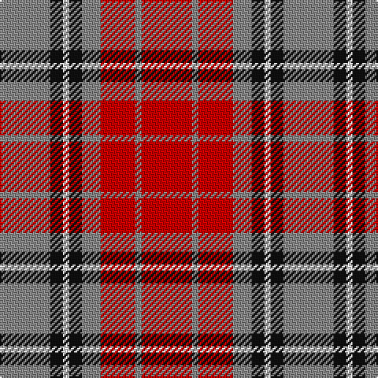

**Bands:** [RKWKRRRR](/stripes/rkwkrrrr/) · **Stripes:** [O K W K O R O R](/stripes/stripes8/) O K W K O R O R

This was sourced from house-of-tartan.  It is a [8 band tartan](/bands/bands8/).

Original link http://www.house-of-tartan.scotland.net/house/TartanViewjs.asp?colr=Def&tnam=1291

## Thread count
N/32 K8 LN4 K8 N12 R22 N4 R/32

## Palette
Each colour and its ΔE from the base-6 reference it is a variant of.

| Colour | Shade | Base | ΔE (OKLab) |
|---|---|---|---|
| K | <code style="background-color:#101010;">#101010</code> `#101010` | K <code style="background-color:#000000;">#000000</code> | 0.17 |
| LN | <code style="background-color:#E0E0E0;">#E0E0E0</code> `#E0E0E0` | W <code style="background-color:#F7F7F7;">#F7F7F7</code> | 0.07 |
| N | <code style="background-color:#888888;">#888888</code> `#888888` | R <code style="background-color:#CC0000;">#CC0000</code> | 0.24 |
| R | <code style="background-color:#C80000;">#C80000</code> `#C80000` | R <code style="background-color:#CC0000;">#CC0000</code> | 0.01 |

# Sample pattern

## Nearest tartans

The nearest existing variants by ΔTartan distance.

1. [Banff](/setts/s7/o6ly3o20o20o3o3lb6~x2/) — ΔT 0.73
1. [MacKintosh-Geddes (Personal?)](/setts/s7/dp2r4g12r3dp6r10w2~x2/) — ΔT 0.76
1. [Henkel](/setts/s10/y28k3r22k8w3k8r22k3y28k3~x2/) — ΔT 0.85
1. [Sydney (Nova Scotia) (District)](/setts/s8/o16k4w2k4o6o11o2o16~x2/) — ΔT 0.91
1. [St. Andrews (Queens University) (Cor](/setts/s8/dy11db1dy11w10db1r11db1r11~x2/) — ΔT 0.93
1. [St Andrews](/setts/s8/r11db1r11db1w10o11db1o11~x2/) — ΔT 0.95
1. [Convention of the Baronage (Corp)](/setts/s9/g3r9t1g9r1g1r9db9r1~x4/) — ΔT 0.99
1. [MacBean/MacElvain](/setts/s7/k2r12db6r3dg12r4db1~x2/) — ΔT 1.02
1. [Manhattan Ethnic](/setts/s7/o72dr30o18lr62y10dr7lr32/) — ΔT 1.04
1. [Leitrim](/setts/s10/y3dr18y4dr3y4r13y3y18dr2lo3~x2/) — ΔT 1.08

## Neighbour map

Every grey dot is one of 14299 variants placed by the first two principal components of the ΔTartan feature space (44% of its variance). Red is this tartan; blue dots are its nearest — click one to open its page.

<svg viewBox="0 0 640 380" role="img" style="max-width:100%;height:auto;border:1px solid #e0e0e0;border-radius:4px;display:block" xmlns="http://www.w3.org/2000/svg"><image href="/nn/cloud.v1.png" width="640" height="380"/><a href="/setts/s7/o6ly3o20o20o3o3lb6~x2/"><circle cx="248.2" cy="199.2" r="4" fill="#3465a4"><title>Banff</title></circle></a><a href="/setts/s7/dp2r4g12r3dp6r10w2~x2/"><circle cx="201.3" cy="222.3" r="4" fill="#3465a4"><title>MacKintosh-Geddes (Personal?)</title></circle></a><a href="/setts/s10/y28k3r22k8w3k8r22k3y28k3~x2/"><circle cx="226.4" cy="180.6" r="4" fill="#3465a4"><title>Henkel</title></circle></a><a href="/setts/s8/o16k4w2k4o6o11o2o16~x2/"><circle cx="244.3" cy="213.2" r="4" fill="#3465a4"><title>Sydney (Nova Scotia) (District)</title></circle></a><a href="/setts/s8/dy11db1dy11w10db1r11db1r11~x2/"><circle cx="200.6" cy="190.2" r="4" fill="#3465a4"><title>St. Andrews (Queens University) (Cor</title></circle></a><a href="/setts/s8/r11db1r11db1w10o11db1o11~x2/"><circle cx="217.7" cy="198.1" r="4" fill="#3465a4"><title>St Andrews</title></circle></a><a href="/setts/s9/g3r9t1g9r1g1r9db9r1~x4/"><circle cx="251.9" cy="197.2" r="4" fill="#3465a4"><title>Convention of the Baronage (Corp)</title></circle></a><a href="/setts/s7/k2r12db6r3dg12r4db1~x2/"><circle cx="260.0" cy="198.1" r="4" fill="#3465a4"><title>MacBean/MacElvain</title></circle></a><a href="/setts/s7/o72dr30o18lr62y10dr7lr32/"><circle cx="227.1" cy="203.8" r="4" fill="#3465a4"><title>Manhattan Ethnic</title></circle></a><a href="/setts/s10/y3dr18y4dr3y4r13y3y18dr2lo3~x2/"><circle cx="247.8" cy="185.5" r="4" fill="#3465a4"><title>Leitrim</title></circle></a><circle cx="236.5" cy="202.4" r="5" fill="#c00000"/></svg>

ID: /setts/s8/r16o2r11o6k4w2k4o16~x2/
