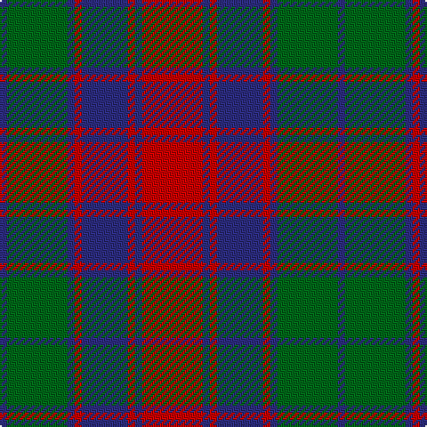

In pattern [BGBRBRBR](/patterns/bgbrbrbr/).

This was sourced from house-of-tartan.  It is a [8 stripes tartan](/stripes/stripes8/).

Original link http://www.house-of-tartan.scotland.net/house/TartanViewjs.asp?colr=Def&tnam=2235

## Thread count
DB/4 G34 DB4 R4 DB26 R4 DB4 R/34

## Palette
Each colour and its ΔE from the base-6 reference it is a variant of.

| Colour | Shade | Base | ΔE (OKLab) |
|---|---|---|---|
| DB | <code style="background-color:#2C2C80;">#2C2C80</code> `#2C2C80` | B <code style="background-color:#2A418A;">#2A418A</code> | 0.06 |
| G | <code style="background-color:#006818;">#006818</code> `#006818` | G <code style="background-color:#006100;">#006100</code> | 0.02 |
| R | <code style="background-color:#C80000;">#C80000</code> `#C80000` | R <code style="background-color:#CC0000;">#CC0000</code> | 0.01 |

# Sample pattern

## Nearest tartans

The nearest existing variants by ΔTartan distance.

1. [Red Remony](/setts/s8/r17b2r2b13r2b2g17b2x2~b304080-g008000-rc00000/) — ΔT 0.54
1. [Remony (Red)](/setts/s8/r17b2r2b13r2b2g17b2x2~b1c0070-g006818-r880000/) — ΔT 0.85
1. [Logan, or Skene](/setts/s7/b9r3b1r3g9r3b1x2~b304080-g008000-rc00000/) — ΔT 0.92
1. [Scottish Netball Association](/setts/s7/b3g14r2b10g2r14b3x2~b800080-g008000-r900030/) — ΔT 0.99
1. [Fraser of Stratherrick](/setts/s12/b20r2b2r2g19r18g2r18g19b19r2b2x2~b2c2c80-g006818-rc80000/) — ΔT 1.00
1. [Chindecella Gorse (Personal)](/setts/s8/y7b4y2b4y23ba19b19ba4x2~b1c1c50-ba5c5c5c-ybc8c00/) — ΔT 1.08
1. [Roxburgh, Red](/setts/s10/b3g26b3r3b20r3b3r26g5w3x2~b304080-g003000-rc00000-we0e0e0/) — ΔT 1.10
1. [Fraser Stewart of Athol](/setts/s12/b28r3b3r3g20r30g4r30g20b22r3b3x2~b2c4084-g005020-rdc0000/) — ΔT 1.10
1. [McGlynn](/setts/s10/g18b3g3b3g2b8r23b2r4g2x2~b2c2c80-g006818-r980044/) — ΔT 1.11
1. [Fraser, Stewart of Athol](/setts/s12/b28r3b3r3g20r30g4r30g20b22r3b3x2~b304080-g008000-rc00000/) — ΔT 1.11

## Neighbour map

Every grey dot is one of 15726 variants placed by the first two principal components of the ΔTartan feature space (44% of its variance). Red is this tartan; blue dots are its nearest — click one to open its page.

<svg viewBox="0 0 640 380" role="img" style="max-width:100%;height:auto;border:1px solid #e0e0e0;border-radius:4px;display:block" xmlns="http://www.w3.org/2000/svg"><image href="/nn/cloud.v1.png" width="640" height="380"/><a href="/setts/s8/r17b2r2b13r2b2g17b2x2~b304080-g008000-rc00000/"><circle cx="240.4" cy="211.2" r="4" fill="#3465a4"><title>Red Remony</title></circle></a><a href="/setts/s8/r17b2r2b13r2b2g17b2x2~b1c0070-g006818-r880000/"><circle cx="245.9" cy="219.7" r="4" fill="#3465a4"><title>Remony (Red)</title></circle></a><a href="/setts/s7/b9r3b1r3g9r3b1x2~b304080-g008000-rc00000/"><circle cx="233.8" cy="231.5" r="4" fill="#3465a4"><title>Logan, or Skene</title></circle></a><a href="/setts/s7/b3g14r2b10g2r14b3x2~b800080-g008000-r900030/"><circle cx="218.7" cy="238.9" r="4" fill="#3465a4"><title>Scottish Netball Association</title></circle></a><a href="/setts/s12/b20r2b2r2g19r18g2r18g19b19r2b2x2~b2c2c80-g006818-rc80000/"><circle cx="217.3" cy="199.1" r="4" fill="#3465a4"><title>Fraser of Stratherrick</title></circle></a><a href="/setts/s8/y7b4y2b4y23ba19b19ba4x2~b1c1c50-ba5c5c5c-ybc8c00/"><circle cx="230.1" cy="210.3" r="4" fill="#3465a4"><title>Chindecella Gorse (Personal)</title></circle></a><a href="/setts/s10/b3g26b3r3b20r3b3r26g5w3x2~b304080-g003000-rc00000-we0e0e0/"><circle cx="200.3" cy="178.1" r="4" fill="#3465a4"><title>Roxburgh, Red</title></circle></a><a href="/setts/s12/b28r3b3r3g20r30g4r30g20b22r3b3x2~b2c4084-g005020-rdc0000/"><circle cx="244.8" cy="196.2" r="4" fill="#3465a4"><title>Fraser Stewart of Athol</title></circle></a><a href="/setts/s10/g18b3g3b3g2b8r23b2r4g2x2~b2c2c80-g006818-r980044/"><circle cx="286.4" cy="194.2" r="4" fill="#3465a4"><title>McGlynn</title></circle></a><a href="/setts/s12/b28r3b3r3g20r30g4r30g20b22r3b3x2~b304080-g008000-rc00000/"><circle cx="245.9" cy="198.6" r="4" fill="#3465a4"><title>Fraser, Stewart of Athol</title></circle></a><circle cx="239.1" cy="210.3" r="5" fill="#c00000"/></svg>

ID: /setts/s8/r17b2r2b13r2b2g17b2x2~b2c2c80-g006818-rc80000/
