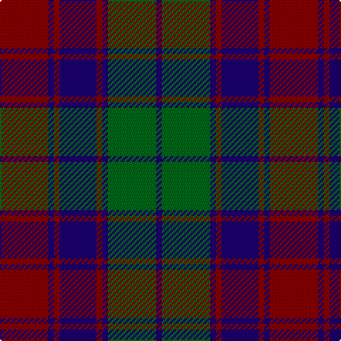

In pattern [BGBRBRBR](/stripes/bgbrbrbr/).

This was sourced from register-of-tartans.  It is a [8 stripe tartan](/stripes/stripes8/).

Original link https://www.tartanregister.gov.uk/tartanDetails.aspx?ref=3497

## Also known as

This cloth is also recorded under:

- Remony

## Attestations

This cloth appears in 4 source records; the oldest owns this page.

- 01/07/1995 — Remony (Red) (register-of-tartans, [record](https://www.tartanregister.gov.uk/tartanDetails.aspx?ref=3497))
- Oct. 1995 — Red Remony (Fashion) (tartans-authority, [record](http://www.tartansauthority.com/tartan-ferret/display/2235/))
- undated — Red Remony (weddslist, [record](http://www.weddslist.com/cgi-bin/tartans/pg.pl?source=sts))
- undated — Red Remony Trade Tartan Tartan Number: 2235. Earliest known date: 1971 Red Remony See products available Copyright © Blair Urquhart, Comrie, 2015 (house-of-tartan, [record](http://www.house-of-tartan.scotland.net/house/TartanViewjs.asp?colr=Def&tnam=2235))

## Register references

External register numbers recorded for this tartan.

- Scottish Register of Tartans: [3497](https://www.tartanregister.gov.uk/tartanDetails.aspx?ref=3497)
- Scottish Tartans Authority (ITI): 2235
- Scottish Tartans World Register: 2235

## Thread count
DR/34 DB4 DR4 DB26 DR4 DB4 G34 DB/4

## Palette
Each colour and the base-6 reference it is a variant of.

| Colour | Shade | Base |
|---|---|---|
| DB | <code style="background-color:#1C0070;">#1C0070</code> `oklch(26.3% 0.162 277.1)` <small>#1C0070</small> | B <code style="background-color:#2A418A;">#2A418A</code> |
| DR | <code style="background-color:#880000;">#880000</code> `oklch(39.4% 0.162 29.2)` <small>#880000</small> | R <code style="background-color:#CC0000;">#CC0000</code> |
| G | <code style="background-color:#006818;">#006818</code> `oklch(45.0% 0.142 145.0)` <small>#006818</small> | G <code style="background-color:#006100;">#006100</code> |

# Sample pattern

## Nearest tartans

The nearest existing variants by ΔTartan distance, with this tartan at the top so the swatches line up against it.

ΔTartan

Tartan

Sett

—

<a href="/ttd/edit/#slug=r17db2r2db13r2db2g17db2~x2">Remony (Red)</a> <a class="nn-out" href="/setts/s8/r17db2r2db13r2db2g17db2~x2/" title="open its dictionary page">↗</a>

0.97

<a href="/ttd/edit/#slug=r6db2r2db21dg20r4dg4~x2">Robertson of Struan</a> <a class="nn-out" href="/setts/s7/r6db2r2db21dg20r4dg4~x2/" title="open its dictionary page">↗</a>

1.02

<a href="/ttd/edit/#slug=g18db3g3db3g2db8m23db2m4g2~x2">McGlynn</a> <a class="nn-out" href="/setts/s10/g18db3g3db3g2db8m23db2m4g2~x2/" title="open its dictionary page">↗</a>

1.07

<a href="/ttd/edit/#slug=r3db1r1db11g10r2db2~x4">Robertson of Struan 1816</a> <a class="nn-out" href="/setts/s7/r3db1r1db11g10r2db2~x4/" title="open its dictionary page">↗</a>

1.09

<a href="/ttd/edit/#slug=db9r3db1g9r3db1~x2">Logan #5</a> <a class="nn-out" href="/setts/s6/db9r3db1g9r3db1~x2/" title="open its dictionary page">↗</a>

1.10

<a href="/ttd/edit/#slug=db9r3db1r3dg9r3db1~x2">Skene</a> <a class="nn-out" href="/setts/s7/db9r3db1r3dg9r3db1~x2/" title="open its dictionary page">↗</a>

1.12

<a href="/ttd/edit/#slug=db3db1g5db3r9db1r1db2~x4">Unidentified #61</a> <a class="nn-out" href="/setts/s8/db3db1g5db3r9db1r1db2~x4/" title="open its dictionary page">↗</a>

1.16

<a href="/ttd/edit/#slug=db8r3db1r3dg14r3db1~x4">Logan</a> <a class="nn-out" href="/setts/s7/db8r3db1r3dg14r3db1~x4/" title="open its dictionary page">↗</a>

1.21

<a href="/ttd/edit/#slug=db9r3db1r3g9r3db1~x2">Logan, or Skene</a> <a class="nn-out" href="/setts/s7/db9r3db1r3g9r3db1~x2/" title="open its dictionary page">↗</a>

1.23

<a href="/ttd/edit/#slug=db20r2db2r2g19r18g2r18g19db19r2db2~x2">Fraser of Stratherrick</a> <a class="nn-out" href="/setts/s12/db20r2db2r2g19r18g2r18g19db19r2db2~x2/" title="open its dictionary page">↗</a>

1.27

<a href="/ttd/edit/#slug=r3k12g4db12r1k2r1~x4">Sandberg</a> <a class="nn-out" href="/setts/s7/r3k12g4db12r1k2r1~x4/" title="open its dictionary page">↗</a>

## Neighbour map

Every grey dot is one of 14299 variants placed by the first two principal components of the ΔTartan feature space (44% of its variance). Red is this tartan; blue dots are its nearest — click one to open its page.

<svg viewBox="0 0 640 380" role="img" style="max-width:100%;height:auto;border:1px solid #e0e0e0;border-radius:4px;display:block" xmlns="http://www.w3.org/2000/svg"><image href="/nn/cloud.v1.png" width="640" height="380"/><a href="/setts/s7/r6db2r2db21dg20r4dg4~x2/"><circle cx="284.7" cy="228.7" r="4" fill="#3465a4"><title>Robertson of Struan</title></circle></a><a href="/setts/s10/g18db3g3db3g2db8m23db2m4g2~x2/"><circle cx="288.2" cy="197.8" r="4" fill="#3465a4"><title>McGlynn</title></circle></a><a href="/setts/s7/r3db1r1db11g10r2db2~x4/"><circle cx="295.5" cy="219.2" r="4" fill="#3465a4"><title>Robertson of Struan 1816</title></circle></a><a href="/setts/s6/db9r3db1g9r3db1~x2/"><circle cx="260.7" cy="242.6" r="4" fill="#3465a4"><title>Logan #5</title></circle></a><a href="/setts/s7/db9r3db1r3dg9r3db1~x2/"><circle cx="219.0" cy="228.4" r="4" fill="#3465a4"><title>Skene</title></circle></a><a href="/setts/s8/db3db1g5db3r9db1r1db2~x4/"><circle cx="217.9" cy="207.9" r="4" fill="#3465a4"><title>Unidentified #61</title></circle></a><a href="/setts/s7/db8r3db1r3dg14r3db1~x4/"><circle cx="289.0" cy="209.7" r="4" fill="#3465a4"><title>Logan</title></circle></a><a href="/setts/s7/db9r3db1r3g9r3db1~x2/"><circle cx="235.8" cy="232.9" r="4" fill="#3465a4"><title>Logan, or Skene</title></circle></a><a href="/setts/s12/db20r2db2r2g19r18g2r18g19db19r2db2~x2/"><circle cx="219.3" cy="200.9" r="4" fill="#3465a4"><title>Fraser of Stratherrick</title></circle></a><a href="/setts/s7/r3k12g4db12r1k2r1~x4/"><circle cx="243.7" cy="206.3" r="4" fill="#3465a4"><title>Sandberg</title></circle></a><circle cx="248.3" cy="222.1" r="5" fill="#c00000"/></svg>

ID: /setts/s8/r17db2r2db13r2db2g17db2~x2/
