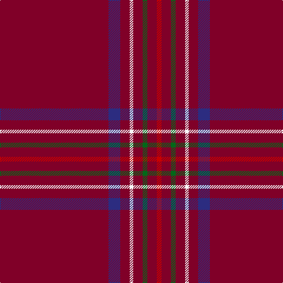

In pattern [RBRWRGRR](/patterns/rbrwrgrr/).

This was sourced from register-of-tartans.  It is a [8 stripes tartan](/stripes/stripes8/).

Original link https://www.tartanregister.gov.uk/tartanDetails.aspx?ref=445

## Thread count
DR/184 DB20 DR16 W6 DR16 G8 DR16 R/8

## Palette
Each colour and its ΔE from the base-6 reference it is a variant of.

| Colour | Shade | Base | ΔE (OKLab) |
|---|---|---|---|
| DB | <code style="background-color:#2C2C80;">#2C2C80</code> `#2C2C80` | B <code style="background-color:#2C4084;">#2C4084</code> | 0.05 |
| DR | <code style="background-color:#800028;">#800028</code> `#800028` | R <code style="background-color:#C80000;">#C80000</code> | 0.16 |
| G | <code style="background-color:#006818;">#006818</code> `#006818` | G <code style="background-color:#006400;">#006400</code> | 0.02 |
| R | <code style="background-color:#C80000;">#C80000</code> `#C80000` | R <code style="background-color:#C80000;">#C80000</code> | 0.00 |
| W | <code style="background-color:#F8F8F8;">#F8F8F8</code> `#F8F8F8` | W <code style="background-color:#F4F4F0;">#F4F4F0</code> | 0.01 |

# Sample pattern

## Nearest tartans

The nearest existing variants by ΔTartan distance.

1. [Burnett of Leys Htg (Clan)](/setts/s8/r150b12r12w4r12g4r12ra4-b181848-g006818-r800028-rac80000-wf8f8f8/) — ΔT 0.88
1. [Fernie (Personal)](/setts/s6/r50b10ra4r24rb2w2-b1c1c1c-r800028-rae86000-rb888888-wfcfcfc/) — ΔT 1.56
1. [Lock in Northumberland](/setts/s8/b180k2ka4ba20ka10r4k4ba4-b59071d-ba737d98-k000000-ka101010-r921415/) — ΔT 1.71
1. [Stenhousemuir Football Club (Sports)](/setts/s9/r12k4r8y6r120b28r6b6w2-b2c2c80-k101010-r901c38-wfcfcfc-ye8c000/) — ΔT 1.71
1. [Inverness, Earl of](/setts/s8/r84b8y2b12g2b2g2r24-b304080-g008000-rc00000-yf0c000/) — ΔT 1.78
1. [Stenhousemuir F.C.](/setts/s9/r12k4r8y6r120b28r6b6w2-b304080-k000000-r802040-we0e0e0-yf0c000/) — ΔT 1.82
1. [Burnett, of Leys](/setts/s8/r120b10r10w4r10g4r10y4-b304080-g008000-rc00000-we0e0e0-yf0c000/) — ΔT 1.87
1. [Burnett of Leys](/setts/s8/r184b20r16w6r16g8r16y6-b2c2c80-g006818-rc80000-wf8f8f8-yd09800/) — ΔT 1.87
1. [Inverness](/setts/s8/r72b6w2b12g2k2g2r18-b304080-g008000-k000000-rc00000-we0e0e0/) — ΔT 1.93
1. [Hampden-Sydney College](/setts/s9/r80w2r5k10r6y4r10k2y6-k101010-r960028-wffffff-yb8b8b8/) — ΔT 1.95

## Neighbour map

Every grey dot is one of 15726 variants placed by the first two principal components of the ΔTartan feature space (44% of its variance). Red is this tartan; blue dots are its nearest — click one to open its page.

<svg viewBox="0 0 640 380" role="img" style="max-width:100%;height:auto;border:1px solid #e0e0e0;border-radius:4px;display:block" xmlns="http://www.w3.org/2000/svg"><image href="/nn/cloud.v1.png" width="640" height="380"/><a href="/setts/s8/r150b12r12w4r12g4r12ra4-b181848-g006818-r800028-rac80000-wf8f8f8/"><circle cx="626.0" cy="116.1" r="4" fill="#3465a4"><title>Burnett of Leys Htg (Clan)</title></circle></a><a href="/setts/s6/r50b10ra4r24rb2w2-b1c1c1c-r800028-rae86000-rb888888-wfcfcfc/"><circle cx="575.0" cy="159.8" r="4" fill="#3465a4"><title>Fernie (Personal)</title></circle></a><a href="/setts/s8/b180k2ka4ba20ka10r4k4ba4-b59071d-ba737d98-k000000-ka101010-r921415/"><circle cx="626.0" cy="99.5" r="4" fill="#3465a4"><title>Lock in Northumberland</title></circle></a><a href="/setts/s9/r12k4r8y6r120b28r6b6w2-b2c2c80-k101010-r901c38-wfcfcfc-ye8c000/"><circle cx="579.0" cy="89.1" r="4" fill="#3465a4"><title>Stenhousemuir Football Club (Sports)</title></circle></a><a href="/setts/s8/r84b8y2b12g2b2g2r24-b304080-g008000-rc00000-yf0c000/"><circle cx="624.6" cy="115.1" r="4" fill="#3465a4"><title>Inverness, Earl of</title></circle></a><a href="/setts/s9/r12k4r8y6r120b28r6b6w2-b304080-k000000-r802040-we0e0e0-yf0c000/"><circle cx="584.6" cy="95.6" r="4" fill="#3465a4"><title>Stenhousemuir F.C.</title></circle></a><a href="/setts/s8/r120b10r10w4r10g4r10y4-b304080-g008000-rc00000-we0e0e0-yf0c000/"><circle cx="626.0" cy="105.3" r="4" fill="#3465a4"><title>Burnett, of Leys</title></circle></a><a href="/setts/s8/r184b20r16w6r16g8r16y6-b2c2c80-g006818-rc80000-wf8f8f8-yd09800/"><circle cx="626.0" cy="101.4" r="4" fill="#3465a4"><title>Burnett of Leys</title></circle></a><a href="/setts/s8/r72b6w2b12g2k2g2r18-b304080-g008000-k000000-rc00000-we0e0e0/"><circle cx="563.9" cy="96.8" r="4" fill="#3465a4"><title>Inverness</title></circle></a><a href="/setts/s9/r80w2r5k10r6y4r10k2y6-k101010-r960028-wffffff-yb8b8b8/"><circle cx="604.0" cy="98.1" r="4" fill="#3465a4"><title>Hampden-Sydney College</title></circle></a><circle cx="626.0" cy="123.2" r="5" fill="#c00000"/></svg>

ID: /setts/s8/r184b20r16w6r16g8r16ra8-b2c2c80-g006818-r800028-rac80000-wf8f8f8/
