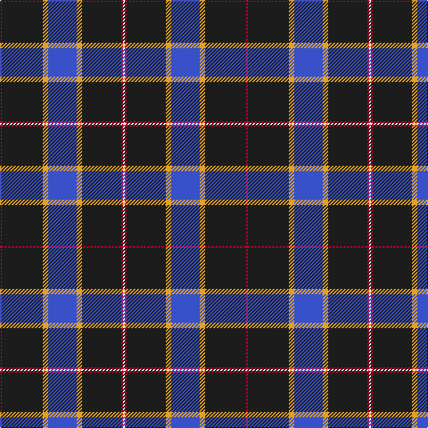

In pattern [RBYBYBRW](/patterns/rbybybrw/).

This was sourced from register-of-tartans.  It is a [8 stripes tartan](/stripes/stripes8/).

Original link https://www.tartanregister.gov.uk/tartanDetails.aspx?ref=11542

## Register references

External register numbers recorded for this tartan.

- Scottish Register of Tartans: [11542](https://www.tartanregister.gov.uk/tartanDetails.aspx?ref=11542)

## Thread count
R/2 K46 Y6 B32 Y6 K44 R2 W/2

## Palette
Each colour and its ΔE from the base-6 reference it is a variant of.

| Colour | Shade | Base | ΔE (OKLab) |
|---|---|---|---|
| B | <code style="background-color:#3850C8;">#3850C8</code> `#3850C8` | B <code style="background-color:#2A418A;">#2A418A</code> | 0.11 |
| K | <code style="background-color:#1C1C1C;">#1C1C1C</code> `#1C1C1C` | B <code style="background-color:#2A418A;">#2A418A</code> | 0.21 |
| R | <code style="background-color:#C8002C;">#C8002C</code> `#C8002C` | R <code style="background-color:#CC0000;">#CC0000</code> | 0.03 |
| W | <code style="background-color:#F8F8F8;">#F8F8F8</code> `#F8F8F8` | W <code style="background-color:#F7F7F7;">#F7F7F7</code> | 0.00 |
| Y | <code style="background-color:#E0A126;">#E0A126</code> `#E0A126` | Y <code style="background-color:#F2BF00;">#F2BF00</code> | 0.08 |

# Sample pattern

## Nearest tartans

The nearest existing variants by ΔTartan distance.

1. [Indiana #2](/setts/s8/b50y4b3y4b8k2ba12w5~b141e46-ba2c4084-k101010-we0e0e0-ye8c000~x2/) — ΔT 1.09
1. [Universal Scientific Indust (Corp.)](/setts/s9/k38b2r24w2k16r6b2k3b5~b2888c4-k101010-r9c68a4-wf8f8f8~x2/) — ΔT 1.16
1. [State Seal of Massachusetts Fash)](/setts/s10/k62b4k7ba29k3y4k3w4k11b16~b1474b4-ba2c2c80-k101010-we8ccb8-ybc8c00~x2/) — ΔT 1.19
1. [Warren Wilson College (Corporate)](/setts/s8/g20y6b20ya3b48r6b4r6~b1c0070-g006818-r880000-ya0a0a0-yae8c000~x2/) — ΔT 1.19
1. [Chestico](/setts/s7/b20g1b1g1ga8k1w3~b202060-g603800-ga003820-k101010-wfcfcfc~x2/) — ΔT 1.26
1. [Unidentified Plaid #5](/setts/s10/b26g6b26r2g26w1r6b2r6b13~b080848-g006428-rdc0000-we0e0e0~x2/) — ΔT 1.31
1. [MacLaurin, of Brioch](/setts/s7/b36k10g3r3g6k1y2~b304080-g008000-k000000-rc00000-yf0c000~x2/) — ΔT 1.32
1. [Round Table of Britain and Ireland, RtbI.](/setts/s6/b47g14ba5r2ra3g7~b000050-ba401000-g008000-r806050-rac00000~x2/) — ΔT 1.33
1. [Genet, Edmond Charles 'Citizen' (Personal)](/setts/s7/r4k9g9ka40r2ka2w2~g285800-k101010-ka000028-rdc0000-wf8f8f8~x2/) — ΔT 1.35
1. [Boxing Scotland](/setts/s8/b26r2ba16b23ba16r2w2y1~b141e46-ba3c82af-rc80000-wffffff-yffe600~x2/) — ΔT 1.36

## Neighbour map

Every grey dot is one of 15726 variants placed by the first two principal components of the ΔTartan feature space (44% of its variance). Red is this tartan; blue dots are its nearest — click one to open its page.

<svg viewBox="0 0 640 380" role="img" style="max-width:100%;height:auto;border:1px solid #e0e0e0;border-radius:4px;display:block" xmlns="http://www.w3.org/2000/svg"><image href="/nn/cloud.v1.png" width="640" height="380"/><a href="/setts/s8/b50y4b3y4b8k2ba12w5~b141e46-ba2c4084-k101010-we0e0e0-ye8c000~x2/"><circle cx="409.9" cy="125.9" r="4" fill="#3465a4"><title>Indiana #2</title></circle></a><a href="/setts/s9/k38b2r24w2k16r6b2k3b5~b2888c4-k101010-r9c68a4-wf8f8f8~x2/"><circle cx="337.1" cy="152.8" r="4" fill="#3465a4"><title>Universal Scientific Indust (Corp.)</title></circle></a><a href="/setts/s10/k62b4k7ba29k3y4k3w4k11b16~b1474b4-ba2c2c80-k101010-we8ccb8-ybc8c00~x2/"><circle cx="351.2" cy="136.5" r="4" fill="#3465a4"><title>State Seal of Massachusetts Fash)</title></circle></a><a href="/setts/s8/g20y6b20ya3b48r6b4r6~b1c0070-g006818-r880000-ya0a0a0-yae8c000~x2/"><circle cx="348.3" cy="165.0" r="4" fill="#3465a4"><title>Warren Wilson College (Corporate)</title></circle></a><a href="/setts/s7/b20g1b1g1ga8k1w3~b202060-g603800-ga003820-k101010-wfcfcfc~x2/"><circle cx="350.2" cy="143.8" r="4" fill="#3465a4"><title>Chestico</title></circle></a><a href="/setts/s10/b26g6b26r2g26w1r6b2r6b13~b080848-g006428-rdc0000-we0e0e0~x2/"><circle cx="346.5" cy="163.7" r="4" fill="#3465a4"><title>Unidentified Plaid #5</title></circle></a><a href="/setts/s7/b36k10g3r3g6k1y2~b304080-g008000-k000000-rc00000-yf0c000~x2/"><circle cx="350.3" cy="116.3" r="4" fill="#3465a4"><title>MacLaurin, of Brioch</title></circle></a><a href="/setts/s6/b47g14ba5r2ra3g7~b000050-ba401000-g008000-r806050-rac00000~x2/"><circle cx="356.6" cy="154.7" r="4" fill="#3465a4"><title>Round Table of Britain and Ireland, RtbI.</title></circle></a><a href="/setts/s7/r4k9g9ka40r2ka2w2~g285800-k101010-ka000028-rdc0000-wf8f8f8~x2/"><circle cx="355.5" cy="146.9" r="4" fill="#3465a4"><title>Genet, Edmond Charles 'Citizen' (Personal)</title></circle></a><a href="/setts/s8/b26r2ba16b23ba16r2w2y1~b141e46-ba3c82af-rc80000-wffffff-yffe600~x2/"><circle cx="319.4" cy="152.8" r="4" fill="#3465a4"><title>Boxing Scotland</title></circle></a><circle cx="365.7" cy="145.2" r="5" fill="#c00000"/></svg>

ID: /setts/s8/r1b23y3ba16y3b22r1w1~b1c1c1c-ba3850c8-rc8002c-wf8f8f8-ye0a126~x2/
