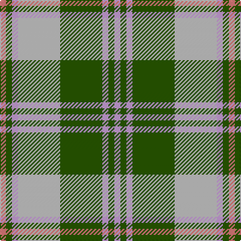

**Bands:** [RGWWGWGW](/stripes/rgwwgwgw/) · **Stripes:** [R DG LP LB DG LP DG LP](/stripes/stripes8/) R DG LP LB DG LP DG LP

This was sourced from tartans-authority.  It is a [8 band tartan](/bands/bands8/).

Original link http://www.tartansauthority.com/tartan-ferret/display/11167/

## Thread count
LR/6 G6 LP6 N42 G42 LP6 G6 LP/6

## Palette
Each colour and its ΔE from the base-6 reference it is a variant of.

| Colour | Shade | Base | ΔE (OKLab) |
|---|---|---|---|
| G | <code style="background-color:#285800;">#285800</code> `#285800` | G <code style="background-color:#006100;">#006100</code> | 0.03 |
| LP | <code style="background-color:#C49CD8;">#C49CD8</code> `#C49CD8` | W <code style="background-color:#F7F7F7;">#F7F7F7</code> | 0.25 |
| LR | <code style="background-color:#E87878;">#E87878</code> `#E87878` | R <code style="background-color:#CC0000;">#CC0000</code> | 0.19 |
| N | <code style="background-color:#C0C0C0;">#C0C0C0</code> `#C0C0C0` | W <code style="background-color:#F7F7F7;">#F7F7F7</code> | 0.17 |

# Sample pattern

## Nearest tartans

The nearest existing variants by ΔTartan distance.

1. [Kyle Tartan Tartan Number: 1288. Earliest known date: pre 1984 Seen in Service Station at Gretna Green in 1984 by Angela Nisbett MSTS . Berars no relation to the other two Kyles (3615 & 3616). See products available Copyright © Blair Urquhart, Comrie, 2015](/setts/s7/o19k2w4k2n5k2n5~x2/) — ΔT 1.21
1. [Raibert, Check](/setts/s12/db3o14g2o2g2o3g6w18db3o2db2o2~x2/) — ΔT 1.22
1. [Birnham, Blue (Dance)](/setts/s6/k3w25g16w3n25w3~x2/) — ΔT 1.25
1. [Cercle de Fermieres de St-Elie . . .](/setts/s7/r2ly1b8r1g7ly1r2~x6/) — ΔT 1.28
1. [New Mexico, State of (Fashion)](/setts/s8/r1g8db1g5db11ly2r1ly1~x4/) — ΔT 1.28
1. [Auld Lang Syne (Philip King Tailoring)](/setts/s8/k1t1k1t7y7k1y1lb1~x6/) — ΔT 1.29
1. [Tilburg Hunting (District)](/setts/s7/b6k3b37ly41w3ly6w3~x2/) — ΔT 1.29
1. [Manitoba Dress (Dance)](/setts/s8/g3r10lb2g3lb13g2lb2g3~x2/) — ΔT 1.32
1. [Riley (Personal)](/setts/s8/p26g6k8g3k8g30w3g3~x2/) — ΔT 1.34
1. [Lindsay Dress, Green (Dance)](/setts/s9/g33n4g4n4g4n12w33n3w6~x2/) — ΔT 1.35

## Neighbour map

Every grey dot is one of 14299 variants placed by the first two principal components of the ΔTartan feature space (44% of its variance). Red is this tartan; blue dots are its nearest — click one to open its page.

<svg viewBox="0 0 640 380" role="img" style="max-width:100%;height:auto;border:1px solid #e0e0e0;border-radius:4px;display:block" xmlns="http://www.w3.org/2000/svg"><image href="/nn/cloud.v1.png" width="640" height="380"/><a href="/setts/s7/o19k2w4k2n5k2n5~x2/"><circle cx="255.7" cy="188.3" r="4" fill="#3465a4"><title>Kyle Tartan Tartan Number: 1288. Earliest known date: pre 1984 Seen in Service Station at Gretna Green in 1984 by Angela Nisbett MSTS . Berars no relation to the other two Kyles (3615 &amp; 3616). See products available Copyright © Blair Urquhart, Comrie, 2015</title></circle></a><a href="/setts/s12/db3o14g2o2g2o3g6w18db3o2db2o2~x2/"><circle cx="183.2" cy="154.3" r="4" fill="#3465a4"><title>Raibert, Check</title></circle></a><a href="/setts/s6/k3w25g16w3n25w3~x2/"><circle cx="180.6" cy="199.4" r="4" fill="#3465a4"><title>Birnham, Blue (Dance)</title></circle></a><a href="/setts/s7/r2ly1b8r1g7ly1r2~x6/"><circle cx="185.4" cy="203.4" r="4" fill="#3465a4"><title>Cercle de Fermieres de St-Elie . . .</title></circle></a><a href="/setts/s8/r1g8db1g5db11ly2r1ly1~x4/"><circle cx="225.5" cy="178.3" r="4" fill="#3465a4"><title>New Mexico, State of (Fashion)</title></circle></a><a href="/setts/s8/k1t1k1t7y7k1y1lb1~x6/"><circle cx="234.4" cy="202.6" r="4" fill="#3465a4"><title>Auld Lang Syne (Philip King Tailoring)</title></circle></a><a href="/setts/s7/b6k3b37ly41w3ly6w3~x2/"><circle cx="288.1" cy="161.3" r="4" fill="#3465a4"><title>Tilburg Hunting (District)</title></circle></a><a href="/setts/s8/g3r10lb2g3lb13g2lb2g3~x2/"><circle cx="173.6" cy="181.0" r="4" fill="#3465a4"><title>Manitoba Dress (Dance)</title></circle></a><a href="/setts/s8/p26g6k8g3k8g30w3g3~x2/"><circle cx="223.9" cy="178.7" r="4" fill="#3465a4"><title>Riley (Personal)</title></circle></a><a href="/setts/s9/g33n4g4n4g4n12w33n3w6~x2/"><circle cx="223.8" cy="176.3" r="4" fill="#3465a4"><title>Lindsay Dress, Green (Dance)</title></circle></a><circle cx="224.2" cy="184.8" r="5" fill="#c00000"/></svg>

ID: /setts/s8/r1dg1lp1lb7dg7lp1dg1lp1~x6/
