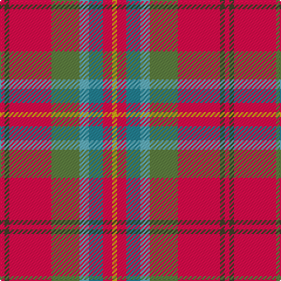

In pattern [RGRGYBRY](/stripes/rgrgybry/).

This was sourced from register-of-tartans.  It is a [8 stripe tartan](/stripes/stripes8/).

Original link https://www.tartanregister.gov.uk/tartanDetails.aspx?ref=10788

## Register references

External register numbers recorded for this tartan.

- Scottish Register of Tartans: [10788](https://www.tartanregister.gov.uk/tartanDetails.aspx?ref=10788)

## Thread count
R/4 T4 R36 G24 B8 Ba12 R8 Y/4

## Palette
Each colour and the base-6 reference it is a variant of.

| Colour | Shade | Base |
|---|---|---|
| B | <code style="background-color:#62B0BE;">#62B0BE</code> `oklch(71.2% 0.079 210.4)` <small>#62B0BE</small> | Y <code style="background-color:#F2BF00;">#F2BF00</code> |
| Ba | <code style="background-color:#248192;">#248192</code> `oklch(55.8% 0.087 212.7)` <small>#248192</small> | B <code style="background-color:#2A418A;">#2A418A</code> |
| G | <code style="background-color:#5D7F40;">#5D7F40</code> `oklch(55.5% 0.098 132.1)` <small>#5D7F40</small> | G <code style="background-color:#006100;">#006100</code> |
| R | <code style="background-color:#F00C4C;">#F00C4C</code> `oklch(60.8% 0.240 16.9)` <small>#F00C4C</small> | R <code style="background-color:#CC0000;">#CC0000</code> |
| T | <code style="background-color:#413F28;">#413F28</code> `oklch(36.3% 0.037 103.8)` <small>#413F28</small> | G <code style="background-color:#006100;">#006100</code> |
| Y | <code style="background-color:#D3A916;">#D3A916</code> `oklch(75.2% 0.150 90.1)` <small>#D3A916</small> | Y <code style="background-color:#F2BF00;">#F2BF00</code> |

# Sample pattern

## Nearest tartans

The nearest existing variants by ΔTartan distance.

1. [Battle of Bannockburn, The](/setts/s8/r1do1r9g6t2b3r2lo1~x4/) — ΔT 0.91
1. [Australia Dress](/setts/s9/lr11r4y2k4y2r4y12r20t2~x2/) — ΔT 1.15
1. [Virginia Military Institute, New Market](/setts/s9/w6r25o2g3o30k3o2r30ly6~x2/) — ΔT 1.19
1. [Dundhuin](/setts/s6/lr6o5k2y18r28w2~x2/) — ΔT 1.26
1. [Virginia Military Institute, New Market](/setts/s9/w6r25y2g3y30k3y2r30ly6~x2/) — ΔT 1.27
1. [Rathmore](/setts/s12/r10lb1r2n1r1n1lo1n4lb2r1lb2lo1~x8/) — ΔT 1.31
1. [Flowers of the Forest, The](/setts/s9/r2do2r20y13lg3db5r2r4o2~x2/) — ΔT 1.33
1. [Christie (London) (Personal)](/setts/s6/w5r25t18g4k2ly5~x2/) — ΔT 1.34
1. [Scottish American Soc. of Michigan](/setts/s6/r48b16lo5g17w8dy3~x2/) — ΔT 1.37
1. [Pubcrawlers, The](/setts/s7/w3o4dg2o22dt5o16ly3~x2/) — ΔT 1.39

## Neighbour map

Every grey dot is one of 14299 variants placed by the first two principal components of the ΔTartan feature space (44% of its variance). Red is this tartan; blue dots are its nearest — click one to open its page.

<svg viewBox="0 0 640 380" role="img" style="max-width:100%;height:auto;border:1px solid #e0e0e0;border-radius:4px;display:block" xmlns="http://www.w3.org/2000/svg"><image href="/nn/cloud.v1.png" width="640" height="380"/><a href="/setts/s8/r1do1r9g6t2b3r2lo1~x4/"><circle cx="222.9" cy="165.9" r="4" fill="#3465a4"><title>Battle of Bannockburn, The</title></circle></a><a href="/setts/s9/lr11r4y2k4y2r4y12r20t2~x2/"><circle cx="232.7" cy="167.0" r="4" fill="#3465a4"><title>Australia Dress</title></circle></a><a href="/setts/s9/w6r25o2g3o30k3o2r30ly6~x2/"><circle cx="282.2" cy="125.3" r="4" fill="#3465a4"><title>Virginia Military Institute, New Market</title></circle></a><a href="/setts/s6/lr6o5k2y18r28w2~x2/"><circle cx="258.0" cy="163.0" r="4" fill="#3465a4"><title>Dundhuin</title></circle></a><a href="/setts/s9/w6r25y2g3y30k3y2r30ly6~x2/"><circle cx="274.2" cy="122.8" r="4" fill="#3465a4"><title>Virginia Military Institute, New Market</title></circle></a><a href="/setts/s12/r10lb1r2n1r1n1lo1n4lb2r1lb2lo1~x8/"><circle cx="230.8" cy="122.5" r="4" fill="#3465a4"><title>Rathmore</title></circle></a><a href="/setts/s9/r2do2r20y13lg3db5r2r4o2~x2/"><circle cx="291.1" cy="153.8" r="4" fill="#3465a4"><title>Flowers of the Forest, The</title></circle></a><a href="/setts/s6/w5r25t18g4k2ly5~x2/"><circle cx="189.6" cy="148.3" r="4" fill="#3465a4"><title>Christie (London) (Personal)</title></circle></a><a href="/setts/s6/r48b16lo5g17w8dy3~x2/"><circle cx="243.6" cy="140.3" r="4" fill="#3465a4"><title>Scottish American Soc. of Michigan</title></circle></a><a href="/setts/s7/w3o4dg2o22dt5o16ly3~x2/"><circle cx="238.0" cy="164.5" r="4" fill="#3465a4"><title>Pubcrawlers, The</title></circle></a><circle cx="224.6" cy="159.1" r="5" fill="#c00000"/></svg>

ID: /setts/s8/r1dy1r9y6lg2t3r2ly1~x4/
