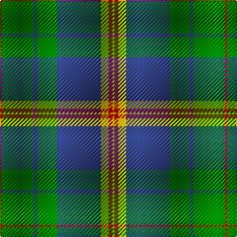

In pattern [RGBGBYRY](/patterns/rgbgbyry/).

This was sourced from weddslist.  It is a [8 stripes tartan](/stripes/stripes8/).

Original link http://www.weddslist.com/cgi-bin/tartans/pg.pl?source=sts

## Thread count
R/2 G32 B4 G20 B44 Y8 R4 Y/2

## Palette
Each colour and its ΔE from the base-6 reference it is a variant of.

| Colour | Shade | Base | ΔE (OKLab) |
|---|---|---|---|
| B | <code style="background-color:#304080;">#304080</code> `#304080` | B <code style="background-color:#2A418A;">#2A418A</code> | 0.02 |
| G | <code style="background-color:#008000;">#008000</code> `#008000` | G <code style="background-color:#006100;">#006100</code> | 0.10 |
| R | <code style="background-color:#C00000;">#C00000</code> `#C00000` | R <code style="background-color:#CC0000;">#CC0000</code> | 0.03 |
| Y | <code style="background-color:#F0C000;">#F0C000</code> `#F0C000` | Y <code style="background-color:#F2BF00;">#F2BF00</code> | 0.00 |

# Sample pattern

## Nearest tartans

The nearest existing variants by ΔTartan distance.

1. [MacOrrell](/setts/s9/b5y2b17g14w1g1w1g4y2~b304080-g008000-we0e0e0-yf0c000~x2/) — ΔT 0.68
1. [Cork](/setts/s9/g28r12g4b20y2b3y2b3g7~b304080-g008000-rc00000-yf0c000~x2/) — ΔT 0.94
1. [MacAuliffe (Name)](/setts/s8/g37w2g6b23y6b2y3b2~b2c2c80-g006818-wf8f8f8-ye8c000~x2/) — ΔT 0.97
1. [Singh](/setts/s8/b3r3b36g17y2g21w2r3~b304080-g008000-rc00000-we0e0e0-yf0c000~x2/) — ΔT 0.99
1. [George (Personal)](/setts/s9/r6b2r1b8r3b16g28w2g4~b2c2c80-g006818-rc80000-we0e0e0~x2/) — ΔT 1.09
1. [Johnston / Johnstone](/setts/s8/y3g2k1g30b24k2b2k2~b304080-g008000-k000000-yf0c000~x2/) — ΔT 1.13
1. [MacOrrell Family Tartan Tartan Number: 672. Earliest known date: Date unknown The MacOrrell tartan has similarities with the MacDonald, Lord of the Isles sett, which may point a connection with the name MacDonnell or MacDonald. The name Orr was used by a sept of the MacGregors and also of the Campbells of Argyll, suggesting that the root of the name originated in the Lochaber and Argyll districts. There is an undated sample of the tartan in the cloth archive of the Scottish Tartans Society. See products available Copyright © Blair Urquhart, Comrie, 2015](/setts/s9/b5y2b17g14w1g1w1g4y2~b2c2c80-g006818-we0e0e0-ye8c000~x2/) — ΔT 1.15
1. [Unidentified (Pahls)](/setts/s10/y4g4b2g29w1b12g2y16g4b2~b2c2c80-g006818-wfcfcfc-ya08858~x2/) — ΔT 1.16
1. [Johnston (Clan)](/setts/s8/y3g2k1g30b24k2b2k2~b1870a4-g007800-k000000-ye8c000~x2/) — ΔT 1.18
1. [Dunedin Chapter (Corporate)](/setts/s10/b39g3b3g20k3g20k3g3k20r3~b5c8ca8-g006818-k101010-rc80000~x2/) — ΔT 1.19

## Neighbour map

Every grey dot is one of 15726 variants placed by the first two principal components of the ΔTartan feature space (44% of its variance). Red is this tartan; blue dots are its nearest — click one to open its page.

<svg viewBox="0 0 640 380" role="img" style="max-width:100%;height:auto;border:1px solid #e0e0e0;border-radius:4px;display:block" xmlns="http://www.w3.org/2000/svg"><image href="/nn/cloud.v1.png" width="640" height="380"/><a href="/setts/s9/b5y2b17g14w1g1w1g4y2~b304080-g008000-we0e0e0-yf0c000~x2/"><circle cx="279.3" cy="159.7" r="4" fill="#3465a4"><title>MacOrrell</title></circle></a><a href="/setts/s9/g28r12g4b20y2b3y2b3g7~b304080-g008000-rc00000-yf0c000~x2/"><circle cx="272.0" cy="175.9" r="4" fill="#3465a4"><title>Cork</title></circle></a><a href="/setts/s8/g37w2g6b23y6b2y3b2~b2c2c80-g006818-wf8f8f8-ye8c000~x2/"><circle cx="314.6" cy="156.8" r="4" fill="#3465a4"><title>MacAuliffe (Name)</title></circle></a><a href="/setts/s8/b3r3b36g17y2g21w2r3~b304080-g008000-rc00000-we0e0e0-yf0c000~x2/"><circle cx="278.6" cy="153.5" r="4" fill="#3465a4"><title>Singh</title></circle></a><a href="/setts/s9/r6b2r1b8r3b16g28w2g4~b2c2c80-g006818-rc80000-we0e0e0~x2/"><circle cx="304.1" cy="147.3" r="4" fill="#3465a4"><title>George (Personal)</title></circle></a><a href="/setts/s8/y3g2k1g30b24k2b2k2~b304080-g008000-k000000-yf0c000~x2/"><circle cx="321.1" cy="134.5" r="4" fill="#3465a4"><title>Johnston / Johnstone</title></circle></a><a href="/setts/s9/b5y2b17g14w1g1w1g4y2~b2c2c80-g006818-we0e0e0-ye8c000~x2/"><circle cx="278.3" cy="159.9" r="4" fill="#3465a4"><title>MacOrrell Family Tartan Tartan Number: 672. Earliest known date: Date unknown The MacOrrell tartan has similarities with the MacDonald, Lord of the Isles sett, which may point a connection with the name MacDonnell or MacDonald. The name Orr was used by a sept of the MacGregors and also of the Campbells of Argyll, suggesting that the root of the name originated in the Lochaber and Argyll districts. There is an undated sample of the tartan in the cloth archive of the Scottish Tartans Society. See products available Copyright © Blair Urquhart, Comrie, 2015</title></circle></a><a href="/setts/s10/y4g4b2g29w1b12g2y16g4b2~b2c2c80-g006818-wfcfcfc-ya08858~x2/"><circle cx="339.1" cy="146.4" r="4" fill="#3465a4"><title>Unidentified (Pahls)</title></circle></a><a href="/setts/s8/y3g2k1g30b24k2b2k2~b1870a4-g007800-k000000-ye8c000~x2/"><circle cx="327.9" cy="138.9" r="4" fill="#3465a4"><title>Johnston (Clan)</title></circle></a><a href="/setts/s10/b39g3b3g20k3g20k3g3k20r3~b5c8ca8-g006818-k101010-rc80000~x2/"><circle cx="228.2" cy="173.3" r="4" fill="#3465a4"><title>Dunedin Chapter (Corporate)</title></circle></a><circle cx="286.8" cy="162.3" r="5" fill="#c00000"/></svg>

ID: /setts/s8/r1g16b2g10b22y4r2y1~b304080-g008000-rc00000-yf0c000~x2/
